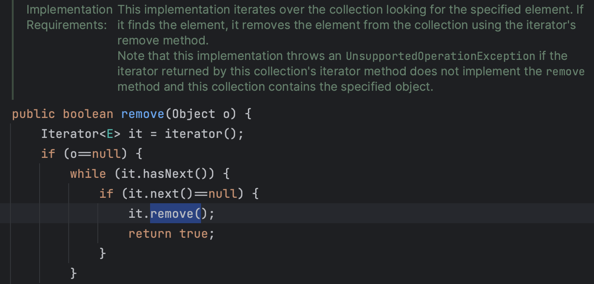
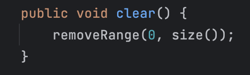
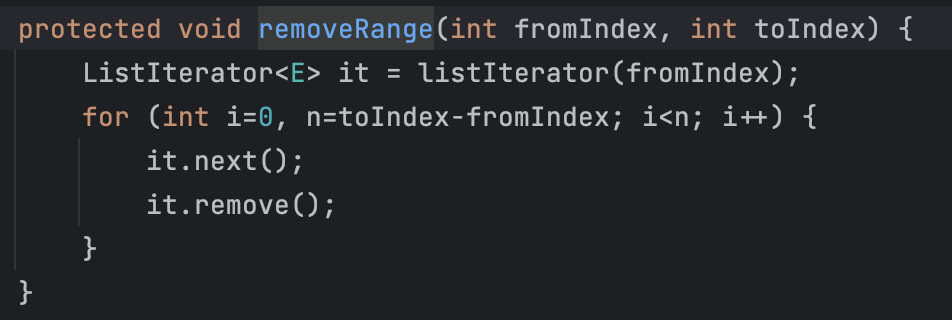
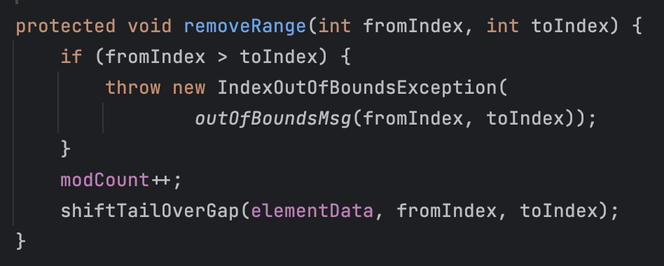
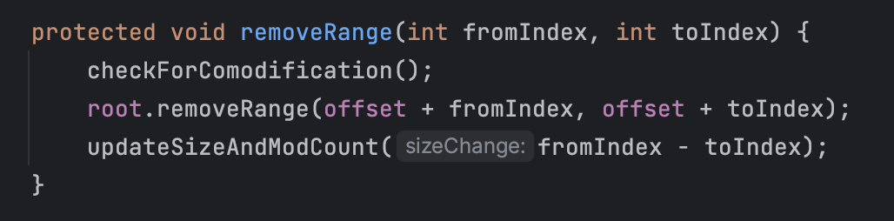

## 상속을 위한 문서화

상속을 위한 문서화란 상속이 가능한 클래스의 재정의 가능 메서드에 해당 메서드를 내부적으로 어떻게 이용하고 있는지, 그래서 어떤 식으로 동작하도록 구현되어야 하는지 문서로 남겨두는 것을 말한다.

이렇게 해야 하는 이유는 클래스를 상속받아 구현된 클래스에서 해당 메서드를 부모 클래스에서의 의도와 다르게 구현할 경우 의도치 않은 동작으로 이어질 수 있기 때문이다.

자바 API에서는 이러한 문서를 `Implementation Requirements` (코드에선 `@ImplSpec`)라는 항목으로 문서화하여 제공하고 있다. 아래는 AbstractCollection.remove() 메서드 일부이다.

이를 통해 Abstract iterator()가 반환하는 Iterator의 remove() 동작을 임의로 재정의하게 되면 컬렉션에서 원소를 삭제하는 기능에 문제가 발생할 수도 있음을 알 수 있다. 이런 식으로 내부 동작을 문서화하여 남김으로써 클래스를 상속해서 메서드를 재정의할 때 개발자가 어떻게 구현해야 하는지 인지하도록 해야 한다.

### 상속은 캡슐화를 해친다

하지만 API는 말그대로 인터페이스이기 때문에 좋은 API문서는 '어떻게' 가 아닌 '무엇'에 초점을 맞추어 설명해야 한다. 이는 상속이 캡슐화를 해치기 때문에 발생하는 현상이다.

즉, 상속이 가능하도록 클래스를 설계함으로써 내부 구현이 (문서를 통해) 외부에 노출되는 일이 벌어지게 되는 것이다.

## 상속용 클래스 설계 시 유의사항

### hook 메서드

효율적인 상속용 클래스 설계를 위해서는 내부 로직 중 일부를 분리해서 protected 메서드로 공개해야 할 수도 있다고 한다. 예를 들어 AbstractList.removeRange() 의 경우 protected 메서드 인데 컬렉션(특히 부분리스트)의 clear() 메서드가 이 removeRange() 메서드를 사용해 원소를 제거하므로 구현 클래스에서 **각 컬렉션의 특징에 맞게** removeRange() 메서드를 재정의하여 효율성을 높일 수 있도록 했다.

예를 들어 ArrayList에서는 배열이라는 특성을 이용해 아래와 같이 removeRange를 재정의하고 있다.

그리고 ArrayList의 clear()에서는 removeRange()를 호출하지 않지만 ArrayList.SubList.clear() 에서는 부모인 AbstractList.clear()을 그대로 호출하기 때문에 ArrayList에서 (컬렉션에 특성에 맞게) 재정의한 removeRange()를 호출하는 SubList.removeRange()가 clear() 동작에 사용된다.

#### ArrayList.SubList.removeRange()

### 생성자에서 재정의 가능 메서드 호출 금지

Item 13 의 clone() 에서도 [비슷한 이야기](https://sh-hyun.tistory.com/110#-clone-%EC%97%90%EC%84%9C%EB%8A%94-%EC%9E%AC%EC%A0%95%EC%9D%98-%EA%B0%80%EB%8A%A5%ED%95%9C-%EB%A9%94%EC%84%9C%EB%93%9C-%ED%98%B8%EC%B6%9C-%EA%B8%88%EC%A7%80)가 있었는데, 생성자에서도 재정의 가능 메서드를 호출하면 안 된다. 상속 클래스의 생성자는 계속해서 부모의 생성자를 super()로 호출하게 되는데 이 과정에서 부모 클래스 레벨의 생성자가 하위 클래스의 **재정의된** 메서드를 호출해버리는 문제가 발생할 수 있기 때문이다.

현재 물리적으로 부모 클래스의 코드가 실행되고 있더라도 실제 인스턴스는 하위 클래스이기 때문에 재정의된 메서드를 호출하면 하위 클래스의 메서드가 호출되고 이는 비정상적인 동작을 불러일으킨다.

따라서, 생성자에서는 절대 재정의 가능 메서드를 호출해선 안 되고 필요한 메서드는 private로 분리해서 호출하도록 해야 한다.

### Cloneable / Serializable 구현 클래스의 상속

Cloneable 이나 Serializable 인터페이스를 구현하는 클래스를 상속 가능하도록 만들면 이를 상속받는 하위의 모든 클래스들이 복제와 직렬화 기능을 고려하여 구현되어야 하기 때문에 구현이 복잡해지고 어려워진다. 따라서 이들 인터페이스를 구현하는 클래스는 상속을 막는 것이 더 적절하다고 한다.

## 상속을 금지하라

지금까지 코드를 작성하면서 클래스에 final 키워드를 달아본 적은 거의 없었던 것 같다. 책에서는 상속용으로 설계하지 않은 클래스는 안전하게 모두 상속을 막아버리라고 조언한다.

이를 위한 방법으로 final로 클래스를 선언하거나 생성자를 private / default 로 선언할 수 있다. 후자의 경우 앞서 말했듯 상속 클래스는 부모 클래스의 생성자를 호출해야 하므로 이게 막혀버리면 상속 자체가 불가능해진다. 이 경우 정적 팩토리 메서드를 통해 객체를 생성하는 API를 제공할 수 있다.

>   클래스를 확장해야 할 명확한 이유가 떠오르지 않으면 상속을 금지하는 편이 나을 것이다. 상속 대신 컴포지션을 우선해서 사용하도록 설계하라!!

>    이펙티브 자바 [전체 아이템 목록](https://github.com/2023-java-study/book-study/tree/main/%EC%9D%B4%ED%8E%99%ED%8B%B0%EB%B8%8C_%EC%9E%90%EB%B0%94) (스터디 정리 레포지토리)