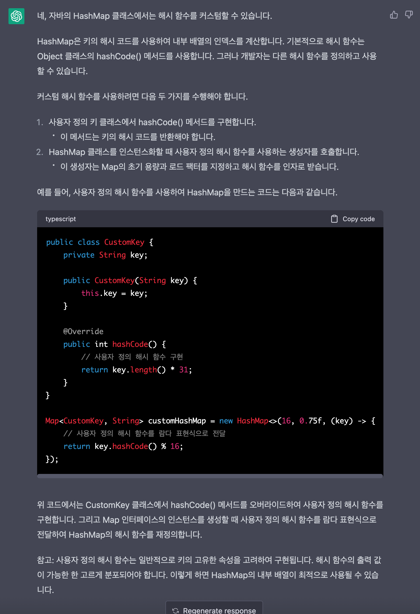
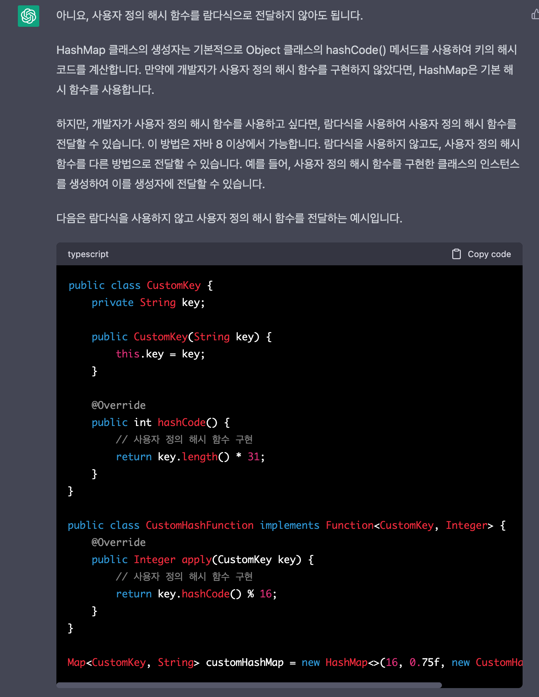
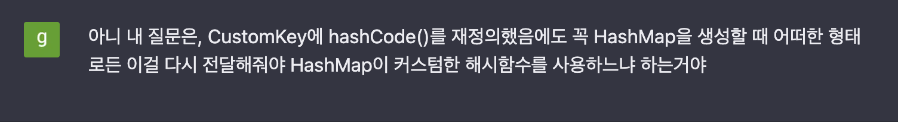
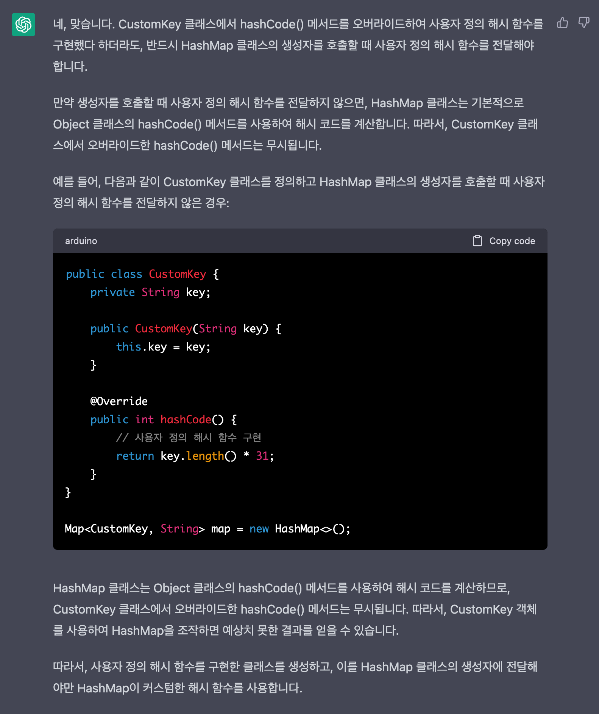
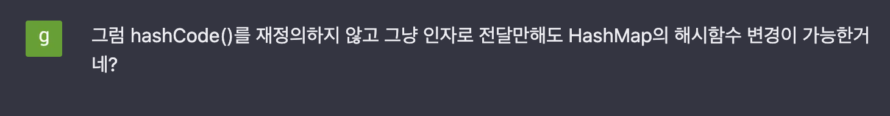
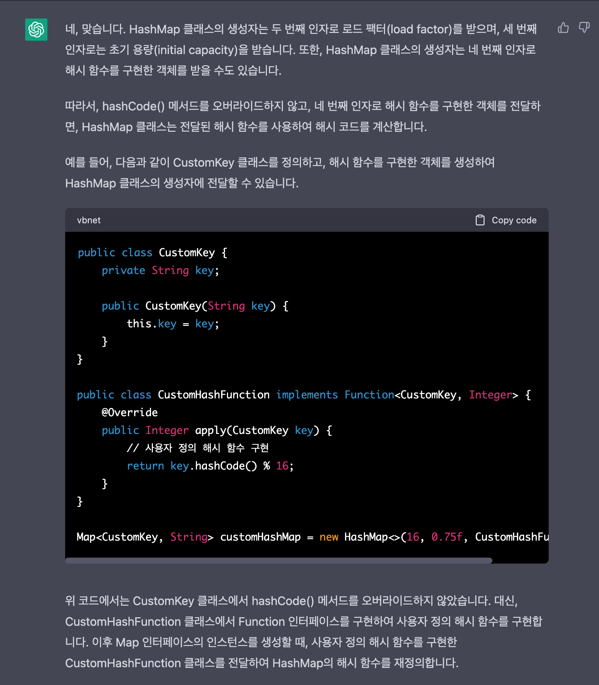
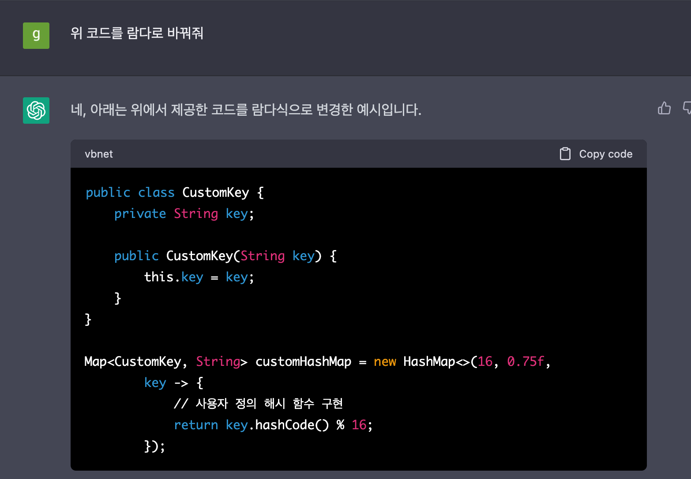
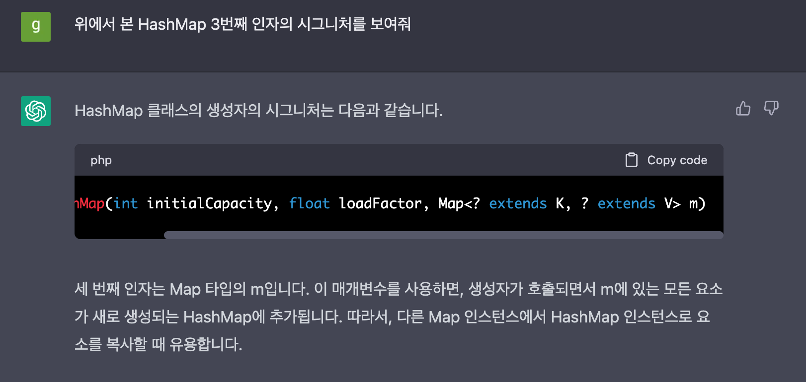

알고리즘 공부하다가 그냥 문득 너무 신기해서 쓰는 글 😳

2-3달 전만해도 사실 크게 관심이 없었는데 주변에서 chatGPT한테 요구사항을 주면 CRUD하는 스프링 코드를 다 짜준다더라, 모델을 명세하면 딥러닝 모델을 만들어준다더라, 백준 문제 번호랑 코드를 주면 틀린 부분을 찾아준다더라(...) 등등 하는 얘기를 듣고 와 이거 진짜 장난아니구나 싶었다.

지금까지는 그냥 구글에 검색하는 것처럼 단편적인 일회성 질문만 가끔 물어봐왔었는데 오늘 처음으로 대화 형태의(?) 질문을 해봤다. (생각해보니 이름이 'chat'GPT 였다) 물어본 내용은 알고리즘 공부를 하다가 자바에서 제공하는 HashMap의 해시 함수를 커스텀할 수 있는지 궁금해져서 해당 내용을 물어봤었다.

일단 대뜸 아래처럼 물어봤다.

그랬더니 이렇게 알려줬다.

일단 1. 커스텀이 가능하다는 사실과 2. 뭔가 인자로 전달하면 된다는 사실을 알아냈다. 그런데 CustomKey에서 hashCode를 재정의하는데 다시 HashMap을 생성할 때 인자로 뭔가 전달해주는 부분에서 왜 이게 중복되는거지? 하는 의문이 들었다. 그래서 다시 아래처럼 물어봤다.

그랬더니 아래처럼 그냥 람다식을 클래스로 바꿔놓은 코드를 보여줬다ㅋㅋㅋ

그래서 이렇게 다시 물어봤다. (여기부터 조금 소름이 돋기 시작했다)

다시 정확하게 물어보니 이제 내가 원하는 답변을 해주었다.

일단 처음에 궁금했던 내용들은 다 해결되었다. 근데 그럼 굳이 해시 함수를 재정의하기 위해 별도로 클래스를 만들어서 hashCode()를 재정의할 필요가 없는 것 아닌가? 하는 생각이 들었다. 그래서 이렇게 다시 물어봤다.

예상대로 굳이 클래스를 생성하지 않고도 해시 함수의 변경이 가능해보였댜.

내친김에 코드를 다시 람다 버전으로 바꿔달라고도 요청해봤다.

... 정말 똑똑하다는 생각이 들었다. 마지막으로 그럼 위에서 호출하는 HashMap 생성자의 3번째 인자는 Function을 받는데 해당 Function의 첫번째 인자는 와일드 카드로 HashMap의 키를 상속받는 클래스만 가능하게 되어있는걸까? 하는 생각이 들었고 사실 이건 코드에서 직접 확인하는게 더 빠르겠지만 그냥 계속 물어봤다.

