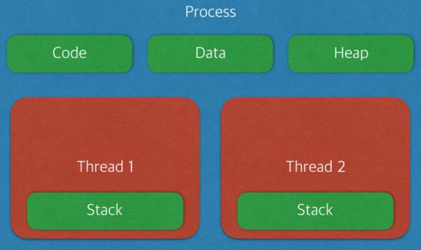
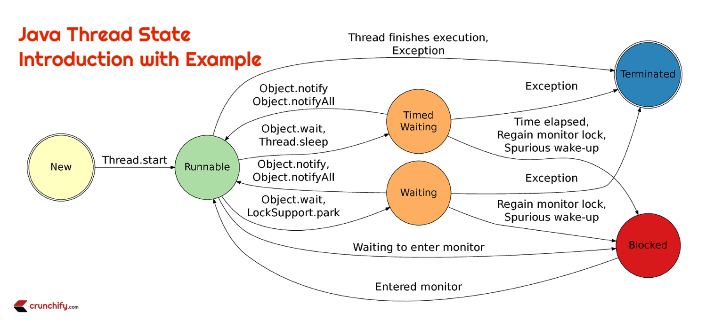
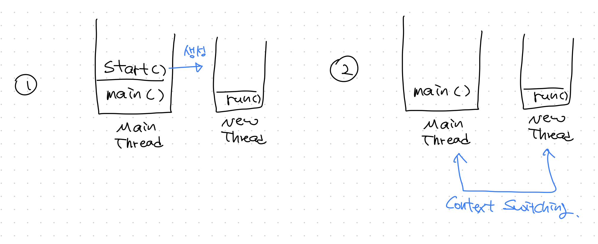
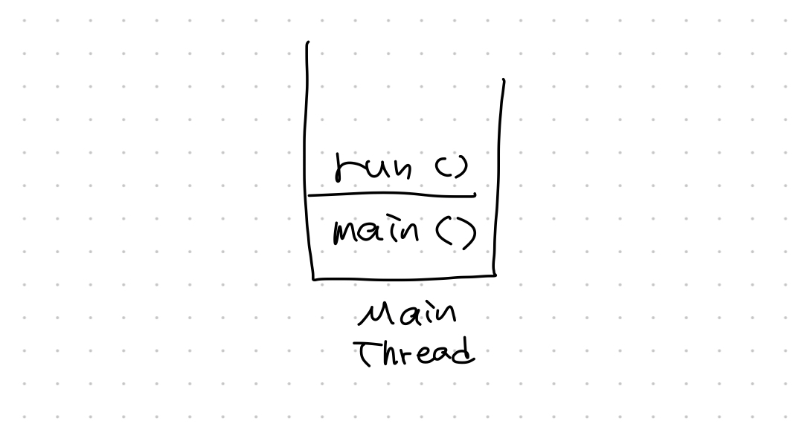
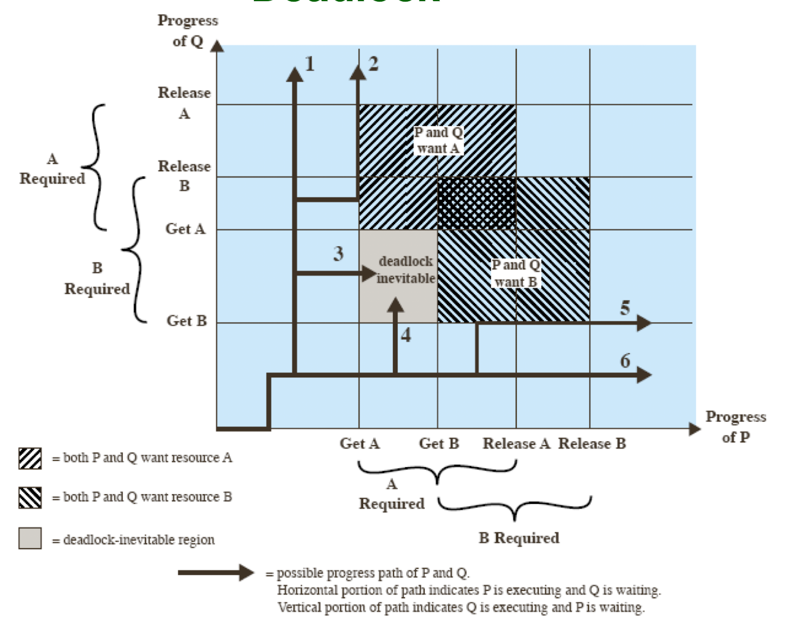

## Process와 Thread

[출처 - https://gyoogle.dev/blog/computer-science/operating-system/Process%20vs%20Thread.html]

### Process
* 메모리에서 실행되는 프로그램
  * 메인 쓰레드 포함 최소 1개의 쓰레드를 갖는다
* 프로세스는 각각 별도의 주소 공간에 할당된다 (독립적)
### Thread
* 프로세스 안에서 실행되는 여러 **흐름 단위**
  * 하나의 프로세스 안에 여러 쓰레드를 구성해 각 쓰레드가 각각의 작업을 맡아서 처리
  * 쓰레드가 있어 **다수의 작업을 동시에 처리**할 수 있다
* 쓰레드는 `Stack` 만 별도로 할당 받고 나머지 영역은 프로세스의 것을 서로 공유한다
  * Context Switching에 들어가는 오버헤드가 적어 각각을 별도의 프로세스로 구성하는 것보다 성능이 좋다
  * 전역, 정적 변수를 쉽게 공유할 수 있다


## Thread 클래스와 Runnable 인터페이스
* `Thread` 클래스는 `Runnable` 인터페이스를 구현한다
  * `Runnable` 인터페이스는 `run()` 메소드 하나만 갖는 함수형인터페이스이다.
  * `Thread` 클래스는 `run()` 메소드 이외에 `start()` 와 같은 추가적인 메소드 / 변수를 갖는다
```java
@FunctionalInterface
public interface Runnable {
    public abstract void run();
}

---

public class Thread implements Runnable {
    ...
}
```
### 쓰레드 클래스 생성
#### `extends Thread` vs `implements Runnable`
* 쓰레드 클래스를 만들기 위해서는 둘 중 아무거나 상속받아 사용하면 되는데, `Runnable` 인터페이스를 상속받아 구현하게 되면 **다른 클래스를 상속받거나 다른 인터페이스를 구현하면서** 동시에 쓰레드를 만들 수 있기 때문에 이럴 경우에 사용할 수 있을 것 같다.
* 또, Thread 클래스는 `run()` 외에도 여러가지 메소드를 제공하므로 이 중 오버라이드 해야 될 메소드가 있다면 Thread를 상속받아 재정의하고, 아니라면 딱 `run()` 만 선언되어 있는 Runnable 인터페이스를 구현하는게 좋다.
#### Thread 클래스 사용
```java
public class MyThread extends Thread {
    @Override
    public void run() {
        System.out.println("쓰레드 실행");
    }
}

---

MyThread myThread = new MyThread();
myThread.start(); // "쓰레드 실행"
```
#### Runnable 인터페이스 사용
```java
public class MyThread implements Runnable {
    @Override
    public void run() {
        System.out.println("쓰레드 실행");
    }
}

---

MyThread myThread = new MyThread();
// Runnable 인터페이스를 구현한 경우, Thread 클래스를 통해 쓰레드를 실행시킬 수 있다
new Thread(myThread).start(); // "쓰레드 실행"
```
* `Runnable` 인터페이스 구현 시 아래와 같이도 가능
```java
public class MyThread extends ParentClass implements Runnable, AnotherInterface {
    @Override
    public void run() {
        System.out.println("쓰레드 실행");
    }

    ...
}
```

## 쓰레드의 상태
* 쓰레드의 상태는 `getState()`를 통해 확인할 수 있다


[출처 : https://crunchify.com/java-thread-state-introduction-with-example/]
### New
* 쓰레드 클래스가 생성된 초기 상태
### Runnable
* `start()` 메서드를 호출한 직후 상태
* 말 그대로 실행이 **가능한** 상태
  * 쓰레드 스케쥴링을 통해 여러 쓰레드가 CPU를 (계속해서) 번갈아가면서 점유하고 run() 메소드를 실행해나간다.
  * 이를 `Running` 상태라 한다
* 즉, 쓰레드는 스케쥴링 방식에 따라 `Runnable` 과 `Running` 상태를 오가며 실행된다

### Timed Waiting, Waiting
* 일시 정지 상태
  * 일시 정지는 실행 대기 (`Runnable`) 상태와 다르다. **실행이 불가능**한 상태를 말한다
* 실행 중인 쓰레드에 `wait()`, `sleep()` 등의 메소드를 사용하면 `(Timed)Waiting` 상태가 된다
  * `notify()`, `notifyAll()` 메소드 등을 통해 다시 `Runnable` 상태가 될 수 있다
* Timed인 것과 아닌 것의 차이는 `wait()` 메소드에서 인자를 지정해주었는지에 따라 달라진다.

### Blocked
* 락이 걸린 상태. `모니터 락(monitor lock)`이 풀리기를 기다리는 상태.
* `synchronized` 블럭이나 메소드에 들어가기를 기다리는 상태이다

### Terminated
* 쓰레드가 종료된 상태

## 쓰레드가 제공하는 메서드
### join()
* 해당 쓰레드가 종료될 때 까지 대기한다
  * 내부적으로는 `Object.wait()` 을 호출한다.
  * 인자에 밀리초를 넣으면 최대 그 시간만큼만 대기한다
```java
// 1. join()을 사용한 경우
public static void main(String[] args) throws InterruptedException {
    Thread thread = new Thread(() -> {
        try {
            sleep(3000);
            System.out.println(Thread.currentThread().getName());
        } catch (InterruptedException e) {
            throw new RuntimeException(e);
        }
    });

    thread.start();
    thread.join();
    
    System.out.println(Thread.currentThread().getName());
}
/* 
 * 출력 결과
 * Thread-0
 * main
 */

// 2. join()을 사용하지 않은 경우
public static void main(String[] args) throws InterruptedException {
    Thread thread = new Thread(() -> {
        try {
            sleep(3000);
            System.out.println(Thread.currentThread().getName());
        } catch (InterruptedException e) {
            throw new RuntimeException(e);
        }
    });

    thread.start();
    // thread.join();
    
    System.out.println(Thread.currentThread().getName());
}
/* 
 * 출력 결과 (Thread-0가 sleep()하는 동안 메인 쓰레드가 동작한다)
 * main
 * Thread-0
 */
```

* 여러 쓰레드가 작동하고 있더라도 나머지 쓰레드를 모두 종료시키는가?
```java
public static void main(String[] args) throws InterruptedException {
    // Thread0, Thread1 정의
    Thread thread0 = new Thread(() -> {
        try {
            sleep(6000); // Thread0 - 6초
            System.out.println(Thread.currentThread().getName());
        } catch (InterruptedException e) {
            throw new RuntimeException(e);
        }
    });
    Thread thread1 = new Thread(() -> {
        try {
            sleep(3000); // Thread1 - 3초
            System.out.println(Thread.currentThread().getName());
        } catch (InterruptedException e) {
            throw new RuntimeException(e);
        }
    });

    // Thread0, Thread1 실행
    thread0.start();
    thread1.start();
    
    thread0.join();

    System.out.println(Thread.currentThread().getName());
}
```
* 출력 결과
```java
Thread-1 // 항상 Thread-1이 먼저 출력
Thread-0
main
```
* 즉, `join()`을 호출한 쓰레드만 해당 쓰레드가 종료될 때 까지 `wait()` 된다.
### interrupt() vs stop()
* 현재 실행 중인 쓰레드를 종료시킬 목적으로 사용되는 메소드이다.
  * `stop()` 메서드는 안전상의 이유로 deprecated 되어 현재는 `interrupt()`를 사용해야 한다
* 쓰레드를 시스템 상에서 즉시 종료시키게 되면 가지고 있던 락이나, 공유 자원 등등 여러 복잡한 문제가 발생할 수 있다.
  * 따라서, 쓰레드는 시스템적으로 즉시 종료시키기보단 개발자가 안전하게 종료시킬 수 있도록 해야 하는데 `interrupt()`를 사용하면 이게 가능하다
* `interrupt()`를 사용하면 해당 쓰레드가 다음 번 일시중지 상태에 들어갈 때 `InterruptedException`을 발생시켜준다.
  * 개발자는 `run()` 메소드 내에서 이를 잡아서 안전하게 쓰레드를 종료시키면 된다.
```java
public class ThreadDemo {
    static class MyThread extends Thread {
        @Override
        public void run() {
            try {
                sleep(1000);
            } catch (InterruptedException e) {
                // 여기서 쓰레드를 안전하게 종료하는 코드를 수행할 수 있다
                System.out.println("쓰레드를 안전하게 종료합니다.");
            }
        }
    }

    public static void main(String[] args) throws InterruptedException {
        MyThread myThread = new MyThread();
        myThread.start();

        myThread.interrupt();
    }
}
```
* 출력
```java
쓰레드를 안전하게 종료합니다.
```

### Thread.currentThread()
* 현재 실행 중인 쓰레드의 객체를 반환한다

### 상태 확인 메소드들
* `checkAccess()` - 현재 수행 중인 쓰레드가 해당 쓰레드를 수정할 권한이 있는지 확인. 없다면 `SecurityException` 발생
* `isAlive()` - 쓰레드가 현재 살아있는지(`run()` 메소드 종료 여부) 확인
* `isInterrupted()` - 쓰레드가 현재 `interrupt` 된 상태인지 출력. 쓰레드가 아예 종료된 상태라면 `false`가 출력됨

## 쓰레드의 우선순위
* 쓰레드는 우선순위에 대한 필드를 갖는다
```java
public class Thread implements Runnable {
    ...
    private int priority;
    ...

    // setPriority() 메서드로 우선순위를 설정할 수 있다
    public final void setPriority(int newPriority) {
        ...
    }
}
```
* 우선순위는 `1-10` 사이의 값을 갖는다
* 쓰레드 클래스는 `1`, `5`, `10` 우선순위를 상수로 정의하고 있다
```java
    // 최소 우선순위
    public static final int MIN_PRIORITY = 1;

    // 아무런 설정을 하지 않았을 때 **기본** 우선순위
    public static final int NORM_PRIORITY = 5;

    // 최대 우선순위
    public static final int MAX_PRIORITY = 10;
```
* 다만, 우선순위가 n배 높다고 해서 무조건 n배 빨리/많이 실행되는 것은 아니다
  * 우선순위가 높은 쓰레드는 낮은 쓰레드보다 좀 더 많이 `실행 큐`에 포함되어, 좀 더 많은 작업 시간을 할당받을 뿐이다.
#### 우선순위 예시
```java
public class MyThread extends Thread {

    public MyThread(String name) {
        super(name);
    }

    @Override
    public void run() {
        for (int i = 0; i < 5; i++) {
            System.out.print(Thread.currentThread().getName() + " ");
            try {
                sleep(10);
            } catch (InterruptedException e) {
                throw new RuntimeException(e);
            }
        }
    }

    public static void main(String[] args) {
        MyThread myThread1 = new MyThread("1");
        myThread1.setPriority(1);
        MyThread myThread2 = new MyThread("2");
        myThread2.setPriority(1);
        MyThread myThread3 = new MyThread("3");
        myThread3.setPriority(10);
        MyThread myThread4 = new MyThread("4");
        myThread4.setPriority(10);

        myThread1.start();
        myThread2.start();
        myThread3.start();
        myThread4.start();
    }
}
```
#### 출력 결과
```java
1 4 2 3 1 3 2 4 1 3 4 2 1 4 3 2 1 3 4 2 
```
* 무조건 우선순위가 높은 쓰레드가 먼저/많이 실행되는게 아니라는 것을 볼 수 있다
  * 또한, 물리적인 cpu 코어 수가 많으면 해당 코어 수 만큼 병렬로 쓰레드가 실행가능하기 때문에, 그 이상의 쓰레드가 실행 대기 중이어야 우선순위가 의미가 있기도 하다.

## Main 쓰레드
* 자바는 JVM 위에서 돌아간다
  * 이게 하나의 **프로세스** 이고, 이 프로세스를 **실행**하기 위해 사용하는 것이 `main()` 메소드 이다
  * 지금껏 아무생각없이 프로그램을 실행하기 위해 작성했던 메인 메소드가 **메인 쓰레드** 를 실행시켜 프로세스를 작동하도록 만들었던 것이다.
```java
// 메인 쓰레드 실행
public static void main (String[] args) {
    ...
}
```
* 별도로 다른 쓰레드를 실행하지 않고 `main()` 메소드만 실행하는 것을 **싱글쓰레드 애플리케이션** 이라 한다.

### 멀티쓰레드 애플리케이션
* `main()` 메소드로 실행된 메인 쓰레드 안에서 추가로 쓰레드를 생성하여 실행하는 것을 **멀티 쓰레드 애플리케이션** 이라고 한다.

### 데몬(Daemon) 쓰레드
* 메인 쓰레드의 작업을 돕는 **보조적인 역할**을 하는 쓰레드
  * 따라서, 메인 쓰레드가 종료되면 데몬 쓰레드는 강제로 종료된다
* 주 쓰레드 실행 중에 데몬 쓰레드로 만들 쓰레드의 `.setDaemon(true)`를 호출하면 호출당한 쓰레드는 데몬이 된다
```java
public static void main() {
    // 주 쓰레드 실행 중
    MyThread myThread = new MyThread();
    myThread.setDaemon(true); // myThread가 메인 쓰레드 (주 쓰레드) 의 데몬 쓰레드가 됨
    myThread.start(); // 데몬 쓰레드는 메인 메소드(쓰레드)가 종료되면 자동으로 종료됨
}
```
* 즉, 위 상황에서는 메인 메소드에서 아무런 작업도 하지 않으므로 데몬 쓰레드가 실행되었음에도 바로 프로세스가 종료되어 버린다
* 데몬 쓰레드는 주 쓰레드를 모니터링 하는 등의 부가적인 작업 수행 용도로 사용할 수 있다.

### Thread.start()
* 쓰레드 객체를 생성하고 `start()` 메서드를 호출하면 아래와 같이 해당 쓰레드가 실행될 수 있는 스택이 생성되고 해당 쓰레드에서 `run()` 메소드를 실행해나간다.
  * 메인쓰레드에서 해당 쓰레드를 호출했다면 메인 쓰레드와 생성된 쓰레드의 `run()` 코드가 번갈아가면서 실행된다.



#### run()
* `start()`를 통하지 않고 직접 `run()`을 호출하는 경우, 쓰레드를 새롭게 생성하는 것이 아니라 단순히 **현재 쓰레드에서** 메서드를 호출하는 것이므로 하나의 쓰레드에서 메서드가 실행된다.



## 동기화
* **여러 쓰레드가 하나의 자원을 사용**하려할 때 현재 해당 자원을 사용하는 하나의 쓰레드를 제외한 나머지 쓰레드의 접근을 막는 것
  * 이렇게 다른 쓰레드의 접근을 막는 것을 `Thread-Safe` 하다고 말한다
* 자바에서 동기화를 구현하는 방법은 3가지로 분류된다
  1. synchronized 키워드
  2. Atomic 클래스
  3. volatile 키워드

### synchronized 키워드
* `synchronized` 는 메소드에 붙여 사용하는 `synchronized methods` 방식과 블럭 앞에 붙여 사용하는 `synchronized statements` 방식이 있다.
#### 1. synchronized methods
* 먼저 메서드에 붙여 사용하는 `synchronized methods` 방식이다
#### 1-1. `synchronized` 키워드를 사용하지 않은 경우
```java
public class Counter {
    private static Counter instance = null;

    private int c = 0;

    private Counter() {
    }

    public static Counter getInstance() {
        if (instance == null) {
            instance = new Counter();
        }
        return instance;
    }

    public void increment() {
        c++;
        try {
            sleep(100);
        } catch (InterruptedException e) {
            throw new RuntimeException(e);
        }
    }

    public int value() {
        return c;
    }

    static class MyThread extends Thread {

        public MyThread(String name) {
            super(name);
        }

        @Override
        public void run() {
            Counter counter = Counter.getInstance();
            counter.increment();

            System.out.println(super.getName() + " : " + counter.value());
        }
    }

    public static void main(String[] args) {
        MyThread first = new MyThread("first");
        MyThread second = new MyThread("second");

        first.start();
        second.start();
    }

}
```
* 출력 결과
```java
first : 2
second : 2
```
* 첫번째 쓰레드에서 1을 증가시키고 값을 출력하기 전에 두번째 쓰레드에서 `Counter` 인스턴스의 `c`를 증가시켜서 두 쓰레드 모두 `2`라는 값을 출력하는 문제가 발생하고 있다
  * 이는 웹 앱이 싱글톤 빈 + 멀티 쓰레드로 실행될 때 심각한 버그를 만들어낼 수 있다
#### 1-2. `synchronized` 키워드를 사용한 경우
* 이를 `synchronized` 키워드를 사용해 해결할 수 있다
  * 기존 `increment()` 메소드에 `synchronized` 키워드를 붙여보자
```java
public synchronized void increment() {
    c++;
    try {
        sleep(100);
    } catch (InterruptedException e) {
        throw new RuntimeException(e);
    }
}
```
* 출력 결과
```java
first : 1
second : 2
```
* 의도한 대로 결과가 나오는 것을 확인할 수 있다
* `increment()` 에서 `sleep()` 이 수행되는 동안 다른 쓰레드가 해당 메서드에 접근할 수 없기 떄문에 문제가 발생하지 않는다
> 위 예제가 이론적으로 완벽한 예제는 아닐 수 있으나 synchronized 키워드의 개념을 이해하기에 쉬운 예제라고 생각했다

추가로, `synchronized block`을 지정하면 해당 인스턴스 단위로 락이 걸린다. 이때, `synchronized` 키워드가 붙은 메서드들에 한하여 락이 걸리게 된다. 즉, 아래와 같이 `syncronized`가 있는 메서드와 없는 메서드가 있을 때 일반 메서드는 락이 걸리는 것과 별개로 언제든지 호출될 수 있다.
```java
public class ThreadDemo {
    static class Instance {
        @SneakyThrows
        public void print() {
            Thread.sleep(1000);
            System.out.println(Thread.currentThread().getName());
        }

        @SneakyThrows
        public synchronized void sleep() {
            System.out.println(Thread.currentThread().getName() + " - lock");
            Thread.sleep(2000);
            System.out.println(Thread.currentThread().getName() + " - unlock");
        }
    }
    public static void main(String[] args) throws InterruptedException {
        Instance instance = new Instance();

        Thread thread0 = new Thread(instance::sleep);
        Thread thread1 = new Thread(instance::sleep);
        Thread thread2 = new Thread(instance::print);

        thread0.start();
        thread1.start();
        thread2.start();
    }
}
```

* 출력 결과
  * thread-0과 thread-1이 `sleep()` 메소드 락이 걸려있는 사이에도 synchronized 가 붙지 않은 `print()`는 호출되는 것을 확인할 수 있음
```java
Thread-0 - lock
Thread-2
Thread-0 - unlock
Thread-1 - lock
Thread-1 - unlock
```

#### 2. synchronized statements
`synchronized` 키워드는 메서드가 아니라 아래와 같이 블럭 단위로도 지정할 수 있다.
```java
public void methodA() {
    ...
    synchronized (this) {
        // 이 블럭 내부 코드끼리만 락이 걸린다
        ...
    }
    ...
}
```
* 이떄 synchronized 옆의 괄호 `( )` 에는 lock 객체를 직접 지정해줄 수 있다. 위 예제의 경우 `this`가 입력되어 있고 즉, 해당 메소드가 선언된 클래스의 객체를 lock 객체로 사용하는 것을 믜미한다.
* 공유 객체로 다른 클래스의 인스턴스를 지정하거나, `클래스.class` 와 같이 클래스 타입 자체를 공유 객체로 선언해 아예 클래스 레벨로 락을 걸 수도 있다.

### volatile
* 자바 애플리케이션은 작업을 수행하는 동안 성능 향상을 위해 변수를 `메인 메모리`에 저장하지 않고 `CPU Cache` 에 저장한다
  * 멀티 쓰레드 환경에서는 쓰레드가 변수의 값을 읽어올 때 각 쓰레드의 `CPU Cache`에 저장된 값이 달라 문제가 발생할 수 있다
  * `volatile` 키워드를 붙인 변수는 매번 `메인 메모리`에 값을 저장하고 불러온다


[출처 : https://sujl95.tistory.com/63]

#### 문제 상황 예시
* `value` 라는 인스턴스 변수를 갖는 `Counter` 클래스가 있다고 하자
  * `Thread-1`은 `value` 값을 더하고 읽는 연산을 한다
  * `Thread-2`는 `value` 값을 읽기만 한다
```java
public class Counter {
    public int value = 0;
}
```

* `Thread-1`에서 `value` 값을 증가시켜도 자신의 `CPU Cache` 에만 반영이 되기 때문에 `Thread-2`에서는 계속해서 업데이트되지 않은 값을 읽어오게 된다.
  * 다른 쓰레드에 의해 변경된 값이 `메인 메모리`에 기록되지 않아 최신 값을 얻지 못하는 문제를 **가시성** 문제라고 한다

#### 문제 해결 (volatile 키워드 사용)
* 아래와 같이 `volatile` 키워드를 붙여주면 항상 `메인 메모리`에 값을 저장하고 불러오기 떄문에 가시성 문제를 해결할 수 있다.
```java
public class Counter {
    public volatile int value = 0;
}
```
* 당연히 `CPU Cache`에 읽고 쓰는 것보다 더 많은 자원이 소모되므로 멀티 쓰레드 환경에서 변수의 값 일치를 반드시 보장해야하는 상황에만 사용

### Atomic 클래스
* `synchronized`와 달리 `non-blocking`하면서 동기화 문제를 해결할 수 있는 방법
  * `CAS(Compared and Swap)` 알고리즘을 사용한다
#### CAS 알고리즘

[출처 : https://sujl95.tistory.com/63]
* 현재 쓰레드가 가지고 있는 (알고 있는) 데이터와 실제 메모리에 저장된 데이터를 비교해서 두 값이 일치할 때만 값을 업데이트한다.
  * `synchronized`는 두 쓰레드 이상이 동시에 공유 자원에 접근하려할 때 `lock`을 가진 쓰레드만 접근이 가능하도록 막는다
  * 반면, `Atomic` 클래스의 `CAS` 알고리즘은 값을 수정하려고 시도하는 쓰레드가 현재 메인 메모리에 저장된 **정확한** 값을 알고 있을 때만 업데이트를 허용하는 방식으로 동기화 문제를 해결한다.
#### 주요 메소드
* `get()` - 현재 값을 반환
* `set(newValue)` - `newValue`로 값을 업데이트
* `getAndSet(new Value)` `newValue`로 값을 업데이트하고 기존 값을 반환
* `compareAndSet(expect, update)`
  1. 현재 메모리의 값이 `expect`와 같다면 `update`로 값을 업데이트하고 `true` 반환
  2. 현재 메모리의 값이 `expect`와 다르다면 업데이트하지 않고 `false` 반환

## 데드락
* 교챡상태, 둘 이상의 쓰레드가 공유 자원에 접근하기 위한 `lock`을 획득하려고 대기하다가 해당 `lock`을 잡고 있는 쓰레드가 다시 다른 `lock`을 대기하느라 `lock`을 반환하지 못하는 상황에서 발생한다


* 위 이미지는 두 쓰레드 `P`, `Q`가 각각 자원 `A`와 `B`를 얻고 반환하는 순서에 따라 데드락이 발생할 수 있는 경우의 수를 표현한 것이다
* 각 쓰레드가 차례로 두 자원을 얻고 반환하는 `1, 2, 5, 6`번 시나리오는 데드락이 발생하지 않지만
  * `3, 4`번 시나리오대로 한 쓰레드가 `A` 자원을 얻은 상태에서 다른 쓰레드도 `B` 자원을 획득하고 **서로 해당 자원을 반환하기 전에 서로의 자원을 원하는 경우** 데드락을 피할 수 없다

## 피드백
1. `ConcurrnetHashMap`?
   1. `HashMap` 은 동기화 문제가 발생할 수 있음. `HashTable`은 동기화 문제가 발생하지 않지만 성능이 느림.
   2. `ConcurrnetHashMap` 은 읽기는 동기화 문제를 고려 X, 쓰기 작업만 고려하여 대안을 제공
2.  멀티 쓰레드는 어떤 상황에 쓰는가?
    1.  웹 요청 쓰레드과 같이 여러 병렬 요청을 동시에 처리해야 할 때, 서버의 성능을 극한으로 쓸 수 있게 해주고 각 쓰레드 (요청)의 대기 시간을 줄여줄 수 있다
3.  `volatile`은 항상 최신 값을 메모리에서 불러오는 것만 보장하기 때문에 한 쓰레드만 쓰기 작업을 할 때 의미가 있다.
   1. 즉, 여러 쓰레드에서 하나의 변수에 대하여 쓰기 작업을 할 때 원자성을 보장하진 않음
   2. 따라서 멀티 쓰레드 쓰기 상황에 원자성까지 보장하려면 `Atomic`도 동시에 사용해야 함
   3. 이런 상황이 드믈기 때문에 `volatile`은 잘 사용하지 않는다
4.  멀티쓰레드 프로그래밍 예제
    1.  `ExecutorService`
    2.  `CountDownLatch`
5.  병렬성(Parallelism, 실제로 동시에 수행) vs 동시성(Concurrency, context switching)
6.  synchronized
    1.  동기화 블럭 -> 공유 객체를 지정할 수 있고 범위를 줄일 수 있어서 더 많이 사용
7.  Critical Path
    1.  동시에 실행된 쓰레드 중에 가장 오래걸리는 작업들의 Path
    2.  다른 쓰레드보다 critical path의 쓰레드 로직을 개선하는게 더 의미있다
    3.  전체 실행 시간에 직접적으로 영향을 미치는 쓰레드들
8.  Thread dump
    1.  현재 애플리케이션에서 실행 중인 Thread와 데드락 발생 유무, 락 객체 등 확인가능
    2.  Visual VM으로 가능
9.  Heap Dump
    1.  메모리를 스냅샷
    2.  서버 메모리보다 로컬 메모리가 더 많아야 heap 분석 가능 


## 참고자료
* https://www.notion.so/Thread-5fdb5d603a6a473186bf2738f482cedc
* https://sujl95.tistory.com/63
* https://gyoogle.dev/blog/computer-science/operating-system/Process%20vs%20Thread.html
* https://widevery.tistory.com/27
* https://wisdom-and-record.tistory.com/48