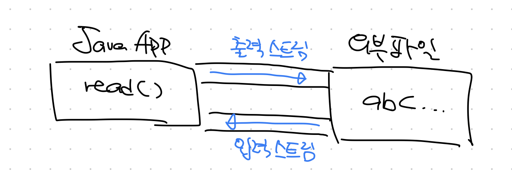
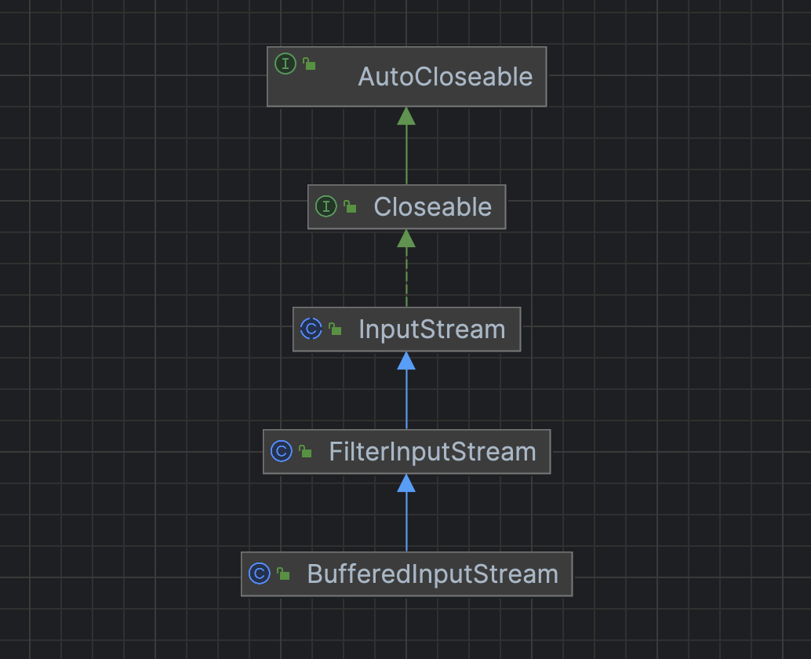
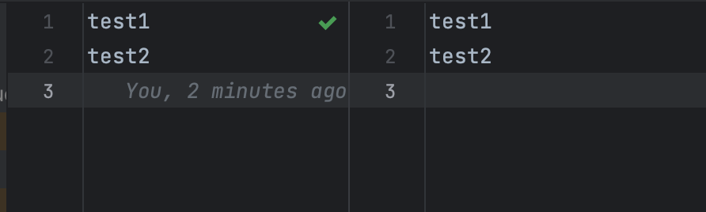

## 스트림 (Stream) / 버퍼 (Buffer) / 채널 (Channel) 기반의 I/O
### 스트림
자바에서는 어느 한 쪽에서 다른 쪽으로 데이터를 전달하기 위해서는 두 대상을 연결할 무언가가 필요한데, 이를 `스트림`이라 한다. 즉, 스트림은 데이터를 전송하는데 사용되는 **연결 통로** 의 역할을 하고 이를 통해 I/O가 이루어진다.

스트림은 단방향으로만 데이터를 전송할 수 있다. 따라서 입력과 출력을 동시에 처리하기 위해서는 아래와 같이 입력 스트림과 출력 스트림, 총 두 개의 스트림이 필요하다.


스트림은 먼저 보낸 데이터를 먼저 받게 되고, 중간에 건너뜀 없이 데이터를 전송한다. 즉, 큐와 같은 `FIFO` 구조로 이루어져있다.

### NIO (New I/O)
자바 1.4버전부터 추가된 API로 기존 스트림을 사용하는 I/O 방식과는 아래와 같은 차이점들이 있다. 

#### 1. 스트림과 채널
기존 IO는 스트림을 사용해 입출력을 처리하는데, NIO는 `채널`을 사용해 입출력을 처리한다. 채널은 스트림과 달리 양방향으로 입력과 출력이 가능하므로 각각 별도의 채널을 만들 필요 없이 하나의 채널로 처리가 가능하다.

#### 2. non-buffer vs buffer
`버퍼`는 byte, char, int 등 기본 데이터 타입을 저장할 수 있는 저장소이다. 입출력 시 버퍼를 사용하지 않는 경우 입력 / 출력 데이터를 무조건 즉시 처리해야 하기 때문에 데이터를 별도로 처리하기도 어렵고 버퍼를 사용할 때보다 많은 시스템 콜이 발생하기 떄문에 성능이 저하될 수 있다. (버퍼 사용 시 복수 개의 바이트를 한꺼번에 전달하는 것이 가능하다)

NIO에서는 기본적으로 입출력 시 버퍼를 사용하기 때문에 기본적으로는 버퍼를 사용하지 않는 스트림 기반의 IO보다 높은 성능을 가진다.

#### 3. blocking vs non-blocking
IO는 `read()`, `write()` 메서드 호출 시 해당 작업이 끝나기 전까지 Thread가 blocking(대기 상태)된다. IO Thread가 블러킹되면 스트림을 닫는 것만을 통해 blocking을 빠져나올 수 있다.

반면, NIO는 입출력 시 해당 작업이 완료되기를 무한정 기다리지 않고 작업을 수행할 준비(지금 당장 읽고 쓸 준비)가 된 채널만 선택해서 Thread가 처리하기 때문에 작업 Thread가 blocking 되지 않는다.

### 채널
NIO에서 사용되는 데이터 전송 통로, 쌍방향으로 데이터가 이동할 수 있다. 채널에서 데이터를 주고받을 때 `버퍼`가 사용된다.`SocketChannel`, `FileChannel` 등이 존재한다.

## InputStream과 OutputStream
### InputStream
**바이트 기반** 입력 스트림의 최상위 추상 클래스, 모든 바이트 기반 입력 스트림 클래스는 이 클래스를 상속받아 만들어진다.

| 메서드 | 설명 |
| :---: | :---: |
| int read() | 입력 스트림으로부터 1바이트를 읽어서 int로 반환 |
| int read(byte[] b) | 입력 스트림에서 여러 바이트를 배열 b에 저장하고 바이트의 길이를 반환한다. 만약 스트림의 `end`에 도달하여 읽기가 불가능하면 `-1` 반환 |
| close() | 스트림과 시스템 자원들을 닫고 반환 |

> 이외에도 `int readNBytes(byte[] b, int off, int len)`, `byte[] readAllBytes()` 등 여러 종류의 읽기 메서드가 제공된다.

`read()` 메소드의 반환 타입이 int인 이유는 바이트를 반환할 때 `0~255` 사이의 값으로 반환하고, 스트림의 마지막에 도달할 경우 `-1` 을 반환하도록 되어 있기 때문이다.

### OutputStream
**바이트 기반** 출력 스트림의 최상위 추상 클래스, 모든 바이트 기반 출력 스트림 클래스는 이 클래스를 상속받아 만들어진다.

| 메서드 | 설명 |
| :---: | :---: |
| void write(int b) | 1바이트 (b)를 출력 스트림에 쓴다 |
| void write(byte[] b) | `b.length` 길이의 바이트를 출력 스트림에 쓴다 |
| flush() | 버퍼에 잔류하는 모든 바이트를 출력 스트림에 쓴다 |
| close() | 스트림과 시스템 자원들을 닫고 반환 |

이떄, `flush()`는 버퍼를 사용하는 스트림에서만 의미있다. 기본적인 OutputStream에서는 아무런 동작을 하지 않는다. 기본적으로 스트림을 사용하는 IO는 버퍼를 통하지 않지만 **보조 스트림**을 통해 기능을 추가하면 가능하다.


## Byte와 Character 스트림
### Byte Stream
지금까지 살펴본 `XxxStream` 방식의 스트림들은 모두 Byte 기반 스트림이다. 이러한 스트림들은 데이터를 8비트(1바이트) 단위로 처리한다. 따라서 binary 데이터 즉, 이미지나 동영상 등을 입출력할 때 사용하면 좋다.
| 입출력 대상 | 입력 스트림 | 출력 스트림 |
| :---: | :---: | :---: |
| 파일 | FileInputStream | FileOutputStream |
| 바이트 배열 | ByteArrayInputStream | ByteArrayOutputStream |
| Pipe (Thread간의 데이터 전달) | PipedInputStream | PipedOutputStream |

### Character Stream
반면, `Character` 스트림은 데이터를 16비트(2바이트) 단위로 처리한다. 또한, 데이터를 유니코드로 읽어들인다. 따라서 text 데이터를 입출력할 때 사용하면 좋다. JSON, HTML 등을 송수신할 때 주로 사용된다고 한다.

클래스들의 이름은 대체로 Byte 기반 스트림에서 `Input/OutputStream`이 `Reader/Writer`로 바뀌도록 명명되어있다. 또한, 제공하는 메소드들도 바이트 기반 스트림과 거의 유사하다.
| 입출력 대상 | 입력 스트림 | 출력 스트림 |
| :---: | :---: | :---: |
| 파일 | FileReader | FileWriter |
| 바이트 배열 | CharArrayReader | CharArrayWriter |
| Pipe (Thread간의 데이터 전달) | PipedReader | PipedWriter |

## 보조 스트림
스트림의 기능을 보완하기 위해 보조 스트림이 제공된다. 보조 스트림은 실제로 데이터를 주고받는 기능은 없지만 주 스트림을 **감싸서** 해당 스트림에 기능을 더하거나 향상시킬 수 있다.

Byte과 Character 기반 스트림 모두에 보조 스트림이 제공된다. 각각 `FilterInput/OutputStream` 과 `FilterReader/Writer`를 상속받아 추가 기능을 수행하는 보조 스트림을 구현한다. `FilterXxx` 클래스는 단순히 `Input/OutputStream` 또는 `Reader/Writer`를 상속받아 상위 클래스의 메서드를 호출하도록 구현되어 있다.
```java
public abstract class FilterReader extends Reader {
    protected Reader in;

    protected FilterReader(Reader in) {
        super(in);
        this.in = in;
    }

    public int read() throws IOException {
        return in.read();
    }
    ...
}
```
  


#### 예시
아래의 예시는 버퍼를 사용하지 않는 `FileInputStream`을 `BufferedInputStream`으로 감싸서 버퍼를 사용하도록 하는 예제이다.
```java
FileInputStream fileInputStream = new FileInputStream("documents.csv");
BufferedInputStream bufferedInputStream = new BufferedInputStream(fileInputStream);

bufferedInputStream.read();
```
이때, 주 스트림을 감싸고 있는 보조 스트림을 통해 read() 메소드를 호출한다. 코드만 보면 보조 스트림이 읽기 작업을 수행할 것 처럼 보이지만 아래의 `BufferedInputStream` 코드를 통해 알 수 있듯 실제 읽기 기능은 주 스트림을 통해서 수행되고 보조 스트림은 일종의 Wrapper 클래스 처럼 기능을 추가/향상 하는 역할만 수행한다.
```java
private void fill() throws IOException {
    ...
    int n = getInIfOpen().read(buffer, pos, buffer.length - pos);
    ...
}

---

private InputStream getInIfOpen() throws IOException {
    InputStream input = in; // 생성자로 받은 InputStream
    if (input == null)
        throw new IOException("Stream closed");
    return input;
}
```

## 표준 스트림 (System.in, System.out, System.err)
표준 스트림은 콘솔을 통한 데이터 입력과 출력을 위한 스트림을 말한다. 자바에서는 아래와 같이 3가지 표준 스트림이 제공되며 `java.lang.System`에 `static` 멤버로 선언되어 있다.
```java
public final class System {
    ...
    // 콘솔로 부터 데이터를 입력받는데 사용
    public static final InputStream in = null;
    // 콘솔에 데이터를 출력하는데 사용
    public static final PrintStream out = null;
    // 콘솔에 데이터를 출력하는데 사용
    public static final PrintStream err = null;
    ...
}
```
지금껏 콘솔에 출력을 위해 사용했던 `System.out.println()` 에서 `System.out`이 바로 위의 `PrintStream` 객체이다.

`PrintSteram` 객체는 `FilterOutputStream`을 상속받는 보조 스트림의 일부로 생성자를 통해 별도의 스트림을 주입받는다.
```java
public class PrintStream extends FilterOutputStream implements Appendable, Closeable {
    ...
    private PrintStream(boolean autoFlush, OutputStream out) {
        super(out);
        ...
    }
    ...
}
```
 
그리고 다시 `System`의 `newPrintStream()` 메서드를 보면 실제로 `System`에서 사용하는 `PrintStream`은 `BufferedOutputStream`을 감싸고 있는 것을 알 수 있다.
```java
private static PrintStream newPrintStream(FileOutputStream fos, String enc) {
    if (enc != null) {
        try {
            return new PrintStream(new BufferedOutputStream(fos, 128), true, enc);
        } catch (UnsupportedEncodingException uee) {}
    }
    return new PrintStream(new BufferedOutputStream(fos, 128), true);
}
```
`out`과 `err` 모두 `PrintStream` 이지만 `out`은 표준 출력, `err`는 표준 에러를 출력하는데 사용된다. 오류 내용은 보다 정확하고 빠르게 출력되어야 하기 때문에 버퍼링을 지원하지 않는다고 한다(버퍼링 도중 프로그램이 종료되면 버퍼의 내용이 출력되지 않음).

### 표준 입출력 대상 변경
기본적으로는 콘솔을 대상으로 표준 입출력이 이루어지지만, 아래 메서드들을 사용하면 임의로 생성한 Stream으로 그 대상을 변경할 수 있다. 즉, `System.out.println()`의 대상을 파일 등으로 바꿀 수 있다.
| 메서드 | 설명 |
| :---: | :---: |
| static void setIn(InputStream in) | `System.in`을 인자 `in` 으로 변경 |
| static void setOut(PrintStream out) | `System.out`을 인자 `out` 으로 변경 |
| static void setErr(PrintStream err) | `System.err`을 인자 `err` 으로 변경 |

## 파일 읽고 쓰기
텍스트 파일은 `Character Stream`을(성능상 이점), 바이너리 파일은 `Byte Stream`을 사용하면 된다. 추가적으로 성능을 높이기 위해 `Buffered` 계열의 보조 스트림으로 주 스트림을 감싸서 버퍼를 사용하도록 하는 것이 좋다.

### 텍스트 파일 예시
```java
try (BufferedReader reader = new BufferedReader(new FileReader("input.txt"));
     BufferedWriter writer = new BufferedWriter(new FileWriter("output.txt"))) {

    String line;

    while ((line = reader.readLine()) != null) {
        writer.write(line + "\n");
    }

} catch (IOException e) {
    throw new RuntimeException(e);
}
```
좌측이 `input.txt`, 우측이 `output.txt`.
  

### 이진 파일 예시
```java
try (BufferedInputStream inputStream = new BufferedInputStream(new FileInputStream("inputFile.jpg"));
     BufferedOutputStream outputStream = new BufferedOutputStream(new FileOutputStream("outputFile.jpg"))) {

    byte[] buffer = new byte[16384];

    while (inputStream.read(buffer) != -1) {
        outputStream.write(buffer);
    }
} catch (IOException e) {
    throw new RuntimeException(e);
}
```

## 참고 자료
* https://bingbingpa.github.io/whiteship-live-study-week13/
* https://www.notion.so/I-O-af9b3036338c43a8bf9fa6a521cda242
* https://www.tutorialspoint.com/Character-Stream-vs-Byte-Stream-in-Java
* https://jenkov.com/tutorials/java-io/filterinputstream.html