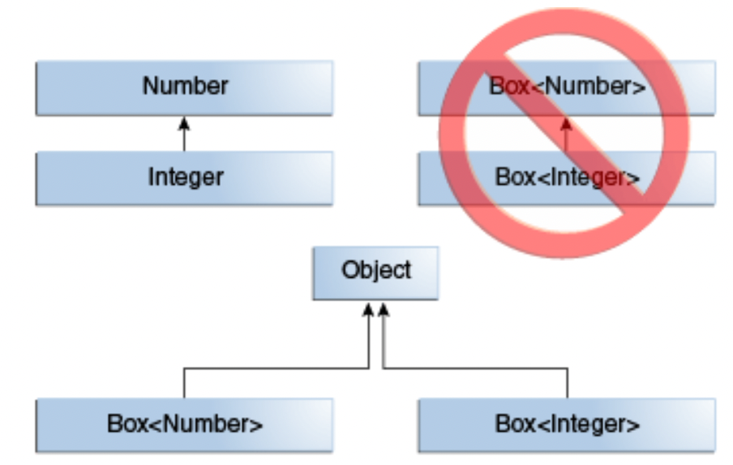
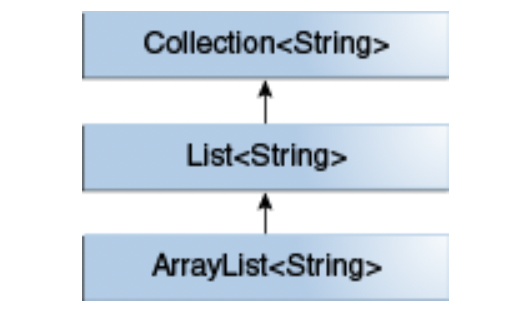
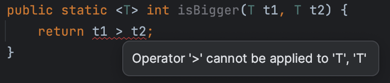
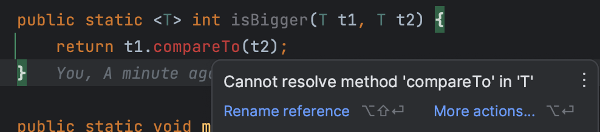
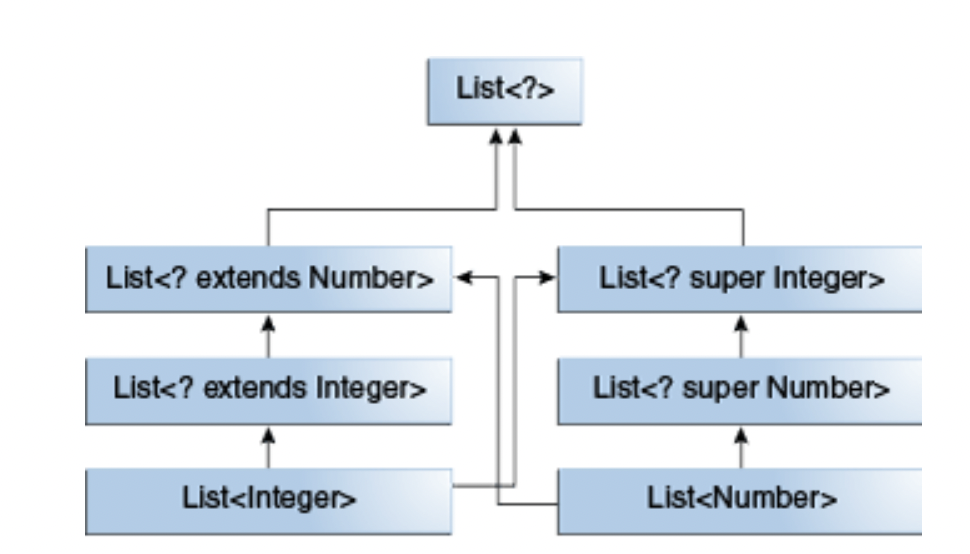
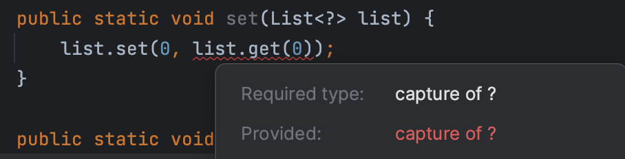
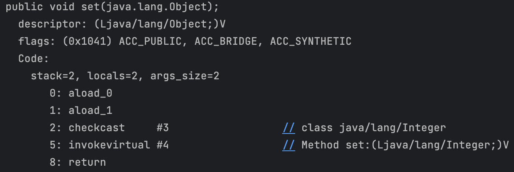

## 제네릭이란

JDK 1.5에서 처음 도입된 기능으로 **클래스 내부에서 사용할 데이터 타입을 외부에서 지정하는 기술**을 말한다. 자바에서 리스트를 사용할 때 `< >` 로 타입을 지정했던 것이 바로 **제네릭**이다.
```java
public interface List<E> extends Collection<E> {
    ...
}

---

List<String> list = new ArrayList<>(); // 사용 예시
```

### 제네릭의 필요성 (사용 이유)

#### 1. 컴파일 타임의 타입 안전성

제네릭으로 타입을 지정하면 자바 컴파일러가 **컴파일 타임**에 강력하게 타입을 체크해서 이상이 있을 경우 오류를 발생시켜준다. 컴파일 오류는 **런타임에 발생하는 오류보다 훨씬 안전**하다.

#### 2. 불필요한 형 변환 삭제

제네릭이 없는 List를 사용하는 아래와 같은 코드가 있다고 해보자.
```java
List list = new ArrayList();
list.add("gmelon");

// String name = list.get(0); // 컴파일 오류
String name = (String) list.get(0); // 형 변환 필요
```
위 코드에서 사용하는 List에 제네릭이 적용되어 있다면 아래처럼 형 변환없이 원소를 가져올 수 있다.
```java
List<String> list = new ArrayList<>();
list.add("gmelon");

String name = list.get(0);
```

#### 3. 코드의 재사용성

처음에 가져온 List 콜렉션 코드처럼 제네릭으로 원소의 타입을 **외부에서 지정** 할 수 있게 함으로써 하나의 클래스가 여러 가지 원소에 대응되도록 할 수 있다.

## 제네릭 사용법

### 클래스에 제네릭 선언하기

아래와 같이 `Object object`를 저장하는 클래스 `Box`가 있다고 하자.

```java
public class Box {
    private Object object;
    
    public void set(Object object) {
        this.object = object;
    }
    
	public Object get() {
        return object;
    }
}
```

위 클래스에서 `object`가 `Object`타입으로 선언되어 있기 때문에 모든 종류의 객체를 저장하고 전달할 수 있다. 하지만, 이러한 방식을 사용하게 되면 컴파일 타임에는 `object`에 실제로 어떤 타입이 들어올지 예측할 수가 없다. 따라서 값을 사용할 때 항상 캐스팅을 해주어야 컴파일 오류를 피할 수 있으며 실수로 다른 타입을 전달했을 때 컴파일러에게 타입 검증을 지원받을 수 없다.

예를 들어 아래와 같은 문제가 발생할 수 있다.

```java
Box box = new Box();
box.set("gmelon");

Integer number = (Integer) box.get(); // Runtime Error (ClassCastException)
```

위 `Box` 클래스에 제네릭을 사용하면 이러한 문제를 해결하고 컴파일 타임에 타입을 검증받을 수 있다. 클래스에 제네릭은 아래와 같이 선언할 수 있다. `T1, T2, ..., Tn`은 `type parameters` (타입 변수) 또는 `type variables` 라고 불린다. type parameter에는 **원시 타입**이 아닌 클래스, 인터페이스, 배열, 심지어 다른 type paramter 등이 올 수 있다.

```java
class 클래스이름 <T1, T2, ..., Tn> {
	...
}
```

이를 이용해 `Box` 클래스를 다시 작성하면 아래와 같다.

```java
public class Box<T> {
    private T t;
    
    public void set(T t) {
		this.t = t;
    }
    
	public T get() {
        return t;
    }
}
```

새롭게 만들어진 `Box` 클래스는 아래와 같이 사용할 수 있다. 이제 `set()` 메서드의 인자 타입이 `T -> Integer` 로 고정되었기 때문에 그 외의 타입을 전달하려고 하면 **컴파일 에러** 가 발생하므로 더 안전하게 코드를 사용할 수 있다. Integer외에 String 등으로 `T` 를 변경하여 `Box` 클래스를 재사용할 수 있다는 점도 장점이 된다.

```java
Box<Integer> integerBox = new Box<>();
// integerBox.set("gmelon"); // Compile Error (Integer <-> String)
integerBox.set(1);

Integer integer = integerBox.get(); // 1
```

이때, 원래는 `Box<Integer> integerBox = new Box<Integer>()` 와 같이 `new` 이후에 생성자를 호출할 때도 `< >` 안에 타입을 적어주어야 했지만 자바 7이후로 컴파일러가 타입을 추론할 수 있을 경우에는 위 코드 예시처럼 생략할 수 있게 되었다.

### Type Parameter 네이밍 컨벤션

type parameter는 대문자 && 한글자로 작성하는 것이 컨벤션이다. 일반적인 클래스나 인터페이스 등과 확연히 구분되도록 하기 위해 이런 컨벤션이 만들어졌다고 한다.

주로 사용되는 컨벤션은 아래와 같다.

*   E - Element
*   K - Key
*   V - Value
*   N - Number
*   T - Type
*   S, U, V, etc. - 2nd, 3rd, 4th types

### Type Parameter & Type Argument

많은 개발자들이 두 용어를 섞어서 사용하고 있지만 둘은 다르다고 한다. 제네릭을 사용해 클래스를 정의할 때 선언하는 `T` 가 `Type Parameter` 이고(`public class Box<T>` 에서 `T`), 실제로 사용할 때 건네주는 실제 타입(`Box<Integer> integerBox`에서 `Integer`)이 `Type Argument` 라고 한다.

### 다중 Type Parameters

하나의 클래스를 두 개 이상의 Type Parameter를 사용해 정의할 수도 있다. 자바 컬렉션의 Map 같은 경우도 그렇게 정의되어 있다.

```java
public interface Map<K, V> {
    ...
    V get(Object key);
    ...
    V put(K key, V value);
    ...
    V remove(Object key);
    ...
}
```

`K` 와 `V` 가 각각 다른 타입으로 인식되어 아래와 같이 사용할 수 있다.

```java
Map<Integer, String> map = new HashMap<>();
map.put(0, "gmelon"); // K = Integer, V = String

String str = map.get(0); // "gmelon"
```

### Parameterized Types

`K`와 `V` 같은 type parameter는 `Parameterized Types` (`List<String>` 과 같은) 로도 사용가능하다. 즉, 아래와 같이 할 수 있다.

```java
Map<Integer, Map<Integer, String>> map = new HashMap<>();
```

## 제네릭 메소드 만들기

제네릭 메소드는 **자체적으로 type parameters를 갖는 메소드**를 말한다. 메서드에서 선언된 type parameters의 scope는 해당 메서드로 제한된다.

static, non-static, 생성자에서 사용가능하며 아래와 같이 타입 앞에 `< >` 를 사용해 선언할 수 있다.

```java
public class Box {
	public <K, V> boolean compare(K k, V v) {
        return k.equals(v);
    }
    
    public <U> Box() {
        // 생성자
    }
}
```

제네릭 메서드도 클래스와 동일하게 사용하면 된다.

```java
Box box = new Box();
box.<Integer, Integer>compare(1, 1); // true
```

그리고 마찬가지로 `< >` 내의 값들도 전달하는 인자를 통해 추론할 수 있는 경우 생략할 수 있다.

```java
box.compare(1, 1); // true
```

### 타입 추론

자바 컴파일러가 제공하는 기능으로 메서드 선언부와 호출 코드의 타입을 비교하여 적합한지 등을 확인한다. 제네릭에서는 타입 추론 덕분에 앞서 말했던 것과 같이 컴파일러에 의해 타입이 추론 가능할 경우 `< >` 에 타입을 명시하지 않고도 type arguments를 전달한 것과 같은 효과를 낼 수 있다.

## 제네릭의 상속

제네릭을 사용한 클래스, 인터페이스에서는 Type Argument가 상속 관계에 있어도 타입을 **사용한** 클래스, 인터페이스는 상속관계가 되지 않는다. 생각해보면 당연한데 착각하기 쉬운 개념인 것 같다.

예를 들어, `Number`는 `Integer`의 상위 타입이다. 따라서 아래와 같은 코드가 가능하다.

```java
Number number = new Integer(10);
```

또한, 아래와 같이 메서드를 호출하는 것도 물론 가능하다.

```java
public void methodA(Number number) {...}

---
    
methodA(new Integer(10));
```

그렇다면 아래와 같은 `Box` 클래스가 있다고 해보자.

```java
public class Box<T> {
    ...
}
```

아래와 같은 코드는 가능할까?? 정답은 가능하지 않다.

```java
// Box<Number> box = new Box<Integer>(); // 컴파일 오류
```

`Number`와 `Integer`가 상속 관계에 있더라도 이를 Type Argument로 갖는 제네릭 클래스는 상속 관계에 있지 않다. 물론 두 클래스 모두 `Object` 의 하위 클래스이기는 하다.



[출처 - https://docs.oracle.com/javase/tutorial/java/generics/inheritance.html]

다만, 제네릭 클래스 자체가 상속 관계에 있고, **Type Argument가 동일한 경우에만** 아래와 같이 상속 관계가 성립한다. 자바 컬렉션의 List와 ArrayList를 그 예시로 들 수 있다.



[출처 - https://docs.oracle.com/javase/tutorial/java/generics/inheritance.html]

만약 상위 클래스가 하나의 Type Parameter를 갖고 그 클래스를 상속 받는 클래스가 두 개 이상의 Type Parameter를 갖는 경우 상위 클래스의 Type Parameter와 대응되는 하위 클래스의 Type Parameter가 같은 타입으로 호출된다면 이때도 상속관계가 유지된다. 즉, 아래 코드와 같다.

```java
public class MyList<E, P> implements List<E> {
    ...
}

List<String> list1 = new MyList<String, String>();
List<String> list2 = new MyList<String, Integer>(); // 가능
List<String> list3 = new MyList<String, Map<String, Integer>>(); // 가능

// List<String> list3 = new MyList<Integer, String>(); // 컴파일 오류
```


## 바운디드 타입

### 용도

전달되는 type arguments를 특정 클래스(인터페이스) 또는 그의 subclasses로 제한하고 싶을 때 사용한다. 아래 예시와 같이 `extends` 를 사용해 `upper bound`를 정의할 수 있다. (바운디드 타입을 정의할 때의 `extends`는 클래스와 인터페이스에서의 `extends`와 유사한 의미로 사용된다고 볼 수 있다)

### 사용법

```java
public class Box<T extends Number> {
    private T t;
    
    public void set (T t) {
        this.t = t;
    }

    public T get() {
        return t;
    }
}
```

아래와 같이 동일하게 사용할 수 있는데, `Number`를 상속받는 `Integer`는 문제가 발생하지 않지만, `Number`를 상속받지 않는 `String` 으로 type argument를 건네면 컴파일 오류가 발생하는 것을 확인할 수 있다.

```java
Box<Integer> integerBox = new Box<>();
// Box<String> stringBox = new Box<>(); // compile error
```

### 바운디드 타입의 메서드 사용

바운디드 타입으로 upper bound 클래스를 정의하면 해당 Type Parameter는 bound 클래스 하위의 클래스라는 것이 보장되기 때문에 bound 클래스의 메서드를 사용할 수 있다.

```java
public class Box<T extends Number> {
    ...
	public int intValue() {
        // intValue()는 Number의 메소드
        return t.intValue();
    }
}
```

### Multiple Bounds

Type Paremeter에게 여러 upper bound를 지정할 수도 있다. 클래스와 인터페이스 모두 가능하다.

```java
<T extends B1 & B2 & B3>
```

이 경우, T로 전달되는 Type Argument는 B1, B2, B3 **모두를** 상속하는 클래스여야만 가능하다. 두 개 이상의 클래스는 지정이 불가능하며 클래스가 포함될 경우 맨 앞에 작성해야 한다. (아니면 컴파일 오류 발생)

### 제네릭 메서드에서의 활용

바운디드 타입은 재사용 가능한 알고리즘을 제공하는 메서드를 구현하는데 필수적인 개념이다. 예를 들어 아래와 같이 대소를 비교하는 메서드가 있다고 해보자.

```java
public static <T> int compare(T t1, T t2) {
    return t1 > t2;
}
```

위 코드는 문제가 없어보이지만 실제로는 컴파일 에러가 발생한다.



`>` 연산자는 원시 타입에만 적용가능하기 때문인데, 이를 해결하려면 t1과 t2를 `compareTo()` 와 같은 메서드로 비교해야 한다. 위와 같은 상태에서는 T가 어떤 타입인지에 대한 정보가 아무것도 없으므로 비교 메서드를 사용할 수 없다.



이때, 앞서 말했듯 바운디드 타입으로 upper bound를 지정하면 해당 bound 클래스에서 사용 가능한 메서드를 type paremeter에도 적용할 수 있는데 이를 활용해 비교 메서드를 적용할 수 있다.

```java
// compareTo() 메서드를 제공하는 Comparable 인터페이스
public interface Comparable<T> {
    public int compareTo(T o);
}
```

아래와 같이 `Comparable` 인터페이스를 상속받는 클래스만 가능하도록 바운디드 타입을 설정한다.

```java
public static <T extends Comparable<T>> int compare(T t1, T t2) {
    return t1.compareTo(t2);
}
```

이제 컴파일 오류 없이 메서드를 사용할 수 있다.

## 와일드카드

자바 제네릭에서 와일드 카드는 물음표 기호 `?` 로 표기하며 `unknown type`을 의미한다. 와일드 카드는 여러가지로 다양하게 활용될 수 있다. 그 활용들에 대해서 아래에 정리해봤다. 와일드 카드는 타입 선언 시에는 사용이 불가능하고, 타입을 사용할 때만 사용할 수 있다. (``class 클래스<? super Xxx>`, `class 클래스<? extends Xxx>` 등은 불가능`)

### Upper Bounded Wildcards

>   Upper Bound 된 와일드 카드. 즉, <? extends T> 형태를 말한다.

먼저, **변수를 느슨하게 사용**하기 위해 와일드 카드가 사용될 수 있다. 예를 들어 `List`를 인자로 받는 메서드를 작성하려고 할 때 해당 메서드가 `List<Double>`, `List<Integer>`, `List<Number>`을 인자로 호출될 수 있다고 하자. Type Argument 없이 `List`를 그대로 사용하는 것은 적절하지 않으므로 Arguments를 전달하긴 해야 하는데, 이 중 가장 상위 타입인 `Number`로 인자를 선언한다고 하여 하위 타입을 Type Argument로 받는 리스트들이 모두 허용되지는 않는다. 즉 아래 코드와 같은 상황이 발생한다.

```java
public static void process(List<Number> list) {
    ...
}

---

List<Integer> integerList = new ArrayList<>();
// process(integerList); // 컴파일 오류
```

이때 와일드 카드를 사용하면 적절히 upper bound를 지정하면서도 하위 클래스들은 모두 허용되도록 지정하는 것이 가능하다. 바운디드 타입을 선언할 때와 같이 `extends` 키워드를 사용하면 된다.

```java
public static void process(List<? extends Number> list) {
    ...
}

---

List<Integer> integerList = new ArrayList<>();
process(integerList); // 가능

List<Double> doubleList = new ArrayList<>();
process(doubleList); // 가능

List<Number> numberList = new ArrayList<>();
process(numberList); // 가능
```

또한, 리스트의 원소가 `Number` 클래스 하위로 정해지기 때문에 이것도 마찬가지로 바운디드 타입 때와 같이 리스트의 원소들로 `Number` 의 메서드를 호출할 수 있다. 즉, 아래와 같은 코드가 가능하다.

```java
public static double process(List<? extends Number> list) {
    double sum = 0.0;
	for (Number number : list) {
        // doubleValue() 는 Number의 메서드
        sum += number.doubleValue();
    }
    return sum;
}
```

아래와 같이 `Integer`과 `Double` 각각에 정상적으로 동작하는 것을 확인할 수 있다.

```java
process(List.of(1, 2, 3)); // 6.0
process(List.of(1.0, 2.0, 3.0)); // 6.0
```

### Unbounded Wildcards

말그대로 bound 되지 않는 와일드 카드이다. `List.size()` 나 `List.clear()` 과 같이 특정 타입에 종속적이지 않은 로직을 수행할 때 유용하게 사용할 수 있다. 모든 클래스 `A`에 대하여 `List<A>`는 `List<?>`의 하위 타입이된다. ( Object의 경우 - `List<String>`가 `List<Object>`의 하위 클래스가 되지는 않는다)

```java
public static int listSize(List<?> list) {
    return list.size();
}

---
    
listSize(List.of(1, 2, 3, 4, 5)); // 5
listSize(List.of("gmelon", "hyun")); // 2
```

이때, `?`로 Type Argument를 건네면 해당 값에는 `null` 만이 대입될 수 있다고 한다. 따라서, `List<Object>` 에는 `Object`나 하위 클래스들을 넣을 수 있지만 `List<?>` 에는 오직 `null`만이 대입될 수 있다. 즉, `Object`과 `?`은 다른 개념이다.

### Lower Bounded Wildcards

`Upper Bounded` 와일드 카드와 반대로, `Lower Bounded` 와일드카드는 Type Parameter가 특정 타입이거나 해당 타입보다 상위(`super`) 타입이 되도록 강제한다. `Lower Bounded`는 `super` 키워드로 선언할 수 있다.

>   단, Upper Bounded와 Lower Bounded를 동시에 선언할 수는 없다

예를 들어 `Integer` 리스트를 받아 해당 리스트에 값을 추가하는 메서드를 만들고자 할 때, `List<Object>`, `List<Number>` 모두 `Integer` 원소를 가질 수 있으므로 유연한 메서드 구현을 위해 정확히 `List<Integer>`만 인자로 받기 보다는 앞서 말한 리스트까지 인자로 받게 하고 싶을 수 있다.

그러나 아래와 같이 작성하면 정확히 `List<Integer>`만 인자로 받고,  `List<Object>`, `List<Number>` 등은 인자로 받지 못한다.

```java
public static void add(List<Integer> list) {
	for(int i = 0 ; i < 10 ; i++) {
        list.add(i);
    }
}

---

List<Integer> integerList = new ArrayList<>();
add(integerList); // 가능

List<Number> numberList = new ArrayList<>();
// add(numberList); // 컴파일 오류
```

이때 리스트를 `List<? super Integer>` 과 같이 선언하면 아래와 같이 `Integer` 과 그 상위클래스들을 원소가 갖는 리스트들이 모두 `add()` 의 인자로 전달될 수 있다.

```java
public static void add(List<? super Integer> list) {
    for(int i = 0 ; i < 10 ; i++) {
        list.add(i);
    }
}

---

List<Integer> integerList = new ArrayList<>();
add(integerList); // 가능

List<Number> numberList = new ArrayList<>();
add(numberList); // 가능

List<Object> objectList = new ArrayList<>();
add(objectList); // 가능
```

### Wildcards and Subtyping

`Unbounded Wildcards` 에서 봤었던 것처럼, `List<?>`는 `List<아무클래스>`의 상위 클래스가 된다. 이는 와일드 카드를 통해 제네릭 클래스 / 인터페이스에 관계를 맺어주는 방법이다.

예를 들어 아래와 같이 `Box` 클래스가 있다고 하자.

```java
public class Box<T> {
    
}
```

와일드 카드를 쓰면 아래와 같은 상속 관계를 맺는 것이 가능하다.

```java
Box<?> box1 = new Box<Object>();
Box<? extends Number> box2 = new Box<Number>();
Box<? extends Number> box3 = new Box<Integer>();

Box<? super Integer> box4 = new Box<Number>();
Box<? super Number> box5 = new Box<Number>();
```

자바 컬렉션의 리스트를 예시로 들면, 아래와 같은 관계 맺기가 가능하다.



[출처 - https://docs.oracle.com/javase/tutorial/java/generics/subtyping.html]

>   와일드 카드를 사용하지 않으면 `List<Number>`는 `List<Integer>`의 상위 클래스가 아님에 주의해야 한다.
>   [[참고 - 제네릭의 상속](#제네릭의 상속)]

### Wildcard Capture

`Wildcard Capture`은 일반적인 상황에서는 고려할 필요가 없지만, `capture of` 라는 메시지가 포함된 **오류 메시지**를 마주했을 때 알아두면 좋은 개념이다.

예시를 보자. 아래와 같은 코드는 **컴파일 오류**를 발생시킨다.

```java
public class WildcardError {
    public static void set(List<?> list) {
        list.set(0, list.get(0));
    }
}
```

오류 메시지를 보면 이해하기 어렵게 `capture of ?` 라고만 되어 있다.



`javac`로 컴파일 메시지를 자세하게 확인해보자.

```bash
❯ javac -Xdiags:verbose ./WildcardError.java
./WildcardError.java:7: error: method set in interface List<E> cannot be applied to given types;
        list.set(0, list.get(0));
            ^
  required: int,CAP#1
  found: int,CAP#2
  reason: argument mismatch; Object cannot be converted to CAP#1
  where E is a type-variable:
    E extends Object declared in interface List
  where CAP#1,CAP#2 are fresh type-variables:
    CAP#1 extends Object from capture of ?
    CAP#2 extends Object from capture of ?
1 error
```

메시지를 보면 `Object` 가 `CAP#1`로 변환될 수 없기 때문에 오류가 발생하는 것 같다. 오라클 문서에 따르면 컴파일러는 `list` 의 원소를 `Object`로 취급한다. 근데 `List<?>`에 `Object` 타입이 삽입될 수 없기 때문에 이러한 오류가 발생하는 것 같다.

이러한 오류는 내부적으로 또 다른 `private` 메소드를 호출하도록 하여 해결할 수 있다.

```java
public class WildcardError {
    public static void set(List<?> list) {
        setHelper(list);
    }

    private static <T> void setHelper(List<T> list) {
        list.set(0, list.get(0));
    }
}
```

`T` 라는 Type Parameter를 갖는 `setHelper`를 사용함으로써 컴파일러는 `CAP#1`의 타입이 `T` 임을 명시적으로 추론할 수 있고, 때문에 컴파일 오류가 발생하지 않는다.

>   와일드 카드를 사용한 메서드를 작성하면서 타입에 의존적인 로직을 구현할 때 참고하면 좋은 내용인 것 같다.

### 🔄 Wildcard 사용 가이드라인

마지막으로, 언제 `upper bounded(extends)`를 사용하고 언제 `lower bounded(super)`를 사용하면 좋을지에 대한 가이드라인이다.

오라클 가이드는 먼저 가이드라인의 이해를 위해 `In` 과 `Out`변수에 대해 정의하고 있다. In, Out 변수의 개념을 고려해 어떤 종류의 bounded wildcard 를 사용할지 결정할 수 있다.

*   In 변수 - code에 data를 전달하는 변수. (ex. `copy(src, dest)` 에서 `src`)
*   Out 변수 - 다른 곳에서 사용될 data를 들고 있는 변수. (ex. `copy(src, dest)`에서 `dest`)
*   어떤 변수는 In, Out 모두의 역할로 사용될 수도 있다.

#### 가이드 라인

*   In 변수는 `extends` 키워드를 사용해 `upper bounded`로 선언하라
*   Out 변수는 `super` 키워드를 사용해 `lower bounded`로 선언하라
*   만약 In 변수가 `Object` 클래스의 메서드를 호출하는데 사용된다면 `unbounded wildcard`를 사용하라
*   코드가 변수를 In, Out 둘 다의 역할로 사용하고자 한다면, 와일드카드를 사용하지 마라

>   가이드 라인 부분은 아직 와일드카드를 사용해 메서드를 개발해본 경험이 없어서 잘 와닿지 않는 것 같다. 나중에 경험이 쌓이면 다시 읽어보려고 한다.

## Erasure

`제네릭`은 자바에 더 강력한 컴파일 타임 타입 체크와 제네릭한 프로그래밍을 지원하기 위해 도입되었다. 기존 레거시 API와의 호환성을 유지하면서 제네릭을 도입하기 위해 컴파일러는 `type erasure` 라는 것을 적용한다. (과거 자바 버전으로 컴파일 되도록 하기 위해)

Type Erasure는

1.   제네릭 타입의 Type Parameter를 상하한이 있는 경우 해당 타입으로, 없는 경우 Object로 변경한다. 따라서 생성된 바이트 코드에는 일반적인 클래스, 인터페이스, 메서드만 포함된다.
2.   타입 캐스팅이 필요한 경우 추가해준다.
3.   제네릭 타입을 상속받은 클래스에서 다형성 유지를 위해 `브리지 메서드`를 생성할 수도 있다.

구체적으로 어떤 일들을 하게 되는지 하나씩 살펴보았다.

### Erasure of Generic Types

자바 컴파일러는 `erasure process`를 통해 모든 Type Parameter를 제거하고 첫번째로 매칭되는 실제 클래스로 이를 대체해준다. 만약, unbounded로 작성된 경우 Object로 대체한다.

예를 들어 아래와 같은 `Box<T>` 클래스는

```java
public class Box<T> {
    private T t;

    public T get() {
        return t;
    }

    public void set(T t) {
        this.t = t;
    }
}
```

`T` 가 unbounded 이므로 `Object`로 대체되어 바이트 코드 상에는 아래와 같이 표현된다.

```java
public class Box {
    private Object t;

    public Object get() {
        return t;
    }

    public void set(Object t) {
        this.t = t;
    }
}
```

만약 `bounded type parameter`인 경우 컴파일을 거치면 아래와 같이 변환된다.

```java
public class Box<T extends SomeClass<T>> {
    private T t;

    public T get() {
        return t;
    }

    public void set(T t) {
        this.t = t;
    }
    
    ...
}
```

```java
public class Box {
    private SomeClass t;

    public SomeClass get() {
        return t;
    }

    public void set(SomeClass t) {
        this.t = t;
    }
    
    ...
}
```

### Erasure of Generic Methods

이는 메서드에서도 동일하게 적용된다.

```java
public static <T> int count(T[] array, T target) {
    int count = 0;
    for (T element : array) {
        if (element.equals(target)) {
            count += 1;
        }
    }
    return count;
}
```

위 메서드는 unbounded 이므로 Object로 변환되고,

```java
public static int count(Object[] array, Object target) {
    int count = 0;
    for (Object element : array) {
        if (element.equals(target)) {
            count += 1;
        }
    }
    return count;
}
```

아래와 같이 bounded는,

```java
public static <T extends Shape> void draw(T shape) {...}
```

해당 타입 (`T -> Shape`)으로 변경된다.

```java
public static void draw(Shape shape) {...}
```

>   컴파일러가 이러한 동작을 수행하는 이유는, 자바 1.5 버전 이전까지의 모든 API들은 제네릭이라는 개념이 없었기 때문에 해당 버전으로 코드를 컴파일하더라도 문제없이 코드가 동작할 수 있게 하기 위함이다.
>
>   즉, 최신 컴파일러는 제네릭으로 쓰여진 코드를 보고, 컴파일 타임에 타입 체크를 수행한 후 문제가 없으면 제네릭을 지우고 동작하도록 한다. 이를 통해 코드를 재사용할 수 있는 등 제네릭의 장점은 취하면서 이전 자바 코드와도 호환이 되도록 했다고 생각한다.

### Bridge Method

제네릭 클래스를 상속받거나, 제네릭 인터페이스를 구현하는 클래스 & 인터페이스를 컴파일할 때 컴파일러는 타입 Erasure의 프로세스로 **브리지 메서드** 를 생성할 수도 있다. 개발자가 이 개념을 알고 사용할 일은 없지만 Exception이 터졌을 때 이 메서드에 대한 정보가 표시된다면 어디서 발생한 문제인지 파악하는데 도움을 받을 수 있을 것 같다.

먼저 아래와 같이 `Box` 와 이를 상속받는 `IntegerBox`가 있다고 해보자.

```java
public class Box<T> {
    private T t;
    
    public T get() {
        return t;
    }
    
    public void set(T t) {
        this.t = t;
    }
}
```

```java
public class IntegerBox extends Box<Integer> {
    public void set(Integer t) {
        super.set(t);
    }
}
```

이 두 클래스는 아래와 같이 Erasure 과정을 거쳐 타입 변수가 사라지면서 컴파일 된다.

```java
public class Box {
    private Object t;
    
    public Object get() {
        return t;
    }
    
    public void set(Object t) {
        this.t = t;
    }
}
```

```java
public class IntegerBox extends Box {
    public void set(Integer t) {
        super.set(t);
    }
}
```

위 코드에서 확인할 수 있듯 Erasure 과정을 거치면서 별도의 작업을 해주지 않으면 부모 클래스인 `Box`의 `set()` 메서드와 `IntegerBox`의 `set()` 메서드의 시그니쳐가 달라져 오버라이딩이 아닌 **오버로딩** 이 되어버려 자바의 다형성 (다이나믹 디스패치) 효과를 적용받을 수 없다.

이러한 문제를 해결하기 위해 자바 컴파일러는 자동으로 부모 클래스의 메서드를 오버라이딩하면서 내부적으론 자신의 오버로딩된 메서드를 호출해주는 브리지 메서드를 만들어준다.



위 코드를 보면 `set()` 메서드가 Object를 받아 (오버라이딩) Integer로 casting을 한 후에 다시 Integer를 인자로 받는 자신의 메서드를 호출하는 것을 알 수 있다. 이후, 해당 메서드가 부모 클래스의 메서드를 호출하게 된다. 즉, 컴파일러에 의해 대략 아래와 같은 메서드가 만들어진다.

```java
public void set(Object t) {
    set((Integer) t);
}
```

## 제네릭을 사용할 때의 주의사항 & 특이점들

### static 변수에서 사용 불가

타입 변수는 아래와 같이 사용할 수 없다.

```java
public class MyClass<T> {
    public static T t;
}
```

왜냐하면 static 변수는 해당 클래스의 모든 인스턴스에서 공유되기 때문에 아래와 같은 상황에서 `T` 가 어떤 타입이어야 하는지 (`ClassA`? `ClassB`? `ClassC`?)모호해지는 문제가 발생하기 때문이다.

```java
MyClass<ClassA>.t;
MyClass<ClassB>.t;
MyClass<ClassC>.t;
```

### 타입 변수로 인스턴스 생성 불가

즉 아래와 같이 할 수 없다.

```java
E elem = new E();
```

이를 가능하게 하려면 같이 형변환을 사용해야한다. (unchecked type casting 경고가 발생하긴 한다)

```java
T t = (T) new Object();
```

타입 변수는 그 자체로는 클래스(타입)가 아니다. 컴파일 전까지는 그저 'placeholder' 로의 역할을 수행한다. 따라서 어떤 타입인지 모르는 상태에서 `new` 키워드로 인스턴스를 생성할 수는 없다.


## 피드백

*   런타임에 제네릭 타입 정보를 알아내는 방법

    *   Erasure가 컴파일 시 제네릭을 지우지만, 메타데이터에는 type arguments 정보가 남는다

    ```java
    public class GenericDao<E extends Entity<K>, K> {
    	private Class<E> entityClass;
        
        public GenericDao() {
            this.entityClass = (Class<E>) ((ParameterizedType) this.getClass().getGenericSuperclass().getActualTypeArguments()[0]);
        }
        ...
    }
    
    ---
        
    
    // 아래와 같이 직접 상속을 받아 클래스를 별도로 만든 경우에만 가능하다
    // GenericDao<Apple, Integer> dao = new GenericDao<>(); 로 사용하는 경우에는 불가
    // (상속을 통해 부모 클래스의 정보를 가져와서 정의하는 방식이기 때문)
    public class AppleDao extends GenericDao<Apple, Integer> {
        
    }
    
    
    ---
        
        
    AppleDao appleDao = new AppleDao();
    appleDao.getEntityClass(); // class Apple
    ```

## 질문 & 추가 정리

1.   `?`는 `Object`의 상위 타입인가?
     1.   `?`에 null만 대입된다는게 뭘 의미하는건지?
2.   `Dao` Generic하게 만드는 것 실습, 정리하기
4.   RawType에 대해 정리

## 참고 자료

* https://docs.oracle.com/javase/tutorial/java/generics/index.html
* https://tecoble.techcourse.co.kr/post/2020-11-09-generics-basic/
* https://www.youtube.com/watch?v=EzZHrzA729w&list=PLfI752FpVCS96fSsQe2E3HzYTgdmbz6LU&index=25&ab_channel=%EB%B0%B1%EA%B8%B0%EC%84%A0
* https://rockintuna.tistory.com/102#type-erasure
* https://blog.naver.com/hsm622/222251602836