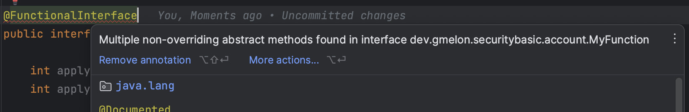
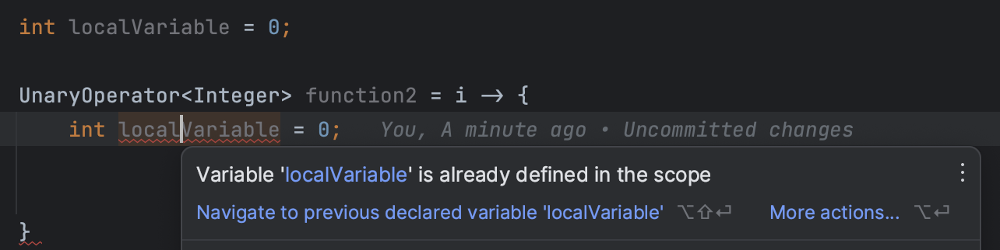

## 람다식이란

람다식은 자바 8에서 추가된 문법으로 자바에서 함수형 프로그래밍을 지원하기 위해 도입되었다. 

### 람다식

람다식은 메서드를 하나의 식 (Expression) 으로 표현한 것으로, 아래와 같이 작성된다.

```java
// 기존 메서드
int sum(int a, int b) {
    return a + b;
}

// 람다식
(a, b) -> a + b
```

위 코드에서 볼 수 있듯 람다식으로 메서드를 작성하면 이름이 사라지기 때문에 **익명 함수** 라고 부른다. 람다식을 사용하면 기존에 메서드를 작성하기 위해 클래스를 만들고, 메서드 시그니처를 작성하는 등의 과정 없이 단순히 식 (Expression) 하나만으로 메서드를 만들고 사용할 수 있다.

### 함수형 프로그래밍

함수형 프로그래밍에는 아래와 같은 큰 특징들이 있다.

#### 1. 순수 함수

함수형 프로그래밍에서 함수는 동일 입력에 항상 동일한 값을 반환한다. 즉, 함수의 실행으로 외부의 값, 상태가 변경되는 **Side Effect**가 없어야 한다.

#### 2. 1급 객체 & 고차 함수

함수형 프로그래밍에서는 함수가 1급 객체가 된다. 1급 객체란 자바에서 일반적인 값과 같이 변수나 데이터 구조에 담을 수 있고 파라미터로 전달될 수 있으며 반환 값으로 사용될 수 있는 객체를 말한다.

자바에서 일반적인 메서드는 인자로 전달되거나 변수에 대입될 수 없지만 람다식을 사용해 생성한 고차 함수는 가능하다.

## 람다식 사용법

기본적으로 `( )` 안에 매개변수를 넣고, 함수의 바디를 `{ }`에 적은 뒤 둘을 `->` 로 연결한다. 즉, 아래와 같은 모양이 된다.

```java
(/*매개변수 리스트*/) -> {
    // 함수 본문
}

// 예시
(message) -> {
    System.out.println(message);
}

// 매개변수는 타입을 적어줄 수도 있으나 생략 가능 (컴파일러가 추론, 반환 타입도 마찬가지 이유로 적지 않는다)
(int length) -> {
    return length == 10;
}

// 바디의 Expression이 하나이고 반환값이 있는 경우 `return` 생략 가능
// 이때는, 아래와 같이 { } 없이 하나의 식으로 작성해야 함
(length) -> length == 10;

// 바디의 Expression이 하나인 경우 `;` 생략 가능
// 이때도 아래와 같이 { } 없이 하나의 식으로 작성해야 함
(length) -> length == 10
    
// 파라미터가 하나인 경우 ( ) 생략 가능
// 단, 이 경우 매개변수를 적어줄 수 없다.
length -> length == 10
    
length -> {
    return length == 10;
}
```

## 함수형 인터페이스

함수형 인터페이스는 작성한 람다식을 변수에 담기 위해 존재한다. 예를 들어 아래와 같이 사용된다.

```java
Function<Integer, Integer> function = (a) -> a + 1;

---

@FunctionalInterface
public interface Function<T, R> {
    R apply(T t);
}
```

람다식은 **익명 클래스의 객체**와 동등하다고 한다. 즉, 위 코드의 람다식은 아래 익명 클래스와 같다.

```java
Function<Integer, Integer> function = new Function<>() {
    @Override
    public Integer apply(Integer a) {
        return a + 1;
    }
};
```

즉, 함수형 인터페이스는 **추상 메서드를 하나만 갖는** 인터페이스를 말하며, 이를 사용해 람다식으로 생성한 익명 객체를 대입하게 된다. 물론 람다식으로 익명 객체를 대체하기 위해서는 대입하려는 함수형 인터페이스와 람다식의 인자 타입 개수, 반환 값 타입은 모두 같아야 한다.

### \@FunctionalInterface

함수형 인터페이스는 선언된 람다식과 1:1로 연결되어야 하기 때문에 오직 하나의 추상 메서드만 선언되어 있어야 한다. 단, static, default 메서드는 재정의할 필요가 없는 것들이므로 개수의 제약에 없다.

@FunctionalInterface 라는 어노테이션을 함수형 인터페이스로 만들 인터페이스에 붙여주면, 해당 인터페이스가 함수형 인터페이스의 제약을 만족하는지 컴파일러가 확인해준다.



### 대표적인 함수형 인터페이스

함수형 인터페이스는 직접 만들어서 사용할 수도 있고, 자바에서 기본적으로도 여러 가지를 제공하고 있다. 대부분 제네릭을 사용하고 특정 타입에 특화된 함수형 인터페이스도 존재하기 때문에 상황에 맞는 적절한 함수형 인터페이스를 사용하면 된다.

#### Function<T, R>

T 타입을 받아 R 타입을 리턴한다. 이때 타입 변수 `T` 는 Type을, `R`은 Return Type을 의미한다.

```java
R apply(T t);
```

#### BiFunction<T, U, R>

두 개의 값 (T, U)를 받아서 R 타입을 리턴한다.

```java
R apply(T t, U u);
```

#### Consumer\<T>

T 타입을 받아서 아무 값도 리턴하지 않는다. 인자를 필요로 하지만 반환 값이 필요 없는 로직 처리에 사용한다.

```java
void Accept(T t);
```

#### Supplier\<T>

T 타입의 값을 제공한다. 인자는 없다.

```java
T get();
```

#### Predicate\<T>

T 타입을 받아서 `boolean` 을 리턴한다.

```java
boolean test(T t);
```

#### UnaryOperator\<T>

Function<T, R> 를 T == R 인 경우로 한정한 함수형 인터페이스. 인자와 반환 타입이 같은 경우 더 간편히 선언해 사용할 수 있다.

```java
@FunctionalInterface
public interface UnaryOperator<T> extends Function<T, T> {
    ...
}

---
    
UnaryOperator<Integer> function = ...
// 아래 코드와 같음
// Function<Integer, Integer> function = ...
```

#### BinaryOperator\<T>

BiFunction<T, U, R>의 특수한 형태(T == U == R 인 케이스)로, 동일한 타입의 입력 값 **두 개**를 받아 다시 같은 타입으로 리턴한다.

```java
@FunctionalInterface
public interface BinaryOperator<T> extends BiFunction<T,T,T> {
    ...
}
```

### 원시타입을 지원하는 함수형 인터페이스

기본형 함수형 인터페이스를 사용하려면 무조건 제네릭을 사용해야 하기 때문에 원시 타입을 그대로 사용하지 못하고 Wrapper 클래스를 통해 사용해야 한다는 문제점이 있다. 이러한 문제를 해결하기 위해 `java.util.Objects` 패키지에는 아래의 `IntUnaryOperator` 이나 `DoubleToIntFunction`과 같이 제네릭을 사용하지 않고 직접 원시 타입을 사용해 만들어진 함수형 인터페이스를 제공하고 있다.

```java
```


## Variable Capture

### 변수 캡처

아래 코드에서와 같이 람다식 밖에서 선언된 변수를 **자유 변수(free variable)** 이라하고, 자유 변수를 람다식 본문 내에서 참조하는 행위를 **변수 캡처** 하고 한다.

```java
int number = 10; // free variable

UnaryOperator<Integer> function = i -> {
    return number + 1; // variable capture
}
```

이때 람다식에서 참조 가능한 자유 변수는 `final` 이거나, `effective(사실상) final` 이어야 한다. 즉, `final`로 변수가 선언되어 있거나 값이 선언 후 한 번도 변경되지 않아 사실상 `final`로 선언된 것과 동일한 상태여야 람다에서 참조할 수 있다는 것이다.

>   이러한 제약 조건은 람다식이 별도의 쓰레드에서 실행될 수 있는데 지역 변수는 스택에 생성되므로 쓰레드간 공유가 불가능하므로 람다에서 해당 변수를 복사해서 자신의 쓰레드 스택에 넣고 사용하기 때문이다. 람다식은 지역 변수를 복사해두고 (이 값이 정확한 값이라고 믿고) 사용하기 때문에 값이 변경되지 않는 final 지역 변수만 사용이 가능하도록 컴파일러가 제약을 두고 있다.
>
>   이와 같은 이유로, 인스턴스 변수는 람다식에서 참조가 가능하다. 왜냐하면 지역 변수와 달리 인스턴스 변수는 스택이 아닌 힙에 생성되어 쓰레드 간 공유가 가능하기 때문에 복사할 필요가 없기 때문이다.


```java
private int instanceVariable = 0;

public boolean someMethod() {
    instanceVariable++;
    UnaryOperator<Integer> function1 = i -> instanceVariable + 1; // 가능

    int localVariable = 0;
    localVariable++;
    // UnaryOperator<Integer> function2 = i -> localVariable + 1; // 컴파일 오류
}
```

### 쉐도윙

람다식은 익명 클래스 구현체와 달리 변수 쉐도윙을 하지 않는다. 그 이유로, 익명 클래스는 해당 클래스 내부만으로 스코프를 새로 만들지만 람다는 **람다를 감싸고 있는 스코프와 람다의 스코프가 같기 때문**이다.



따라서 위와 같이 메서드 내에 선언된 지역 변수와 같은 이름의 변수를 람다식 내에서 선언하려고 하면 동일한 이름을 가진 변수가 있다고 오류를 출력한다.

## 메소드, 생성자 레퍼런스

람다가 하는 일이 단지 **기존 메서드 혹은 생성자를 호출**하는 거라면, 메서드 레퍼런스를 통해 간결하게 할 수 있다.

예를 들어 아래와 같은 클래스가 있다고 해보자.

```java
public class Box {
    private int size = 0;
    ...
    public boolean isEmpty() {
        return size == 0;
    }
}
```

그리고, `Box` 의 배열에서 비어있는 박스만 선별하고 싶다면 아래와 같이 스트림을 사용할 수 있다.

```java
Arrays.stream(boxes)
        .filter(box -> box.isEmpty())
        .collect(Collectors.toList());
```

이 코드에서 `filter()` 에 인자로 전달되는 `Predicate` 함수형 인터페이스를 구현하는 람다식은 단지 `Box` 클래스의 `isEmpty()` 메서드를 호출하고 있다. 바로 이러한 경우 메서드 레퍼런스를 사용해 아래와 같이 코드를 간단히 쓸 수 있다.

```java
Arrays.stream(boxes)
        .filter(Box::isEmpty) // 클래스::메서드명
        .collect(Collectors.toList());
```

메서드 레퍼런스를 사용할 수 있는 경우는 아래 4가지와 같다.

|               종류               |             문법             |
| :------------------------------: | :--------------------------: |
|        스태틱 메서드 참조        |      타입::스태틱메서드      |
| 특정 객체의 인스턴스 메서드 참조 | 객체레퍼런스::인스턴스메서드 |
| 임의 객체의 인스턴스 메서드 참조 |     타입::인스턴스메서드     |
|           생성자 참조            |          타입::new           |

위 4가지 경우 중에서 한 가지 이해가 되지 않았던 것은 **임의 객체의 인스턴스 메서드 참조** 항목이었다. 위에서 소개한 예제 코드가 이 경우에 해당하는데 `Box` 클래스의 **임의 객체**들이 스트림으로 전달될 때 각 임의 객체의 **인스턴스 메서드**를 호출하고 싶은 경우, `타입::인스턴스메서드` 와 같이 호출하면 각 객체들의 인스턴스 메서드를 호출해주게 된다.

또한, 메서드 / 생성자가 인자를 필요로 하는 경우에도 추론이 가능하다면 아래와 같이 메서드 레퍼런스를 사용할 수 있다.

```java
// 메서드 레퍼런스 미사용
Stream.of("A", "B", "C")
        .map(s -> Integer.valueOf(s))
        ...

// 메서드 레퍼런스 사용
Stream.of("A", "B", "C")
        .map(Integer::valueOf)
        ...
```

## 피드백

*   람다식은 익명 내부 클래스가 아니다.
    *   익명 내부 클래스는 컴파일 시 `$Xxx`  라는 `.class` 파일이 생성되지만, 람다는 생성되지 않음
    *   람다는 `INVOKEDYNAMIC (INDY)` 로 구현되어 있다
*   메서드 레퍼런스에서 `String::compareToIgnoreCase` 등의 경우 `(this, o2) -> this.compareToIgnoreCase(o2)` 로 해석하면 된다
*   람다식은 선언한 부분이 아니라 호출된 부분에서 실행되기에 **지연 연산**을 구현하기 위해 사용할 수도 있다
*   함수형 인터페이스에 람다식으로 만든 객체가 들어가지만, 함수형 인터페이스는 Object로는 형변환할 수 없다. 무조건 함수형 인터페이스에만 대입될 수 있다.

## 추가 정리

*   람다와 익명 내부 클래스의 차이점
*   Wrapper 가 아닌 기본형을 사용하는 FunctionalInterface [링크](https://velog.io/@onionlily123/15%ED%9A%8C%EC%B0%A8.-%EB%9E%8C%EB%8B%A4%EC%8B%9D#%EA%B8%B0%EB%B3%B8%ED%98%95%EC%9D%84-%EC%82%AC%EC%9A%A9%ED%95%98%EB%8A%94-%ED%95%A8%EC%88%98%ED%98%95-%EC%9D%B8%ED%84%B0%ED%8E%98%EC%9D%B4%EC%8A%A4)
*   function, predicate가 제공하는 static, default 메서드들
*   

## 참고문헌

*   https://www.notion.so/758e363f9fb04872a604999f8af6a1ae
*   https://jongminfire.dev/%ED%95%A8%EC%88%98%ED%98%95-%ED%94%84%EB%A1%9C%EA%B7%B8%EB%9E%98%EB%B0%8D%EC%9D%B4%EB%9E%80
*   https://www.inflearn.com/course/the-java-java8
*   https://docs.oracle.com/javase/tutorial/java/javaOO/methodreferences.html
*   https://perfectacle.github.io/2019/06/30/java-8-lambda-capturing/