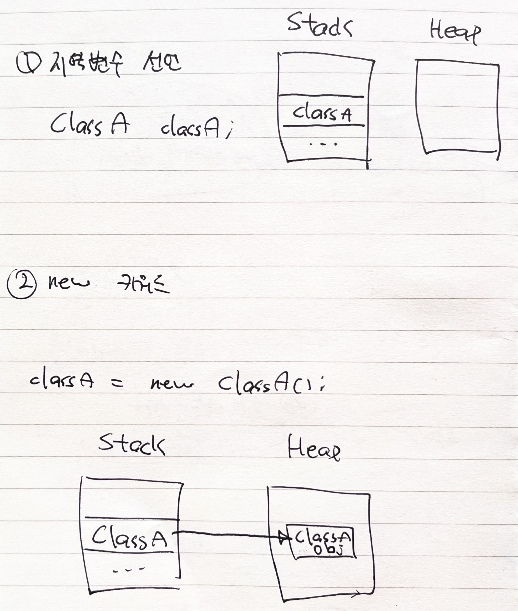

## 클래스란?
* 클래스는 공통의 특징(characteristics)/행동(behavior)/속성(properties, attributes)을 공유하는 객체들의 집합
* 클래스는 다양한 타입의 변수들과 메소드의 그룹
### 클래스가 포함하는 것들
* data member (field) - 객체의 데이터가 저장되는 곳
* method - 객체의 동작에 해당
* constructor - `new` 연산자로 호출되는 메소드로 객체 생성 시 필드의 초기화를 담당
* nested class - 클래스 내부에 또 다른 클래스를 선언할 수 있음
* interface `(!!)`

### 내부 클래스 (Inner Class)
* 내부 클래스는 외부 클래스의 private을 포함한 멤버들에 쉽게 접근이 가능하며 연관된 클래스를 그룹핑할 수 있다는 장점 때문에 사용
* 내부 클래스는 static, member inner, anonymous inner, local inner 등으로 구분됨
#### 1. Static Nested Class
* `static`으로 선언했기 떄문에 외부 클래스와 내부 클래스가 **분리**되어 외부 클래스의 객체를 통하지 않고도 내부 클래스의 객체를 생성할 수 있음
* 외부 클래스와 분리되기 때문에 외부 클래스의 **인스턴스 변수**에 접근할 수 없음
 * **static 변수**는 당연히 접근 가능
* 사용 목적
  * 특정 클래스와 연관된 클래스를 **grouping** 하기 위해 사용
```java
public class Outer {
    private static String message1 = "outer static message";
    private String message2 = "outer instance message";

    public static class Inner {
        public String getMessage() {
            // return message2; // 컴파일 오류
            return message1;
        }
    }
}

---

Outer.Inner inner = new Outer.Inner();
inner.getMessage(); // "outer static message"
```
#### 2. Member Inner Class
* 일반적으로 생각하는 inner class
* 아래와 같은 구조
```java
public class Outer {
    private int age = 20;

    public class Inner {
        public int getAge() {
            // 외부 클래스의 instance 변수에 접근 가능
            return age;
        }
    }
}
```
* 외부 클래스의 instance 변수에도 접근 가능
* **반드시 외부 클래스의 인스턴스를 통해서만 내부 클래스를 생성할 수 있음**
  * 아래와 같이 생성
  * Heap에 저장될 때 내부 클래스의 인스턴스는 **외부 클래스 인스턴스 내부**에 생성됨
  ```java
  Outer outer = new Outer();
  Outer.Inner inner = outer.new Inner();
  inner.getAge(); // 20
  ```
* 컴파일 시엔 두 개의 클래스 파일이 생성됨
  * 위 예제의 경우 `Outer`, `Outer$Inner` 두 개의 클래스 파일 생성
* 내부 클래스는 컴파일 시 아래와 같이 외부 클래스에 대한 참조를 갖음
  * 따라서 클래스 파일이 별개로 생성되지만, 외부 클래스에 접근할 수 있음
```java
class Outer$Inner {
    final Outer this$0; // 외부 클래스에 대한 참조
}
```
#### 3. Anonymous Inner Class
* 익명 클래스
  * 말그대로 이름 없는 클래스로, 기존 **클래스나 인터페이스의 메소드를 오버라이드**하는 객체를 만들 때 사용 가능함
* 인터페이스의 경우 함수형 인터페이스 구현체를 만들 때 주로 사용됨
  * 자바 8 부터는 람다 표현식을 사용해 편하게 익명 클래스 구현체를 만들 수 있음
```java
// 1. 클래스
public class Person {
    private int age = 26;
    public boolean isAgeEqual(int age) {
        return this.age == age;
    }
}

---

Person person = new Person() {
    @Override
    public boolean isAgeEqual(int age) {
        return false;
    }
};

person.isAgeEqual(26); // 항상 false

// 2. 인터페이스
@FunctionalInterface
public interface Function<T, R> {
    R apply(T t);
}

---

// 기존 방법
Function<Integer, Integer> function1 = new Function() {
    @Override
    public Object apply(Object o) {
        return (Integer) o + 1;
    }
};

// 람다 표현식 사용
Function<Integer, Integer> function2 = (i) -> i + 1;

function1.apply(1); // 2
function2.apply(1); // 2
```

#### 4. Local Inner Class
* 메소드 내부에서 생성된 클래스를 Local Inner Class라 부름
  * 메소드 내부에서 지역 변수에 대입되기 때문에 `접근 제어자`를 가질 수 없음
* 또한, 이들은 메소드 내부에서만 인스턴스화 될 수 있음
  * 즉, 스코프가 메소드 내부로 제한됨
  * 외부에서는 이에 접근해 직접 생성할 수 있는 방법이 없다
```java
public class Outer {
    public void someMethod() {
        class Inner {
            public void someMethod() {
                doSomeThing();
            }
        }
        Inner inner = new Inner();
        inner.someMethod();
    }

    public void someMethod2() {
        // 아래 코드는 컴파일 오류
        // Inner inner = new Inner();
    }
}
```

## 클래스 정의하는 방법
* 아래와 같이 클래스 정의 가능
```java
접근제어자 class 클래스명 {
    // 필드
    private int count;
    ...

    // 생성자
    ...

    // 메소드
    ...
}
```
### 접근 제어자
* 접근 제어자 (Access Modifiers)는 필드, 메소드, 생성자, 클래스 등의 접근성 (acessibillity)를 설정
  * 필드, 메소드, 생성자, 클래스의 앞에 접근 제어자를 붙여서 접근성을 제어할 수 있음

| 접근 제어자 | 접근 가능 범위 |
| :---: | :---: |
| Private | **클래스 내부**로 한정 |
| Default | **동일 패키지 내부**로 한정. 접근 제어자를 명시하지 않으면 설정되는 기본 값 |
| Protected | **동일 패키지 내부 + 해당 클래스를 상속 받은 자식 클래스**에 한정 |
| Public | **어디서나** 접근 가능 |

## 객체 만드는 방법 (new 키워드 이해하기)
* 아래와 같이 객체 생성 가능
```java
public class ClassA {}

---

public class Main {
    public static void main(String[] args) {
        ClassA classA = new ClassA(); // ClassA의 객체 classA 생성
    }
}
```
* `new` 키워드를 사용하면 runtime에 객체가 메모리에 생성됨
  * 객체는 모두 `Heap` 영역에 생성됨
  * 객체를 저장하는 `classA` 변수는 `Stack` 메모리에 생성됨
* 따라서 `new` 키워드를 사용한 후 `Stack`과 `Heap` 의 모습은 아래와 같음


### new 시 바이트 코드 분석
* `new` 로 객체를 생성하는 아래의 코드는 바이트코드로 다음과 같이 컴파일된다
#### 자바 코드
```java
public class Person {
    private final String name;
    private final int age;

    public Person(String name, int age) {
        this.name = name;
        this.age = age;
    }

    public static void main(String[] args) {
        Person person = new Person("현상혁", 26);
    }
}
```
#### 바이트 코드
```java
...

public static void main(java.lang.String[]);
Code:
    0: new           #4                  // class dev/gmelon/spring/springboot/web/Person
    3: dup
    4: ldc           #5                  // String 현상혁
    6: bipush        26
    8: invokespecial #6                  // Method "<init>":(Ljava/lang/String;I)V
    11: astore_1
    12: return

...
```
1. `new`
    * `Heap` 메모리에 빈 `Person` 객체가 생성됨
    * 동시에 `Operand Stack` 에 해당 Person 객체에 대한 참조값이 저장됨
2. `dup`
   *  `invokespecial`을 통해 생성자를 호출하면 현재 `Operand Stack`의 참조값이 날라감. 따라서 복제해둠
3. `ldc`
   * `"현상혁"` 리터럴을 `Method Area`의 `Runtime Constant Pool`에 생성
   * 그 후, 해당 리터럴에 대한 참조를 `Operand Stack`에 저장
4. `bipush 10`
   * 생성자에 전달할 인자 (26)을 `Operand Stack`에 추가
5. `invokespecial`
   * 생성자 호출
   * 이 단계에서 `Heap`에 만들어진 객체 껍데기가 **초기화**된다
6. `astore`
   * 지역 변수에 `Operand Stack`의 참조 값을 넣음

## 메소드 정의하는 방법
* 메소드 구성요소
  * 접근 제어자 - `public, private, ...`
  * 반환 타입 - `void, String, int, ...`
  * 메소드 이름
  * 파라미터들 - `(파라미터1, 파라미터2, ...)`
  * 예외 - `throws Exception`
  * 메소드 본문 - `{...}`
* 예시
```java
public String getName(Long id) {
    return names.get(id);
}

private void validate(String name) throws Exception {
    service.validate(name); // Exception 발생 가능 메소드
}

// static 키워드를 통해 클래스 메소드로 선언할 수도 있음
// 이 경우 객체가 없어도 메소드 호출이 가능
public static ClassA init(Long id) {
    return new ClassA(id, initValue);
}
```

### 메소드 오버로딩
* 파라미터만 다른 동일한 이름의 메소드를 여러 개 만드는 것을 말함
  * 메소드 호출 시, 인자에 따라 다른(적절한) 메소드가 호출됨
```java
public int add(int a, int b) {
    return a + b;
}

public double add(double a, double b) {
    return a + b;
}

public String add(String a, String b) {
    return a + b;
}
```

## 생성자 정의하는 방법
* 클래스 정의 후 아무런 생성자를 명시하지 않으면 기본 생성자가 생성됨
  * `기본 생성자` - 아무런 인자를 받지 않는 (모든 필드에 기본 값이 채워지는) 객체 생성
  * 주의할 점은, 하나라도 생성자를 직접 작성하면 기본 생성자는 만들어지지 않음
* 클래스의 필드에 값을 설정한 상태로 객체를 생성하고자 하면, 파라미터가 있는 생성자를 작성하면 됨
  * 생성자의 **이름은 클래스와 동일**해야 함
  * 생성자는 반환 타입을 명시하지 않음 (`return ...;` 도 X)
* 생성자도 메소드와 동일하게 **overloading**이 가능
  * 이때, `this()`를 사용해 생성자 내부에서 다른 생성자를 호출할 수 있음
  * 생성자에서 `this()` 나 `super()` 를 호출할 땐 무조건 첫 라인에서 해야함
* 생성자에는 항상 `super()` 가 숨겨져 있어서 부모의 생성자를 implicit하게 호출한다.

```java
public class Person {
    public String name;
    public int age;

    // 기본 생성자 (아무런 생성자를 명시하지 않으면 작성하지 않아도 기본으로 생성됨)
    Person() {
    
    }

    // 파라미터가 있는 생성자
    Person(String name) {
        this.name = name;
        
        // 위 코드는 아래와 같이 this()를 사용해서도 동일하게 구현이 가능하다
        // this(name, 0);
    }

    // 생성자 오버로딩
    Person(String name, int age) {
        this.name = name;
        this.age = age;
    }
}

---

public static void main(String[] args) {
    Person withoutName = new Person();
    System.out.println(withoutName.name); // null
    System.out.println(withoutName.age); // 0

    Person withName = new Person("현상혁");
    System.out.println(withName.name); // 현상혁
    System.out.println(withName.age); // 0

    Person withNameAndAge = new Person("현상혁", 26);
    System.out.println(withNameAndAge.name); // 현상혁
    System.out.println(withNameAndAge.age); // 26
}

```
### 생성자와 final 키워드
* final로 선언된 변수를 생성자나 변수 선언 시 초기화하지 않으면 컴파일 오류가 발생함
```java
// 컴파일 오류 발생
public class ClassA {
    private final int age;

    ClassA() {}
}

---

// 옵션 1 / 2 중 하나의 방법으로 변수 초기화를 수행해주어야 함
public class ClassA {
    // 옵션 1
    private final int age = 0;

    // 옵션 2
    ClassA (int age) {
        this.age = age;
    }
}
```
### 초기화 블럭
* static 혹은 instance 초기화 블럭
  * 값을 변수 선언과 동시에 직접 대입하기 어려울 때 (반복문, 기타 로직 수행 등) 초기화할 수 있는 수단을 제공
* instance 변수의 경우 **생성자**를 통하면 되므로 굳이 사용할 필요는 없어 보임
  * 만약 초기화 블럭과 생성자 모두에서 하나의 변수에 대해 동시에 값을 변경하게 되면, `초기화 블럭 -> 생성자` 순으로 호출되므로 생성자의 값이 최종 값으로 덮어씌워짐
* static 초기화 블럭 사용 예시
```java
class Test {
    private static List<Integer> list;

    // static 초기화 블럭
    // 클래스 로딩 시점에 static 변수에 값을 대입해줌
    static {
        list = new ArrayList():
        list.add(...);
        ...
    }
}
```

## this 키워드 이해하기
* 자기 자신의 **인스턴스** `참조`를 가리키는 키워드
  * 즉, **클래스를 기반으로 생성된 인스턴스를 가리키는 참조**
  * 인스턴스에 대한 참조이기 때문에 `static` 메소드에서는 당연히 사용 불가능
* 주로 생성자 등에서 지역 변수 (혹은 파라미터)와 인스턴스 변수의 이름이 같은 경우 이를 구분하기 위해 사용
```java
public class Person {
    public String name;

    Person(String name) {
        // this를 사용해 `인스턴스 변수 name에 파라미터로 전달된 name을 넣겠다` 는 의미가 모호하지 않고 확실해짐
        this.name = name;
    }

    public void changeName(String name) {
        // 일반 메소드에서도 인스턴스 변수의 이름과 지역 변수의 이름이 겹치는 경우 아래와 같이 사용 가능
        this.name = name;
    }

    // 물론, 서로의 이름이 달라도 사용은 가능
    // public void changeName(String givenName) {
    //     this.name = givenName;
    // }
}
```

* this와 객체의 참조 값 비교
```java
class Person {
    public String address() {
        return this.toString();
    }
}

---

Person person = new Person();

System.out.println(person.toString()); // ...Person@2002fc1d
System.out.println(person.address());  // ...Person@2002fc1d
```

## 과제
* int 값을 가지고 있는 이진 트리를 나타내는 Node 라는 클래스를 정의하세요.
* int value, Node left, right를 가지고 있어야 합니다.
* BinrayTree라는 클래스를 정의하고 주어진 노드를 기준으로 출력하는 bfs(Node node)와 dfs(Node node) 메소드를 구현하세요.
* DFS는 왼쪽, 루트, 오른쪽 순으로 순회하세요.

## 참고문헌
* https://www.geeksforgeeks.org/classes-objects-java/
* https://coding-factory.tistory.com/864
* https://www.javatpoint.com/access-modifiers
* https://docs.oracle.com/javase/tutorial/java/javaOO/methods.html
* https://jaynamm.tistory.com/entry/JAVA-this-%EC%9D%98%EB%AF%B8%EC%99%80-%EC%82%AC%EC%9A%A9%EB%B2%95
* https://codechacha.com/ko/java-static-keyword/
* https://ahnyezi.github.io/java/javastudy-5/#%EC%9D%B8%EC%8A%A4%ED%84%B4%EC%8A%A4-%EC%83%9D%EC%84%B1%EA%B3%BC%EC%A0%95-%EB%B6%84%EC%84%9D