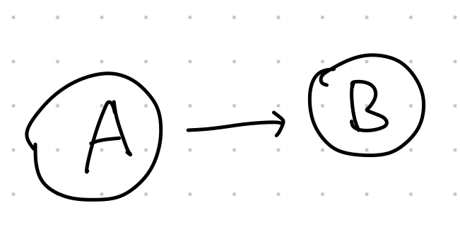
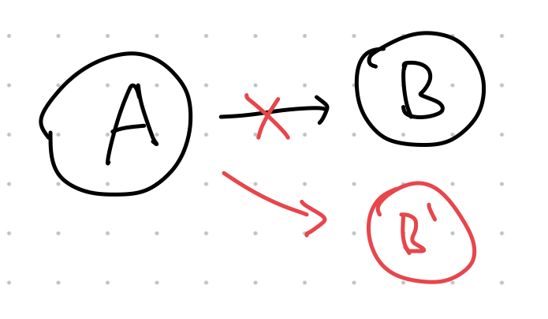
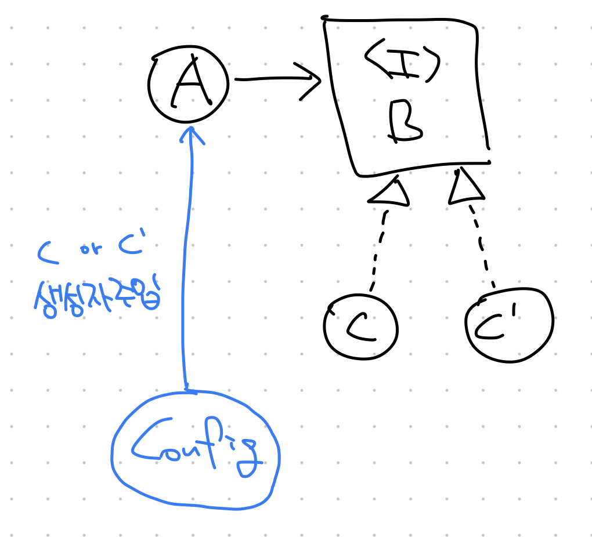

## 추상 클래스와 인터페이스
자바8부터 인터페이스에 `default`, `static` 메서드를 정의할 수 있게 되면서 추상 클래스와 인터페이스를 어떨 때 어떻게 구분해서 사용해야 하는지가 혼란스러워졌다. 이에 인터페이스에 대해 공부하기 전에 추상 클래스와의 차이를 먼저 정리해보았다.

앞선 주차 스터디에서 추상 클래스에 대해서는 이미 학습했었는데, 추상 클래스는 여러 클래스가 가진 공통 속성을 추출하기 위해 사용한다고 했다. `K5`, `소나타` 등의 클래스가 `자동차` 라는 추상 클래스로 묶일 수 있는 등의 예시를 생각할 수 있을 것 같다.

이들을 추상 클래스로 묶음으로써 클래스 별로 다른 부분을 제외하고 **공통적인 속성과 행위를 하나의 클래스에서 관리**할 수 있다는 장점이 생기게 된다.

### 공통점
이 둘의 공통점은 아래와 같다.
1. 직접 인스턴스화 할 수 없고, 다른 클래스가 `implements` 나 `extends` 하여야 객체화할 수 있다.
2. `implements` 하거나, `extends` 한 클래스는 상위의 추상 클래스나 인터페이스에서 정의한 추상 메서드를 반드시 구현해야 한다.

### 차이점
반면 이 둘의 차이점은 아래와 같다. 자바 8부터는 인터페이스에도 본문이 있는 메소드를 포함할 수 있게 되면서 둘의 차이가 모호해졌다.

| 항목 | 추상 클래스 | 인터페이스 |
| :---: | :---: | :---: |
| 일반 메서드 포함 가능 여부 | 가능 | 가능 (자바 8 이후로 가능) |
| 다중 상속 | 불가능 | 가능 |
| 포함 가능한 필드 | 상수, **변수(상태)** | 상수 |

### IS - A vs HAS - A
그렇다면, 둘은 어떻게 구분해서 사용해야 할까? 추상 클래스는 구현 클래스와 `IS - A` 관계를 맺고, 인터페이스는 `HAS - A` 관계를 맺는다.

예를 들어 추상 클래스 `Person` 이 있고 구현 클래스 `SangHyeok` 이 있을 때, `SangHyeok`은 `Person` 이다(`IS - A`). 반면, 인터페이스 `Swimable` 가 있을 때 `SangHyeok`이 이를 구현한다면 `SangHyeok`은 `Swimable` 하다(`HAS - A`).

즉, 어떤 구현 클래스가 보다 상위 개념에 **속하는** 것을 표현하려면 추상 클래스를, 구현 클래스가 어떤 행위를 **할 수 있다**는 것을 표현하려면 인터페이스를 사용하는게 맞다고 생각이 된다.

추가로, 기능을 구현하는 관점에서는 인터페이스는 **상태**를 갖지 못하므로, `default method` 만으로 모든 것을 다 구현할 수는 없다. 이럴 경우에도 추상 메서드가 가치를 가질 수 있다.

### 인터페이스를 사용하는 이유
다시 정리하면, 인터페이스는 클래스들이 공통적으로 가져야할 기능에 대한 설계도 (API)를 만들어두기 위해 사용된다. 또한, 하나의 인터페이스를 구현하는 구현 클래스들을 동일 인터페이스 타입으로 사용할 수 있기 때문에 동일한 행위를 수행하는 클래스들 간에 관계를 맺어줄 수 있고 코드에서 구현 클래스가 아닌 인터페이스 타입을 통해 메서드를 호출함으로써 특정 구현체에 의존적이지 않은 코드를 작성할 수 있다(DIP 만족).

### 강한 결합 vs 느슨한 결합
예를 들어, 아래와 같이 `클라이언트 A`가 `클래스 B`를 의존하고 있다고 할 때,


`클래스 B`가 `B'`로 변경되면 `클라이언트 A`의 코드가 변경될 수밖에 없다. (강한 결합)


그러나, `인터페이스 B`를 구현한 `클래스 C, 클래스 C'`가 있고, `클라이언트 A`가 `인터페이스 B`에만 의존한다면 구현 클래스를 `C`에서 `C'`으로 외부에서 주입해주는 방법으로 쉽게 교체할 수 있다. (느슨한 결합)


## 인터페이스 정의하는 방법
```java
public interface Swimable {
    // public static final 은 생략 가능
    // 다른 말로는, 인터페이스에서 선언하는 변수는 public static final만 가능
    public static final int SWIM_VALUE = 100;

    // public abstract는 생략 가능
    public abstract void swim();

    // 본문을 가지려면 default 키워드 필수 (자바 8부터 가능)
    default boolean isAble() {
        return false;
    }
}
```

## 인터페이스 구현하는 방법
* `implements` 키워드를 사용해 인터페이스를 구현하는 클래스 생성 가능
   * 인터페이스에서 정의한 추상 (abstract) 메소드는 반드시 구현체에서 구현해야 한다.
```java
public class MyClass implements Swimable {
    @Override
    public void swim() {
        ...
    }
}
```
## 인터페이스 레퍼런스를 통해 구현체를 사용하는 방법
* 인터페이스를 구현(implements) 하는 클래스는 해당 인터페이스 타입으로 사용이 가능하다
```java
public class ClassA implements Swimable {
    @Override
    public void swim() {
        ...
    }
}

---

public class ClassB implements Swimable {
    @Override
    public void swim() {
        ...
    }
}

--

Swimable a = new ClassA();
a.swim();
Swimable b = new ClassB();
b.swim();
```
## 인터페이스 상속
* 인터페이스는 클래스와 달리 **다중 상속** 이 가능하다
* 다중상속은 [ISP (Interface Segregation Principle, 인터페이스 분리 원칙)](https://sh-hyun.tistory.com/14#isp-interface-segregation-principle) 을 지킬 때 사용할 수 있다
* 아래와 같이 상속 및 다중 상속을 할 수 있다
  * 인터페이스를 클래스로 구현하는 것은 `implements` 키워드를 사용하지만
  * 인터페이스 간의 상속은 클래스 들간의 상속과 마찬가지로 `extends` 키워드를 사용한다
```java
public interface A {}
public interface B {}

// 상속
public interface C extends A {}
// 다중 상속
public interface D extends A, B {}
```
* 인터페이스는 또한, (클래스에서) 다중 구현될 수도 있다
  * 이때, 당연히 구현하는 모든 인터페이스의 추상 메소드를 **구현**해야 한다.
```java
public class MyClass implements A, B {
    ...
}
```

## 인터페이스의 기본 메소드 (Default Method), 자바 8
* 자바 8 이전까지는 인터페이스는 `추상 메소드`만 포함할 수 있었다
  * 하지만, 자바 8부터는 본문을 갖는 `default method`를 가질 수 있다
```java
public interface A {
    // default 키워드 생략 불가!
    default void methodA() {
        ...
    }
}
```
### 사용 이유
* `default` 메소드가 없을 때 인터페이스에 새로운 api를 추가하게 되면, 해당 인터페이스를 상속받는 모든 클래스가 해당 메소드를 override 해야하는 문제가 있었다
  * 따라서, 인터페이스에 새로운 메소드를 추가하기가 어려웠다
* `default` 메소드가 등장한 이후로는 인터페이스에 메소드를 추가할 때 `default` 로 추가하여 이를 구현하는 클래스에서 별도의 조치를 취하지 않아도 바로 메소드를 사용할 수 있게 할 수 있다
* 기존에는 이러한 효과를 주기 위해 인터페이스와 구현 클래스 사이에 `추상 클래스`를 두었다
  * 하지만, `default` 메소드의 등장으로 **최소한** 추상 클래스를 더 이상 그런 용도로는 사용하지 않게 되었다.
  * 스프링 프레임워크에서도 `default` 메소드 등장 이후 기존 `interface -> abstract class -> class` 의 구조에서 `abstract class`에 있던 `default method`를 `interface`로 옮기는 리팩토링을 상당 부분 진행했다.
* 새로운 api를 추가할 때뿐 아니라, 처음부터 구현 클래스가 모든 추상 메소드를 구현하고 싶지 않게 할 때, 본문이 비어있는 `default` 메소드를 통해 api를 정의하는 경우로도 사용 가능
  * 아래는 스프링 MVC의 `HandlerInterceptor` 인터페이스 예시
```java
public interface HandlerInterceptor {

	default boolean preHandle(HttpServletRequest request, HttpServletResponse response, Object handler) throws Exception {
		return true;
	}

	default void postHandle(HttpServletRequest request, HttpServletResponse response, Object handler, @Nullable ModelAndView modelAndView) throws Exception {
	}

	default void afterCompletion(HttpServletRequest request, HttpServletResponse response, Object handler, @Nullable Exception ex) throws Exception {
	}

}

```
### default 메소드 오버라이드
* `default` 메소드도 추상 메소드와 같이 오버라이드가 가능하다
* 구현하는 인터페이스의 `default` 메소드를 호출하기 위해서는 `인터페이스명.super.메소드명()` 을 사용한다
  * 다중 구현, 다중 상속 등이 가능한 인터페이스 특성 상 인터페이스가 모호하게 지정되는 것을 방지하기 위함인듯
* 당연히, `static` 메소드로 `default` 메소드를 오버라이드할 순 없다

### default 메소드 다중 상속 시
* 인터페이스는 다중 구현, 상속이 가능하기 때문에 동일한 `default` 메서드를 제공하는 인터페이스를 상속 또는 구현할 경우 어떤 메서드를 실행해야 할지 혼란이 생가게 된다.
* 따라서 동일한 `default` 메서드가 2개 이상 존재할 경우 **반드시 해당 메서드를 재정의** 해주어야 한다.
  * 그렇지 않으면 **컴파일 에러가 발생**한다.
* 다만, 둘 중 하나가 `static` 메소드인 경우 다중 상속을 해도 컴파일 오류가 발생하지 않는다
  * `static` 과 `instance` 메소드는 서로 다른 영역에 생성되기 때문에, 호출 시 혼동이 발생하지 않기 때문이다
  * (`static` 메소드는 인터페이스 타입을 통해서만 호출 가능하므로 호출되는 메소드는 항상 `default` 메소드이다)

## 인터페이스의 static 메소드, 자바 8
* `static` 키워드를 붙여 사용할 수 있음
  * `private static` 도 가능하다 (`static` 메서드를 분리해야 하는 경우 등에 사용할 수 있을 듯함)
* `static` 메소드는 구현체에서 **재정의가 불가능** 하다
  * 부모 클래스의 `static` 메소드를 자식 클래스에서 재정의할 수 없는 것과 동일
* 인터페이스의 `static` 메소드는 오직 `인터페이스.static메소드명()` 형태로만 호출할 수 있다
  * 인터페이스를 구현한 클래스를 통해서는 **호출할 수 없다**
  * **부모의 `static` 메소드를 상속받은 자식 클래스를 통해 호출할 수 있는 것과 구분됨**
```java
public interface A {
    int NUMBER = 10;
    
    static void print() {
        System.out.println(NUMBER);
    }
}

---

public class MyClass implements A {
    ...
}

---

// MyClass.print(); // 컴파일 오류
A.print(); // 10
```

### 사용 이유
* `static` 메소드를 사용하면 우선 `default` 메소드와 유사하게 여러 구현체에서 공통으로 사용될 수 있는 메소드를 인터페이스 레벨에서 구현해둘 수 있음
* 여기에 추가로 `static` 메소드의 경우 구현체 없이 인터페이스만으로 호출이 가능하기 때문에 **코드의 중복**을 막고 **코드를 분리**하는데 도움을 줄 수 있음

## 인터페이스의 private 메소드, 자바 9
* 인터페이스 내부에서 `private` 메소드를 정의할 수 있다
* private 메소드를 구현했다고 하여 구현 클래스에서 사용할 수 있는 것은 아님
  * `private` 이므로 당연히 자식에서 접근 불가능
  * 인터페이스 내부의 `default` 메소드 내부에서만 사용 가능하다
  * `static method` 와 마찬가지로 구현 클래스에서 재정의할 수 없다
  
```java
public interface A {
    String MESSAGE = "message";

    private void print() {
        System.out.println(MESSAGE);
    }

    default int doSomething() {
        print();
        ...
    }
}

---

public class MyClass implements A {
    public void doSomething() {
        // 컴파일 오류
        // print();
    }
}
```
### 사용 이유
* 외부에 메소드를 드러내지 않고 (은닉), 캡슐화를 유지하기 위해 사용
  * `default` 메소드 구현 시 내부 코드 중 일부가 별도 메서드로 분리될 수 있고 해당 메서드는 외부에서 접근할 필요가 없을 수 있다.
  * 이때 `private` 메소드는 인터페이스 내부에서만 접근이 가능하기 때문에 이러한 목적을 달성하는데 활용할 수 있다.
* 또한, 복잡한 유틸리티성 메소드를 구현 클래스에게 숨길 수 있어서 보다 깔끔하고 조직력있는 코드를 작성하는데 도움이 된다
  * 따라서, 코드 가독성 측면에서도 도움이 됨
* 한 곳에서 코드를 관리할 수 있기 때문에 유지보수성 또한 좋아질 수 있다

## (추가) constant interface
* 인터페이스에 오직 상수만을 모아넣고 사용하는 것을 `constant interface`라 한다
  * 이는 안티 패턴이므로 사용을 지양해야 한다.
### 안티패턴인 이유
1. 인터페이스를 상속받는 클래스들은 사용하지 않아도 상수를 모두 가지고 있어야 한다.
2. 인터페이스에 정의된 상수를 사용할 때 상수명만으로 접근할 수 있기 때문에 상수의 출처를 알기 어렵다. 
3. 클래스에서 정의한 상수와 이름이 동일하면 덮어씌워지기 때문에 의도치 않은 동작이 발생할 수 있다.
4. 인터페이스의 목적에 어긋난다.
   1. 인터페이스는 해당 클래스가 어떤 일을 할 수 있는지 (메소드) 알리기 위해 사용한다.
   2. 따라서, 상수로만 구성된 (행위가 없는) 인터페이스를 만드는 것은 클래스에게 의미가 없다.

## 질문
1. 인터페이스 default 메소드를 선언하고, 구현체별로 다르게 동작하는 부분을 재정의해서 사용하는 방식이 클린 코드 관점에서 좋은 구현인가?
   1. 맞다면, 추상 클래스의 경우는?

## 참고문헌
1. https://k3068.tistory.com/34
2. https://www.w3schools.com/java/java_interface.asp
3. https://camel-context.tistory.com/58