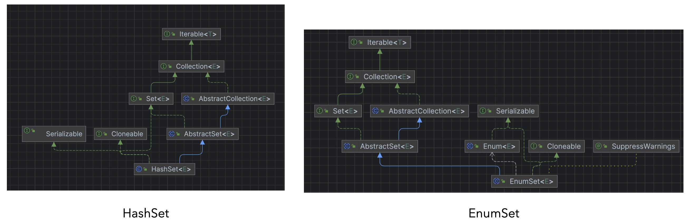

## enum 이란?
`enum` 타입은 특수한 데이터 타입으로, 미리 지정된 상수만 대입할 수 있다. 미리 정의한 enum 클래스 내의 상수만 enum 타입에 대입될 수 있다. 예를 들어 방위(`NORTH`, `SOUTH`, `EAST`, `WEST`)나 요일(`MONDAY`, ...) 등의 상수를 미리 정의하는 용도로 사용 가능하다.

Enum 클래스는 가장 간단하게는 아래와 같이 정의할 수 있다.
```java
public enum Day {
    SUNDAY, MONDAY, TUESDAY, WEDNESDAY,
    THURSDAY, FRIDAY, SATURDAY 
}
```
Enum에 정의된 상수들은 각각 해당 enum 클래스의 객체이다. 이렇게 미리 정의된 상수만 객체로 사용할 수 있게 하여 enum 타입에 미리 정의된 값만 대입될 수 있게 하는 것이다. (enum의 생성자는 `private`로 강제된다)

즉, 위의 enum을 정의하는 코드는 내부적으론 아래와 같이 동작한다.
```java
public enum Day {
  // static fianl로 선언된 상수로만 객체 획득 가능
  public static final SUNDAY = new Day("SUNDAY");
  public static final MONDAY = new Day("MONDAY");
  ...
  public static final SATURDAY = new Day("SATURDAY");


  // 모든 Enum이 상속받는 java.lang.Enum 클래스에 정의된 `name` 필드
  private String name;

  // 생성자는 private로 강제
  private Day(String name) {
    this.name = name;
  }
}
```

### enum을 사용하는 이유?
개인적으로 현재까지 느낄 수 있었던 enum의 장점은 아래와 같다.
* 상수들을 미리 선언해두어 여러 클래스에서 불러다 사용할 수 있다.
  * 이떄, 미리 정의해둔 값만 허용하게 되므로 안전하다.
* 새로운 상수나 메소드를 추가하더라도 해당 상수를 사용하는 모든 클래스를 수정하지 않고 enum 클래스만 수정하면 되므로 리팩토링이 간편하고 안전하다.

이밖에도 `상태와 행위를 한 곳에서 관리` 하는 등 여러 장점이 있다. 아래 블로그에 관련 내용이 잘 정리되어 있어서 도움을 많이 받았다.
https://techblog.woowahan.com/2527/

경험이 많지 않아 처음 읽을 땐 완벽히 이해되진 않았는데 여러 번 읽다보니 enum을 써야하는 상황과 장점을 어느정도 알 것 같았다. 코드에 잘 녹여낼 수 있기를..!
## enum 정의하는 방법
enum은 기본적으로는 위에서 말한 방법처럼 정의할 수 있다. 추가로 자바의 enum은 다른 언어와 다르게 **클래스**기 때문에 메소드나 생성자, 추가 필드도 정의할 수 있다.
### 추가 필드 정의
```java
public enum Status {
  N("NEW", 10),
  ST("STARTED", 20),
  CA("CANCELED", 30),
  FN("FINISHED", 40);

  // non-final도 가능하지만, 상수의 목적상 final을 주로 사용
  public final String label;
  public final int code;

  // 내부에서 (위의 상수 선언부) 사용하므로 private 지만 생성자를 통해 필드 값을 전달하는게 가능함
  // private는 생략 가능 (무조건 private만 가능하므로)
  private Status(String label, int code) {
    this.label = label;
    this.code = code;
  }
}
```
`N("NEW", 10)` 이 `public static final Status N = new Status("N", "NEW", 10);` 으로 동작하기 때문에 필드를 추가하기 위해서는 1. 필드를 선언하고 2. 생성자를 추가한 뒤 3. 필드 값을 채워 상수를 선언하면 된다. 이때 필드의 `final` 여부는 선택이지만 불변 상수를 제공하는 enum의 목적을 생각하면 `final`을 항상 붙여주는게 맞다고 생각된다.

추가로, 앞서 말했듯이 enum도 클래스이므로 아래와 같이 상수를 선언하여 클래스 내부에서 사용하는 등의 활용도 물론 가능하다.
```java
public enum Status {
  // Status type의 상수 선언
  ...

  // enum 내부에서 사용할 상수 정의 가능
  private static final int NUMBER = 10;
  
  // 나머지 필드, 생성자 정의
  ...
}
```

### 메소드 추가
```java
public enum Status {
    CANCELED(value -> value * 0.3),
    FINISHED(value -> value * 0.8);

    private final Function<Integer, Double> function;

    Status(Function<Integer, Double> function) {
        this.function = function;
    }

    public double calculate(int value) {
        return function.apply(value);
    }
}
```
위와 같이 `Function`을 필드로 갖는 enum 클래스를 만들고 각 상수에 대응되는 계산식을 상수가 가지고 있게 한 뒤 해당 `Function`을 호출하는 메서드를 enum 클래스에 만들어주었다. 이렇게 하면, 현재 **상태**에 따른 **행위**를 한 클래스에서 관리할 수 있어 안전하고 편리하다. 물론 `static` 메소드도 정의하여 필요에 따라 사용할 수 있다.

## enum이 제공하는 메소드 (values()와 valueOf())
| 메서드 | 설명 |
| :---: | :---: |
| `static` T[] values() | 해당 enum 타입에 정의된 상수들의 배열을 반환 |
| `static` T valueOf(Class<T> enumType, String name) | 입력한 `enumType` 열거형에서 `name`에 해당하는 상수 객체를 반환 |
| String name() | 상수의 '이름'을 반환 |
| int ordinal() | 상수가 정의된 순서를 반환 (처음은 0)|

### values()
`java.lang.Enum`에 정의되어 있지는 않지만 컴파일러가 자동으로 생성해주는 메소드로, 열거형 타입의 모든 상수 객체를 배열로 반환한다. 아래와 같이 `Stream` 등을 사용해 필터링 해 원하는 값만 추출하는 등 방식으로 활용할 수 있다.
```java
public enum MyEnum {
  // 상수 정의

  private final int code;

  // 생성자 정의

  // values()를 사용해 주어진 code에 해당하는 MyEnum 상수를 반환
  public MyEnum getMyEnumByCode(int code) {
        return Arrays.stream(MyEnum.values())
                .filter(myEnum -> myEnum.code == code)
                .findFirst()
                .orElseThrow(() -> new IllegalArgumentException("주어진 code에 해당하는 MyEnum이 존재하지 않습니다."));
    }
}
```

### valueOf(Class<T> enumType, String name)
주어진 열거형 타입과 `name`에 맞는 상수 객체를 반환한다.
```java
public enum MyEnum {
  N(10, "NEW");

  private final int code;
  private final String label;

  MyEnum(int code, String label) {
    this.code = code;
    this.label = label;
  }
}

---

// java.lang.Enum으로 호출할 경우 열거형 타입 명시 필요
MyEnum myEnum = Enum.valueOf(MyEnum.class, "N");

// 실제 열거형 타입으로 호출하면 첫번째 `Class` 인자 생략 가능
MyEnum myEnum = MyEnum.valueOf("N");
```

### name()
열거형 상수가 선언된 **이름을 그대로** 반환한다. 예를 들어 상수가 아래와 같이 선언되어 있으면 각각 `N`, `CA` 를 반환한다.
```java
public enum MyEnum {
  N(10, "NEW"),
  CA(20, "CANCELED");
  
  ...
```
자바 공식 문서에서는 `name()` 대신 `toString()`을 사용하라고 이야기한다. 이유로는 `name()`은 선언된 상수의 이름 그 자체를 반환하지만 `toString()`은 필드 추가 & 메서드 재정의를 통해 유저 친화적인 이름을 작성하고 반환할 수 있기 때문이다.

### ordinal()
상수가 정의된 순서를 반환한다. 처음에 작성한 상수가 `0`부터 시작하여 `1`씩 증가한다. 공식문서에서는 이 메서드는 개발자가 일반적인 상황에서 사용하기 보다 내부적으로 `EnumSet` 이나 `EnumMap`에서 사용하기 위해 존재하는 메서드이기 때문에 **다른 메서드를 사용해 로직을 구현**하라고 가이드하고 있다.

## java.lang.Enum
개발자가 만든 모든 enum 클래스는 자동으로(명시하지 않아도) `java.lang.Enum`을 상속받는다. 자바는 클래스의 다중 상속을 지원하지 않으므로 모든 enum 클래스는 다른 클래스를 상속받을 수 없다. 

앞서 다룬 enum 클래스가 제공하는 메서드들은 모두 `java.lang.enum` 클래스에 정의되어 있어서 이를 상속받는 다른 enum 클래스들이 사용할 수 있는 것이다.

```java
package java.lang;

...

public abstract class Enum<E extends Enum<E>> implements Comparable<E>, Serializable {
   
    private final String name;

    public final String name() {
        return name;
    }

    private final int ordinal;

    ...
```

## EnumSet
`EnumSet`은 `HashSet`과 같이 `Set` 인터페이스의 구현체 중 하나로, 값이 enum 타입으로 한정되는 Set이다. `HashSet`보다도 빠른 성능을 제공하므로 값이 enum 타입으로 한정되는 경우 `EnumSet`을 사용하는게 유리하다.

`HashSet`과 `EnumSet`의 상속 구조 차이는 아래와 같다.


`EnumSet` 자체는 `abstract`로 선언되어 `new`를 사용해 직접 객체를 생성할 수 없고 아래와 같이 여러 정적 팩토리 메서드를 통해 상황에 맞게 적절한 하위 클래스를 반환한다.
```java
public abstract class EnumSet<E extends Enum<E>> extends AbstractSet<E>
    implements Cloneable, java.io.Serializable
{
  ...

  public static <E extends Enum<E>> EnumSet<E> noneOf(Class<E> elementType) {
        Enum<?>[] universe = getUniverse(elementType);
        if (universe == null)
            throw new ClassCastException(elementType + " not an enum");

        if (universe.length <= 64)
            return new RegularEnumSet<>(elementType, universe);
        else
            return new JumboEnumSet<>(elementType, universe);
    }

  ...

}
```

정리하면, EnumSet은 아래와 같이 선언하고 사용할 수 있다.
```java
public enum MyEnum {
  A, B, C, D
}

---

EnumSet<MyEnum> enumSet;

// 주어진 열거형의 모든 상수를 포함하는 EnumSet 반환
enumSet = EnumSet.allOf(MyEnum.class);
System.out.println(enumSet); // [A, B, C, D]

// 주어진 상수만을 포함하는 EnumSet 반환
enumSet = EnumSet.of(MyEnum.A);
System.out.println(enumSet); // [A]

// 주어진 열거형 타입의 EnumSet을 반환하되, 주어진 set이 포함하지 않는 상수만을 포함한다
enumSet = EnumSet.complementOf(enumSet);
System.out.println(enumSet); // [B, C, D]

// 주어진 상수들의 ordinal을 기준으로 사이에 있는 상수들을 포함하는 EnumSet을 반환 (인자 두 개 모두 inclusive)
enumSet = EnumSet.range(MyEnum.B, MyEnum.D);
System.out.println(enumSet); // [B, C, D]

// 주어진 열거형 타입의 EnumSet을 반환하되, 빈 EnumSet을 반환한다.
enumSet = EnumSet.noneOf(MyEnum.class);
System.out.println(enumSet); // []

// Set 인터페이스를 상속받기 때문에 add, addAll, clear, remove, contains, isEmpty, size 등의 메서드 또한 사용할 수 있다.
enumSet.add(MyEnum.A);
enumSet.add(MyEnum.B);
enumSet.remove(MyEnum.A);
enumSet.add(MyEnum.C);
System.out.println(enumSet); // [B, C]
```

위에서 살펴본 것외에 EnumSet은 아래와 같은 특징을 갖는다.
1. `null` 값을 추가하는 것을 허용하지 않는다
   1. 시도하면 `NPE`가 발생
2. 모든 메서드가 산술 비트 연산자를 이용해 구현되어 (해시 함수를 사용하지 않아) 매우 빠른 성능을 제공한다. (시간 복잡도 O(1))
3. 제네릭을 사용해 `EnumSet<T>`와 같이 선언하므로 해당 Set의 모든 값들은 같은 열거형 타입에 속한 상수여야 한다.
4. `Thread-safe` 하지 않다.

## 참고자료
* https://docs.oracle.com/javase/tutorial/java/javaOO/enum.html
* https://docs.oracle.com/javase/7/docs/api/java/lang/Enum.html
* https://wisdom-and-record.tistory.com/52
* https://techblog.woowahan.com/2527/
* https://velog.io/@jwkim/java-enum
* https://www.baeldung.com/java-enum-values