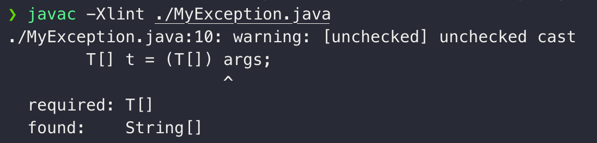

## 어노테이션이란?
어노테이션은 사전적으로는 '주석' 이라는 의미이다. 자바에서 어노테이션은 클래스, 인터페이스, 메소드, 필드 등에 붙어서 컴파일러와 JVM에게 **추가적인 정보(metadata)**를 제공하는 역할을 한다.

### 어노테이션이 만들어진 이유
어노테이션 등장 이전에는 XML을 사용해 소스 코드의 메타 데이터를 작성하고 유지했다. 시스템과 분리되어 있으므로 어떤 면에서는 유지보수성이 좋다고 할 수 있으나, 프로그램이 방대해짐에 따라 오히려 유지보수가 어려워지는 문제가 발생했다. 어노테이션은 소스 코드에 바로 메타데이터를 작성할 수 있으므로 보다 직관적으로 메타 데이터를 작성할 수 있다.

추가로, 어노테이션은 어노테이션 프로세스를 통해 컴파일 타임에 코드나 기타 파일의 생성 등 작업이 가능하다. 어노테이션이 없을 때는 하이버네이트 등 라이브러리에서 주석? 에 코드를 작성하는 방식으로 여러 비슷한 시도를 했다고 한다. 지금은 어노테이션 기반으로 편하고 직관적으로 처리가 가능해졌다.

### 어노테이션의 조상
어노테이션은 어떤 인터페이스를 상속받아 만들어질까? `javap` 명령을 통해 확인해보았다.


위 결과를 통해 어노테이션은 `java.lang.annotation.Annotation` 인터페이스를 상속받는 **특수한** 인터페이스임을 추측해볼 수 있다. 해당 조상 인터페이스에 별 메소드가 없는 것으로 봐서는 단순 어노테이션을 묶어놓기 위한 인터페이스가 아닐까..? 추측해봤다.

## 자바의 Built-in 어노테이션
### \@Override
`@Override` 어노테이션은 해당 메소드가 부모 클래스의 메소드를 제대로 재정의하고 있음을 보장한다. 만약 `@Override`가 붙어있는 메소드인데 부모 클래스의 메소드를 재정의하고 있지 않다면 컴파일 오류가 발생한다. 메소드 재정의 시 `@Override` 어노테이션 작성은 필수는 아니지만, 오타나 시그니처를 잘못 입력하는 경우 등에 컴파일러의 도움을 받을 수 있으니 입력하는 것이 권장된다.

### \@SuppressWarnings
이 어노테이션을 사용하면 컴파일러에 의해 발생한 **경고**가 보이지 않게 할 수 있다. 아래와 같이 `String[] value()` 가 필드로 생성되어 있으므로
```java
@Target({TYPE, FIELD, METHOD, PARAMETER, CONSTRUCTOR, LOCAL_VARIABLE, MODULE})
@Retention(RetentionPolicy.SOURCE)
public @interface SuppressWarnings {
    String[] value();
}
```
아래 표의 값을 `value`에 입력하면 해당 경고가 표시되지 않도록 할 수 있다. value는 IDE나 JVM, 컴파일러 벤더에 따라 달라진다. ([기타 value 예시](https://www.ibm.com/docs/ko/radfws/9.6.1?topic=code-excluding-warnings))

| value 값 | 억제되는 경고 |
| :---: | :---: |
| all | 모든 경고 |
| cast | cast 오퍼레이션과 관련된 경고 |
| deprecation | @Deprecated된 대상에서 발생하는 경고 |
| unchecked | 미확인 연산과 관련된 경고 |
| rawtypes | 제네릭 타입을 명시하지 않을 때 발생하는 경고 |

예를 들어 아래와 같이 `ArrayList`를 제네릭 명시 없이 사용하면 경고가 발생하는데,


`@SuppressWarning("rawtypes")` 를 통해 해당 경고가 표시되지 않도록 할 수 있다.


아래와 같이 `-Xlint` 옵션을 주어 컴파일하면 경고의 종류를 확인할 수도 있다. 
```java
public class MyException{
    ...
    // unchecked 경고 발생 코드
    T[] t = (T[]) args;
    ...
}
```
컴파일 시 `unchecked` 경고가 출력되는 것을 확인할 수 있다.


### \@Deprecated
deprecated될 메소드에 붙여준다. 이 어노테이션이 붙은 메소드를 사용하면 컴파일 시 곧 지원이 만료될 메서드를 사용하고 있다는 경고 메시지가 출력된다. 이렇게 함으로써 API를 사용하는 클라이언트 개발자에게 해당 메소드가 곧 deprecated될 것이므로 다른 메서드를 사용하라는 정보를 전달할 수 있다.

### \@FunctionalInterface
함수형 인터페이스를 명시할 떄 사용한다. 이 어노테이션이 붙은 인터페이스는 오직 하나의 추상 메소드만 가질 수 있도록 컴파일러가 강제해준다. (추상 메소드가 아닌 메소드는 가능)

`@FunctionalInterface`가 없으면 여러 추상 메서드가 가능하지만, 아래와 같이 붙여주면 컴파일러 레벨에서 오류를 발생시켜준다.


### \@Native
`Native Method`에서 참조하는 상수에 선언하는 어노테이션. 예로, 아래 `Integer` 클래스의 상수가 있다.
```java
public final class Integer extends Number implements Comparable<Integer> {
    @Native public static final int MIN_VALUE = 0x80000000;
    ...
}
```
#### 네이티브 메서드
JVM이 설치된 Host OS의 메서드를 말한다. 보통 C언어로 작성되어 있고, 자바에서는 아래와 같이 선언부만 작성하고 구현은 하지 않는다.
```java
public class Thread implements Runnable {
    ...
    private native void start0();
    ...
}
```
자바에 정의된 네이티브 메서드와 실제 호출되는 OS의 메서드를 연결해주는 것은 JNI(Java Native Interface)가 담당한다.

## 애노테이션 정의하는 방법
`@interface` 를 사용해 아래와 같이 정의할 수 있다.
```java
public @interface MyAnnotation {
}
```
어노테이션은 추상 메소드들을 가질 수 있고, 해당 메소드들은 아래와 같은 규칙을 따라야 한다.
1. 메소드는 예외를 던질 수 없다
2. 메소드는 파라미터를 가질 수 없다
3. 메소드는 `원시타입`, `String`, `Class`, `enum`, `이들의 배열` 중 하나를 반환해야 한다
4. 메소드들은 `default` 값을 가질 수 있다.

추상 메서드의 개수에 따라 어노테이션은 아래 3가지로 나뉜다.
1. Marker Annotaion
2. Single-Value Annotation
3. Multi-Value Annotation

### Marker Annotation
추상 메소드가 없는 어노테이션을 말한다. `@Override`나 `@Deprecated`가 여기에 속한다. 단지 컴파일러에게 **어떤 정보를 전달**하기 위해서 존재하기 때문에 이런 이름이 붙여진 것 같다.
```java
@Target(ElementType.METHOD)
@Retention(RetentionPolicy.SOURCE)
public @interface Override {
}
```
### Single-Value Annotation
하나의 메서드를 갖는 어노테이션을 말한다. 아래와 같이 선언하고 사용할 수 있다.
```java
public @interface MyAnnotation {
    int value();
}

---

@MyAnnotation(value = 0)
...

@MyAnnotation(value = 10)
...

// 필수로 입력해야 하는 값이 하나이면서 메서드 이름이 "value"인 경우 메서드 이름 생략 가능
@MyAnnotation(10)
...
```

`default` 값을 제공할 수도 있다. `default`가 제공되는 값의 경우 아래와 같이 입력을 생략할 수도 있다.
```java
public @interface MyAnnotation {
    int value() default 0;
}

---

@MyAnnotation() // 값을 생략해도 value = 0과 같음
...

// 기존과 동일하게도 사용 가능
@MyAnnotation(value = 10)
...

@MyAnnotation(10)
...
```

추가로, 만약 **메서드 이름이 `value`가 아니면** 유일한 필수 값이어도 입력 자체를 생략할 순 있지만 입력 시 **메서드 이름 생략은 불가능**하다.
```java
public @interface MyAnnotation {
    int name() default 0;
}

---

@MyAnnotation(name = 10) // 가능

@MyAnnotation() // 가능

@MyAnnotation(10) // 컴파일 오류 (메서드 이름이 value가 아니므로!!)
...

```

배열을 반환하는 메서드의 경우 `{ }`를 사용해 여러 개의 값을 전달할 수 있다.
```java
public @interface MyAnnotation {
    int[] value() default {1, 2, 3};
}

---

@MyAnnotation()
...

@MyAnnotation(value = {4, 5, 6})
...
```
### Multi-Value Annotation
두 개 이상의 메서드를 갖는 어노테이션을 말한다.
```java
public @interface MyAnnotation {
    int value();
    String name();
    String option() default "OPT";
}

---

// 아래와 같이 , 로 구분해 입력할 수 있다.
// default 값이 있는 메소드는 마찬가지로 입력을 생략할 수 있다.
@MyAnnotation(value = 10, name = "HSH")
```

## meta-annotation
다른 어노테이션에 사용되는 어노테이션을 말한다. `@Target`이 `ANNOTATION-TYPE`으로 지정되어 있다. 대표적으로 `@Retention`, `@Target`, `@Documented` 등이 있다.
### \@retention
어노테이션이 활성화(유지)되는 레벨을 지정하기 위해 사용한다. 아래의 3가지 타입이 존재한다.
| RetentionPolicy | 활성화 범위 |
| :---: | :---: |
| SOURCE | 소스코드에서만 사용되고 컴파일 시점에 컴파일러에 의해 삭제된다. 따라서 컴파일된 `.class` 파일에선 확인할 수 없다 |
| CLASS (기본값) | `.class` 파일에서 확인 가능하다. 컴파일러에겐 영향을 주지만 JVM에는 영향을 주지 못한다 |
| RUNTIME | 런타임에 까지 영향을 준다. 즉, 컴파일러와 JVM 모두에 영향을 준다 |

#### SOURCE
`SOURCE`로 사용되면 클래스 파일에 어노테이션 정보가 저장되지 않는다. 즉, 컴파일 시점까지만 해당 정보가 필요하고 그 이후로는 필요없다는 의미이다. 예시로 표준 어노테이션인 `@Override`나 롬복의 `@Getter`, `@Setter`가 있다.
```java
@Target(ElementType.METHOD)
@Retention(RetentionPolicy.SOURCE)
public @interface Override {
}
```

```java
@Target({ElementType.FIELD, ElementType.TYPE})
@Retention(RetentionPolicy.SOURCE)
public @interface Getter {
    ...
}

@Target({ElementType.FIELD, ElementType.TYPE})
@Retention(RetentionPolicy.SOURCE)
public @interface Setter {
    ...
}
```

#### RUNTIME
`RUNTIME` 으로 사용되면 자바 애플리케이션이 동작하는 동안에도 해당 어노테이션 정보를 읽어들일 수 있다. 즉, 클래스로더가 바이트 코드를 읽어들일 때 메모리에 어노테이션에 대한 정보가 적재된다. 따라서 리플렉션 등의 기능 사용이 가능하다.

스프링의 경우 `@Controller`, `@Service`, `@Autowired` 등이 모두 RUNTIME으로 선언되어 있는데, 이는 스프링이 실행 시점(RUNTIME)에 컴포넌트 스캔을 통해 빈 등록을 해야 하기 떄문에 RUNTIME까지 어노테이션 정보가 유지될 필요가 있기 떄문이다. (스프링도 내부적으로 리플렉션 등을 통해 어노테이션을 확인하고 여러 작업을 수행한다고 한다)

#### CLASS
`CLASS` 로 선언되면 컴파일 된 클래스 파일에 어노테이션 정보가 남는다. 즉, 바이트 코드를 열면 어노테이션 정보를 확인할 수 있다. 다만, 해당 정보는 런타임에는 확인이 불가능하다. 즉, JVM에 적재될 때는 `CLASS`로 선언된 어노테이션 정보는 싹 사라지고 나머지 바이트 코드만 적재된다.

여기까지 이해하고 나니 JVM에 적재되지 않아 런타임에 정보를 가져올 수도 없다면 `SOURCE`를 사용하는 것과 차이가 무엇일까? 하는 의문이 들었다. [이 글과 댓글](https://jeong-pro.tistory.com/234)에서 이 질문에 대한 답을 찾을 수 있었다.

maven/gradle로 dependency를 추가해 다운받은 라이브러리는 `jar` 파일만 받게 되는데, 이때 해당 jar 파일에는 `.java` 소스 코드는 포함되어 있지 않고 `.class` 파일만 포함되어 있다. 그럼 생각해보자. `@NonNull` 어노테이션이 적용된 파라미터에 null 값을 넣게 되면 인텔리제이는 경고를 띄워준다. 그런데 만약 maven/gradle로 다운받은 라이브러리에서 제공하는 메소드 인자에 `@NonNull`이 선언되어 있고, 해당 어노테이션이 `SOURCE` 라면 어떻게 될까? IDE는 바이트 코드만 가지고 해당 어노테이션의 존재를 알아차릴 방법이 없으므로 개발자는 null 체크 등 IDE의 보조를 받을 수 없을 것이다. 이러한 상황에서 어노테이션이 `CLASS`로 선언되는 것이 의미가 있다.

### \@target
어노테이션이 적용될 타겟의 타입을 명시하기 위해 사용한다. `java.lang.annotation.ElementType`에 정의된 아래와 같은 상수를 사용해 어노테이션의 타겟을 명시할 수 있다. 만약 `@Target`을 명시하지 않으면 자바의 모든 element에서 해당 어노테이션을 사용할 수 있다.
| ElementType | 어노테이션 타겟 |
| :---: | :---: |
| TYPE | 클래스, 인터페이스(어노테이션 포함), enum |
| FIELD | 필드 |
| METHOD | 메서드 |
| CONSTRUCTOR | 생성자 |
| LOCAL_VARIABLE | 로컬 변수 |
| ANNOTATION_TYPE | 에노테이션 |
| PARAMETER | 파라미터 |
| PACKAGE | 패키지 선언부 |
| TYPE_PARAMETER | 타입 변수 선언부 |
| TYPE_USE | [타입 사용 코드](https://www.logicbig.com/tutorials/core-java-tutorial/java-8-enhancements/type-annotations.html) |
| MODULE | 모듈 선언부 |


아래와 같이 사용할 수 있다.
```java
// 메소드에만 사용 가능
@Target(ElementType.METHOD)
public @interface MyAnnotation {
}
```

(enum에 붙일 경우 컴파일 오류 발생)

아래와 같이 여러 타겟을 지정할 수도 있다.
```java
@Target({ElementType.METHOD, ElementType.CONSTRUCTOR})
public @interface MyAnnotation {
}
```

`@Target` 어노테이션의 경우 어노테이션을 타겟으로 하므로 아래와 같이 `@Target(ElementType.ANNOTATION_TYPE)` 이 붙어있다.
```java
@Target(ElementType.ANNOTATION_TYPE)
public @interface Target {
    ElementType[] value();
}
```

### \@Inherited
기본적으로 어노테이션은 자식 클래스에게 상속되지 않는다. 하지만 `@Inherited` 어노테이션이 적용된 어노테이션이 부모 클래스에 적용되었다면 자식 클래스에게 해당 어노테이션이 전파된다.

### \@documented
기본적으로는 `Javadoc`을 사용했을 때 적용된 어노테이션 정보는 출력되지 않는다. 다만, `@Documented` 어노테이션이 적용된 어노테이션은 `Javadoc`에서 기본적으로 어노테이션 정보를 출력해준다.

```java
@Target(ElementType.TYPE)
@Retention(RetentionPolicy.RUNTIME)
@Documented
public @interface MyAnnotation {
}

---

@MyAnnotation
public class Parent {}
```


```java
@Target(ElementType.TYPE)
@Retention(RetentionPolicy.RUNTIME)
// @Documented
public @interface MyAnnotation {
}

---

@MyAnnotation
public class Parent {}
```


### \@Repeatable
하나의 타겟에 동일한 어노테이션을 여러 번 작성하고 싶을 수 있다. 기본적으로는 허용되지 않지만 `@Repeatable` 을 붙인 어노테이션은 가능하다.

아래는 특정 작업을 UNIX의 크론 스케쥴러처럼 일정 주기마다 반복하도록 구현할 때 작업 주기를 어노테이션으로 명시하는 예시이다. 동일한 작업을 동작시키고 싶은 주기가 여러 개라고 할 때 `@Repeatable`을 적용하면 아래와 같이 각각의 주기를 동일한 어노테이션을 사용해 반복적으로 명시할 수 있다.
```java
@Schedule(dayOfMonth="last")
@Schedule(dayOfWeek="Fri", hour="23")
public void doPeriodicCleanup() { ... }
```

[오라클 문서](https://docs.oracle.com/javase/tutorial/java/annotations/repeating.html)에 따르면 이렇게 반복 선언된 어노테이션은 호환성을 위해 `컨테이너 어노테이션`에 저장된다고 한다. 이 작업은 **컴파일러에 의해 자동**으로 이루어 지지만, 컴파일러가 이러한 작업을 수행하도록 하려면 아래와 같은 두 가지의 작업이 필요하다고 한다.

#### 1. 사용할 \@Repeatable 어노테이션 생성
먼저 반복 선언할 어노테이션을 `@Repeatable` 메타 어노테이션을 붙여 생성한다
```java
@Repeatable(Schedules.class) // () 안에는 컨테이너 어노테이션을 명시
public @interface Schedule {

  String dayOfMonth() default "first";
  String dayOfWeek() default "Mon";
  int hour() default 12;

}
```

#### 2. 컨테이너 어노테이션 생성
컨테이너 어노테이션은 반복 선언될 `어노테이션의 배열` 을 반환하는 `value()` 추상 메서드를 반드시 가져야 한다. 아래와 같이 작성할 수 있다.
```java
public @interface Schedules {

    Schedule[] value();

}
```

## 애노테이션 프로세서
어노테이션 프로세서는 어노테이션을 기반으로 컴파일 시점에 추가적인 파일 / 코드를 생성하는 기술을 말한다. 생성되는 파일은 자바 파일에 한정되지 않아서 자바 코드의 어노테이션을 기반으로 description, metadata, documentation, resources를 포함한 기타 모든 종류의 파일을 생성할 수 있다.

예시로는 QueryDSL, JPA에서 메타 클래스를 생성하는데에 사용되고 Lombok에서 추가적인 코드를 생성하는데 사용된다.

간단한 작동 방식으로는, 먼저 컴파일러가 소스 코드에서 어노테이션을 탐색하고 각 어노테이션에 맞는 어노테이션 프로세스를 선택한다. 그리고 이렇게 선택된 어노테이션 프로세서들은 추가적인 파일 / 코드를 생성한다.

자주 사용되는 Lombok을 예시로 가져와봤다.
```java
import lombok.Data;

@Data
public class Person {
    private final int age;
    private final String name;
    private final String[] group;
}
```

위와 같이 `@Data` 라는 롬복에서 제공하는 어노테이션을 붙여주고, 인텔리제이에서 어노테이션 프로세서 설정을 켜준다. 해당 클래스를 컴파일한 결과는 아래와 같다.

```java
public class Person {
    private final int age;
    private final String name;
    private final String[] group;

    public Person(final int age, final String name, final String[] group) {
        this.age = age;
        this.name = name;
        this.group = group;
    }

    public int getAge() {
        return this.age;
    }

    public String getName() {
        return this.name;
    }

    public String[] getGroup() {
        return this.group;
    }

    public boolean equals(final Object o) {
        if (o == this) {
            return true;
        } else if (!(o instanceof Person)) {
            return false;
        } else {
            Person other = (Person)o;
            if (!other.canEqual(this)) {
                return false;
            } else if (this.getAge() != other.getAge()) {
                return false;
            } else {
                Object this$name = this.getName();
                Object other$name = other.getName();
                if (this$name == null) {
                    if (other$name == null) {
                        return Arrays.deepEquals(this.getGroup(), other.getGroup());
                    }
                } else if (this$name.equals(other$name)) {
                    return Arrays.deepEquals(this.getGroup(), other.getGroup());
                }

                return false;
            }
        }
    }

    protected boolean canEqual(final Object other) {
        return other instanceof Person;
    }

    public int hashCode() {
        int PRIME = true;
        int result = 1;
        result = result * 59 + this.getAge();
        Object $name = this.getName();
        result = result * 59 + ($name == null ? 43 : $name.hashCode());
        result = result * 59 + Arrays.deepHashCode(this.getGroup());
        return result;
    }

    public String toString() {
        int var10000 = this.getAge();
        return "Person(age=" + var10000 + ", name=" + this.getName() + ", group=" + Arrays.deepToString(this.getGroup()) + ")";
    }
}
```

`final` 필드들을 인자로 받는 생성자, 각 필드의 getter와 setter, equals()와 hashCode() 메서드 등등이 컴파일 단계에서 자동으로 생성되었다. `@Data` 라는 어노테이션을 기반으로 롬복의 어노테이션 프로세서가 동작한 결과이다.

## 피드백
* 어노테이션은 정적인 요소 즉, 컴파일 타임에 작동할 수 있는 요소만 사용 가능하다
  * 마킹 (주석)의 느낌이 강함
  * 어노테이션 자체로 런타임에 뭔가 다이나믹한 로직을 수행하는 것은 아님
* RetentionPolicy가 RUNTIME이면 **리플렉션**을 사용할 수 있다는 의미
  * 리플렉션은 클래스로더가 (바이트 코드의 정보를) 읽어들인 정보를 기반으로 (메모리에 들어있는 정보를) 읽어오는 것
* JavaDoc 활용 끝판왕은 Mockito
* 자바의 `ServiceLoader`
   * 인터페이스만 제공하면서 구현체의 `jar` 파일만 바꿔끼우면서 동작시킬 수 있는 기능 (구현체를 몰라도 구현체를 사용할 수 있음)
   * `jar` 파일만으로 내부 구현체의 메소드를 호출할 수 있다
   * 어노테이션 프로세서, 스프링부트의 자동설정도 비슷한 매커니즘을 사용
* 에노테이션 프로세서는 해당하는 구현체가 있을 경우에만 사용 가능

## 참고자료
* https://www.javatpoint.com/java-annotation
* https://b-programmer.tistory.com/264
* https://www.baeldung.com/java-annotation-processing-builder
* https://docs.oracle.com/javase/tutorial/java/annotations/repeating.html
* https://jeong-pro.tistory.com/234