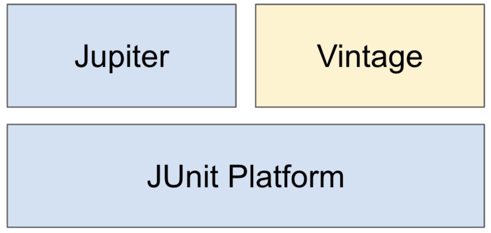
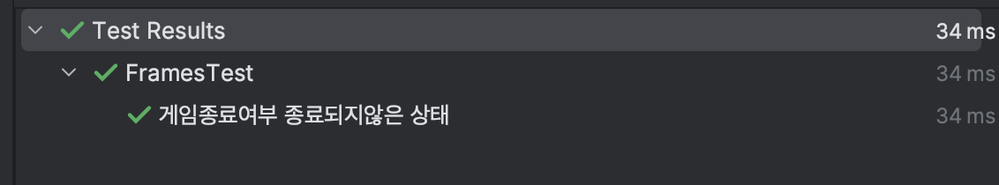

## 선택문 (조건문)
### if-else
* if 조건이 참인 경우에 if문 블럭 내의 내용을 수행
```java
	if (true) {
    	// 본문 내용 수행
        return value;
	}
```
* if 조건이 거짓인 경우 else문 블럭 내의 내용을 수행
  * else if 문이 있을 경우 먼저 else if 조건이 참인지 평가하고 참이면 else if 블럭 내용을 수행함
```java
	if (false) {
    	// 실행 X
        return a;
    } else if (true) {
    	// 실행 O
        return b;
    } else {
    	// 실행 X
        return c;
    }
    
    if (false) {
    	// 실행 X
        return a;
    } else if (false) {
    	// 실행 X
        return b;
    } else {
    	// 실행 O
        return c;
    }
```
* if 문 블럭 내부에 또 다시 if문을 넣을 수도 있음 (중첩 if문)
```java
	if (true) {
    	if (false) {
	        // 실행 X
        } else {
	        // 실행
            return value;
        }
	}
```
### switch / case
* 조건으로 주어진 하나의 값이 어떤 값인지에 따라 많은 양의 다른 로직을 수행하고자 할 때 유용
  * 다중 if문에 비해서는 가독성이 높음
  * 각 case마다 로직 종료 후 `break`를 걸지 않으면 계속해서 다음 case의 로직을 수행하기 때문에 조심해야 함
```java
	int a = getValue();
	switch(a) {
	    case 0:
        	doSomeThingA();
            break;
	    case 1:
        	doSomeThingB();
            break;
	    case 2:
        	doSomeThingC();
            break;
		default:
        	doSomethingDefault();
		}
```
## 반복문
### for문 (기본)
* `for(초기화 ; 조건문 ; 증감식) {}` 의 구조를 사용함
  * `조건문`이 참인 동안 `내부 로직 수행 -> "증감식" 수행` 을 반복함
  * 최초 동작 시 (조건문이 참일 경우) `초기화` -> `조건문 확인` -> `내부 로직 수행` -> `증감식 수행` -> `조건문 확인` -> ... 순으로 동작하므로 최초 선언된 조건문이 참이면 최소 1회는 본문 내용이 수행됨
```java
	int iterationCount = getIterationCount();
	for (int i = 0 ; i < iterationCount ; i++) {
    	doSomething(i);
    }
```
### while문
* `while (조건) {}` 의 구조를 사용
  * `조건`이 참일 동안 본문 로직을 반복 수행
* 최초 조건이 거짓이면 **1회도 본문 로직이 수행되지 않을 수** 있음
  * 반면, 조건이 변화하지 않으면 무한 루프에 빠질 수 있으므로 주의 (루프 내에서 통해 조건이 변화해야 함)
```java
	int i = 0;
	while (i <= 1) {
    	// i == 0, i == 1인 경우 총 2회 수행
    	i++;
	}
```
### do-while문
* while과 달리 **최소 1회는 본문 로직이 수행**됨
  * 즉, 먼저 구문을 실행한 후 마지막에 조건을 확인
```java
	int i = 0;
    do { 
    	// i == 0, i == 1인 경우 총 2회 수행
    	System.out.println(i); // 0, 1
    	i++;
	} while (i <= 1); // 조건이 참이면 다시 위로 올라가 본문을 수행
```
### for-each문 (향상된 for문)
* 컬렉션의 원소를 하나씩 가져와 for문처럼 반복을 수행할 수 있음
```java
	List<String> names = getNames();
	for (String name : names) {
	    // names의 원소를 하나씩 꺼내서 해당 원소를 name에 대입하여 아래 로직을 수행
    	doSomething(name);
	}
```
### 컬렉션에서의 forEach(Consumer)
* 컬렉션에서 제공하는 메소드 `forEach()`에 인자로 익명 함수 (함수형 인터페이스 Consumer의 메소드를 구현) 전달하면 간단히 컬렉션 원소에 특정 로직을 반복시킬 수 있음
```java
	List<String> names = getNames();
	names.forEach(name -> name.doSomething()); // (name::doSomething) 으로도 가능
```
### break과 continue
* break
  * 자신이 속한 가장 안쪽의 반복문을 중단
* continue
  * 자신이 속한 가장 안쪽의 반복문에서 다음 반복으로 넘어감
### Collection의 Iterator()
* Iterator를 사용하는 모든 콜렉션은 `iterator()` 메소드를 구현
  * 이 메서드는 `Iterator 인터페이스`를 리턴
#### Iterator 인터페이스
* Iterator는 `hasNext()`, `next()` 메소드를 필수로 갖고, `remove()` 메소드를 선택적으로 지원
```java
	public interface Iterator<E> {

    boolean hasNext();

    E next();

    default void remove() {
        throw new UnsupportedOperationException("remove");
    }
    
	...
  }

```
#### hasNext(), next()
* `hasNext()` - 다음번 엘리멘트가 있다면 `true`를 반환, 없다면 `false`를 반환
* `next()` - 다음번 엘리멘트를 반환
  * 최초 호출 시, 첫번째 엘리멘트를 반환함

#### for문에서의 활용
```java
	list = 아무아무 컬렉션;
	for (Iterator<Integer> itr = list.iterator() ; itr.hasNext() ; ) {
	    // itr.next() 수행으로 인해 itr.hasNext()의 값이 바뀌게 되므로 for문의 증감식은 필요하지 않음
    	doSomething(itr.next());
    }
```
#### ⭐️ remove()
* 오라클 자바 공식 문서에서는 아래와 같이 `Iterator.remove`가 반복 도중 원소를 삭제하는 **유일하게 안전한 방법**이라고 소개하고 있음
  > Note that `Iterator.remove` is the **only safe way to modify a collection during iteration**; the **behavior is unspecified** if the underlying collection is modified **in any other way** while the iteration is in progress.

* 향상된 for문에서 remove를 시도할 경우
  * `ConcurrentModificationException` 발생
```java
	List<String> names = getNames();
	for (String name : names) {
		if (name.equals("현상혁")) {
			names.remove(name);  // ConcurrentModificationException 💥
		}
	}
```
* 기존 인덱스 기반으로 remove를 시도할 경우
  * 이 경우 삭제는 되지만, **삭제 시마다 인덱스가 조정**되기 때문에 따로 인덱스를 보정해주지 않는다면 의도한대로 모든 원소를 순회할 수 없음
  * 아래 예시에서는 `3`을 삭제하면서 인덱스가 `4`를 스킵하고 바로 `5`를 가리키게 되므로 삭제가 정상적으로 수행되지 못함
```java
	List<Integer> numbers = new ArrayList<>(List.of(1, 2, 3, 4, 5));
	for (int i = 0; i < numbers.size(); i++) {
		Integer number = numbers.get(i);
			if (number.equals(3) || number.equals(4)) {
				numbers.remove(number);
            }
        }

        System.out.println(numbers); // [1, 2, 4, 5]
	}
```
* Iterator.remove() 사용 시
  * 내부적으로 콜렉션이 아닌 복제본을 순회 (추가 메모리 사용) 하기 때문에 가능한 일
```java
        List<Integer> numbers = new ArrayList<>(List.of(1, 2, 3, 4, 5));
        for (Iterator<Integer> itr = numbers.iterator(); itr.hasNext();) {
            Integer number = itr.next();
            if (number.equals(3) || number.equals(4)) {
                itr.remove(); // 컬렉션이 아닌 itr에게 remove()를 해야 함
            }
        }

        System.out.println(numbers); // [1, 2, 5]
```
* Iterator.remove()의 더 간편한 사용 방법
  * `컬렉션.removeIf(Predicate)`으로 순회를 직접 작성하지 않아도 원하는 원소를 삭제할 수 있다
```java
	List<Integer> numbers = new ArrayList<>(List.of(1, 2, 3, 4, 5));
	numbers.removeIf(number -> number.equals(3) || number.equals(4));

	System.out.println(numbers); // [1, 2, 5]
```

## JUnit 필수 개념 정리
### JUnit5 소개
* 자바 개발자가 가장 많이 사용하는 테스팅 프레임워크
  * 자바 8 이상을 필요로 함
* 구성
  * JUnit Platform - 테스트를 실행해주는 **런쳐** 제공. TestEngine **API** 제공.
  * Jupiter - TestEngine API 구현체, **Junit 5** 제공
  * Vintage - TestEngine API 구현체, Junit 3, 4 제공
  


### 의존성 추가
* `2.2+` 버전의 스프링 부트 프로젝트 생성 시 자동으로 JUnit 5 의존성이 같이 받아짐
* 스프링 부트 미사용 시
```gradle
	<dependency>
    <groupId>org.junit.jupiter</groupId>
    <artifactId>junit-jupiter-engine</artifactId>
    <version>원하는_버전_작성</version>
    <scope>test</scope>
	</dependency>

```
### 테스트 이름 표시
* `@DisplayNameGeneration()`
  * 클래스 어노테이션으로 작성하면 미리 구현된 혹은 직접 구현한 **테스트 이름 표시 규칙**을 적용해줌
  * 기본 [구현체](https://junit.org/junit5/docs/current/user-guide/#writing-tests-display-names) 중 `ReplaceUnderscores` 제공 -> 테스트 메소드의 `_`를 공백으로 바꿔줌
```java
	@DisplayNameGeneration(DisplayNameGenerator.ReplaceUnderscores.class)
	class FramesTest {

    public static final int GAME_FINISHING_BOWL_TRIES = 12;

    @Test
    void 게임종료여부_종료되지않은_상태() {
        assertThat(framesProvider(1).gameFinished()).isFalse();
    }
```


* `@DisplayName()`
  * `@DisplayNameGeneration()`보다 우선순위가 높음
  * 어떤 테스트 인지 메소드명 말고 별도로 테스트 이름을 작성할 수 있는 기능
### Assertj 라이브러리를 사용한 대표적인 Assertions
* Assertj
  * JUnit과 호환되는 3rd-party 라이브러리
  * 더욱 편리하고 가독성 좋게 테스트 코드를 작성할 수 있음
  * JUnit 팀에서도 정식 추천하는 라이브러리
  * 메서드 체이닝을 사용해 편하게 검증을 수행할 수 있음
* 대표적인 Assertions

| assertj 코드 | 검증 내용 |
| :---: | :---: |
| isEqualTo(Object o) | 실제 값이 주어진 값과 같은지 확인 ( equals() ) |
| isSameAs(Object o) | 실제 값이 주어진 값과 같은지 확인 ( == ) |
| isInstanceOf(Class type) | 실제 값이 주어진 유형의 인스턴스인지 확인 |
| isExactlyInstanceOf(Class type) | 실제 값이 **정확히** 주어진 유형의 인스턴스인지 확인 |
| isTrue() / isFalse() | 주어진 값이 참 / 거짓인지 확인 |
| contains(Object o) | 컬렉션이 주어진 값을 포함하는지 확인 |
| containsOnly(Object o) | 컬렉션이 주어진 값**만** 포함하는지 확인 |
| containsExactly(Object o) | 컬렉션이 정확히 **순서까지 고려하여** 주어진 값만 포함하는지 확인 |
| startsWith(Object o) | 컬렉션이 주어진 값으로 시작하는지 확인 |
| doesNotContainNull() | null을 포함하지 않는지 확인 |

### 테스트 반복
* RepeatedTest
  * 반복 횟수 / 반복 테스트 이름을 설정할 수 있음
#### ParameterizedTest
* 여러 다른 매개변수를 대입해가며 테스트를 반복 실행 가능
* 인자 값을 받는 방법들
  * `@ValueSource`
  * `@NullSoure`, `@EmptySource`, `@NullAndEmptySource`
  * `@MethodSource`
  * `@CsvSource`
  * ...
  
## 과제 0
`// TODO 과제 작성`

## 피드백
* `Queue`의 동작
  * 각각 삽입, 삭제, 확인 기능
  * `offer()`, `poll()`, `peek()` 은 수행이 불가해도 예외가 터지지 않고, `false`나 `null`을 반환
  * `add()`, `remove()`, `element()`는 수행 불가 시 예외가 터짐
  * 메소드 구현 시 **일관성**에 대해 고민하기

## 참고문헌
* https://www.notion.so/Live-Study-4-ca77be1de7674a73b473bf92abc4226a
* https://imasoftwareengineer.tistory.com/84
* https://docs.oracle.com/javase/tutorial/collections/interfaces/collection.html
* https://www.daleseo.com/how-to-remove-from-list-in-java/
* 백기선님 인프런 강의 - [더 자바, "코드를 테스트 하는 다양한 방법"](https://www.inflearn.com/course/the-java-application-test)