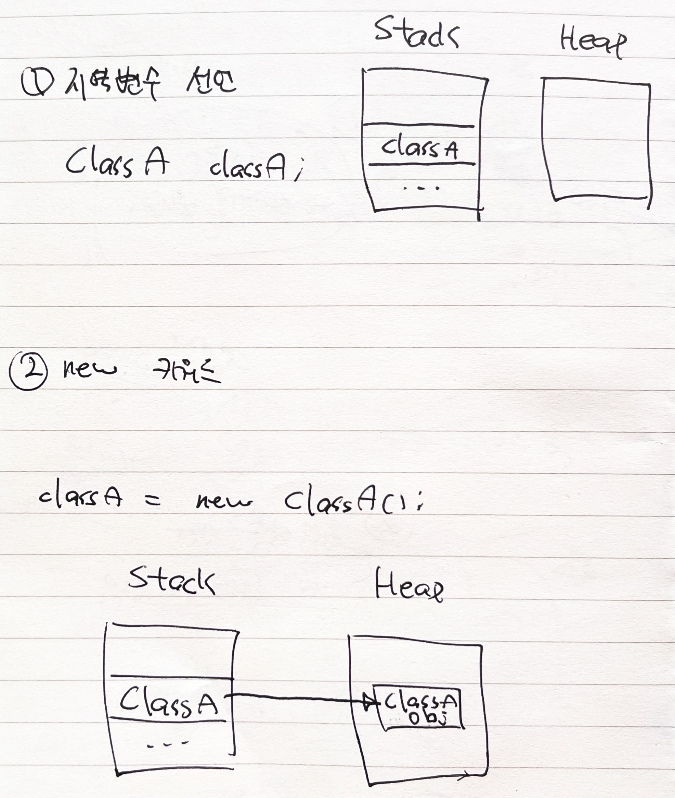

## 클래스란?
* 클래스는 공통의 특징(characteristics)/행동(behavior)/속성(properties, attributes)을 공유하는 객체들의 집합
* 클래스는 다양한 타입의 변수들과 메소드의 그룹
### 클래스가 포함하는 것들
* data member (field) - 객체의 데이터가 저장되는 곳
* method - 객체의 동작에 해당
* constructor - `new` 연산자로 호출되는 메소드로 객체 생성 시 필드의 초기화를 담당
* nested class - 클래스 내부에 또 다른 클래스를 선언할 수 있음
* interface `(!!)`

## 클래스 정의하는 방법
* 아래와 같이 클래스 정의 가능
```java
접근제어자 class 클래스명 {
    // 필드
    private int count;
    ...

    // 생성자
    ...

    // 메소드
    ...
}
```
### 접근 제어자
* 접근 제어자 (Access Modifiers)는 필드, 메소드, 생성자, 클래스 등의 접근성 (acessibillity)를 설정
  * 필드, 메소드, 생성자, 클래스의 앞에 접근 제어자를 붙여서 접근성을 제어할 수 있음

| 접근 제어자 | 접근 가능 범위 |
| :---: | :---: |
| Private | **클래스 내부**로 한정 |
| Default | **동일 패키지 내부**로 한정. 접근 제어자를 명시하지 않으면 설정되는 기본 값 |
| Protected | **동일 패키지 내부 + 해당 클래스를 상속 받은 자식 클래스**에 한정 |
| Public | **어디서나** 접근 가능 |

## 객체 만드는 방법 (new 키워드 이해하기)
* 아래와 같이 객체 생성 가능
```java
public class ClassA {}

---

public class Main {
    public static void main(String[] args) {
        ClassA classA = new ClassA(); // ClassA의 객체 classA 생성
    }
}
```
* `new` 키워드를 사용하면 runtime에 객체가 메모리에 생성됨
  * 객체는 모두 `Heap` 영역에 생성됨
  * 객체를 저장하는 `classA` 변수는 `Stack` 메모리에 생성됨
* 따라서 `new` 키워드를 사용한 후 `Stack`과 `Heap` 의 모습은 아래와 같음


## 메소드 정의하는 방법
* 메소드 구성요소
  * 접근 제어자 - `public, private, ...`
  * 반환 타입 - `void, String, int, ...`
  * 메소드 이름
  * 파라미터들 - `(파라미터1, 파라미터2, ...)`
  * 예외 - `throws Exception`
  * 메소드 본문 - `{...}`
* 예시
```java
public String getName(Long id) {
    return names.get(id);
}

private void validate(String name) throws Exception {
    service.validate(name); // Exception 발생 가능 메소드
}

// static 키워드를 통해 클래스 메소드로 선언할 수도 있음
// 이 경우 객체가 없어도 메소드 호출이 가능
public static ClassA init(Long id) {
    return new ClassA(id, initValue);
}
```

### 메소드 오버로딩
* 파라미터만 다른 동일한 이름의 메소드를 여러 개 만드는 것을 말함
  * 메소드 호출 시, 인자에 따라 다른(적절한) 메소드가 호출됨
```java
public int add(int a, int b) {
    return a + b;
}

public double add(double a, double b) {
    return a + b;
}

public String add(String a, String b) {
    return a + b;
}
```

## 생성자 정의하는 방법
* 클래스 정의 후 아무런 생성자를 명시하지 않으면 기본 생성자가 생성됨
  * `기본 생성자` - 아무런 인자를 받지 않는 (모든 필드에 기본 값이 채워지는) 객체 생성
  * 주의할 점은, 하나라도 생성자를 직접 작성하면 기본 생성자는 만들어지지 않음
* 클래스의 필드에 값을 설정한 상태로 객체를 생성하고자 하면, 파라미터가 있는 생성자를 작성하면 됨
  * 생성자의 **이름은 클래스와 동일**해야 함
  * 생성자는 반환 타입을 명시하지 않음 (`return ...;` 도 X)
* 생성자도 메소드와 동일하게 **overloading**이 가능
  * 이때, `this()`를 사용해 생성자 내부에서 다른 생성자를 호출할 수 있음
```java
public class Person {
    public String name;
    public int age;

    // 기본 생성자 (아무런 생성자를 명시하지 않으면 작성하지 않아도 기본으로 생성됨)
    Person() {
    
    }

    // 파라미터가 있는 생성자
    Person(String name) {
        this.name = name;
        
        // 위 코드는 아래와 같이 this()를 사용해서도 동일하게 구현이 가능하다
        // this(name, 0);
    }

    // 생성자 오버로딩
    Person(String name, int age) {
        this.name = name;
        this.age = age;
    }
}

---

public static void main(String[] args) {
    Person withoutName = new Person();
    System.out.println(withoutName.name); // null
    System.out.println(withoutName.age); // 0

    Person withName = new Person("현상혁");
    System.out.println(withName.name); // 현상혁
    System.out.println(withName.age); // 0

    Person withNameAndAge = new Person("현상혁", 26);
    System.out.println(withNameAndAge.name); // 현상혁
    System.out.println(withNameAndAge.age); // 26
}

```
### 생성자와 final 키워드
* final로 선언된 변수를 생성자나 변수 선언 시 초기화하지 않으면 컴파일 오류가 발생함
```java
// 컴파일 오류 발생
public class ClassA {
    private final int age;

    ClassA() {}
}

---

// 옵션 1 / 2 중 하나의 방법으로 변수 초기화를 수행해주어야 함
public class ClassA {
    // 옵션 1
    private final int age = 0;

    // 옵션 2
    ClassA (int age) {
        this.age = age;
    }
}
```

## this 키워드 이해하기
* 자기 자신의 **인스턴스** `참조`를 가리키는 키워드
  * 즉, **클래스를 기반으로 생성된 인스턴스를 가리키는 참조**
  * 인스턴스에 대한 참조이기 때문에 `static` 메소드에서는 당연히 사용 불가능
* 주로 생성자 등에서 지역 변수 (혹은 파라미터)와 인스턴스 변수의 이름이 같은 경우 이를 구분하기 위해 사용
```java
public class Person {
    public String name;

    Person(String name) {
        // this를 사용해 `인스턴스 변수 name에 파라미터로 전달된 name을 넣겠다` 는 의미가 모호하지 않고 확실해짐
        this.name = name;
    }

    public void changeName(String name) {
        // 일반 메소드에서도 인스턴스 변수의 이름과 지역 변수의 이름이 겹치는 경우 아래와 같이 사용 가능
        this.name = name;
    }

    // 물론, 서로의 이름이 달라도 사용은 가능
    // public void changeName(String givenName) {
    //     this.name = givenName;
    // }
}
```

* this와 객체의 참조 값 비교
```java
class Person {
    public String address() {
        return this.toString();
    }
}

---

Person person = new Person();

System.out.println(person.toString()); // ...Person@2002fc1d
System.out.println(person.address());  // ...Person@2002fc1d
```

## 과제
* int 값을 가지고 있는 이진 트리를 나타내는 Node 라는 클래스를 정의하세요.
* int value, Node left, right를 가지고 있어야 합니다.
* BinrayTree라는 클래스를 정의하고 주어진 노드를 기준으로 출력하는 bfs(Node node)와 dfs(Node node) 메소드를 구현하세요.
* DFS는 왼쪽, 루트, 오른쪽 순으로 순회하세요.

## 피드백
1. static, instance 초기화 블럭 (블럭 초기화의 필요성)
   1. 인스턴스 변수의 경우 블럭 초기화 -> 생성자 순으로 실행됨 (오버라이드 된다)
2. 생성자에는 `super()` 가 숨겨져 있어서 부모의 생성자를 implicit하게 호출한다.
3. 생성자에서 `this()` 를 호출할 땐 무조건 첫 라인에서 해야한다.

## 추가 정리할 것들
1. 로컬, 내부, 익명 클래스 등 여러가지 클래스의 종류와 스코프, 객체 생성 방법 등 정리
   1. 컴파일 시 어떻게 `.class` 파일로 바뀌는지
2. [클래스 로딩 과정](https://ahnyezi.github.io/java/javastudy-5/) 정리하기
3. 리플렉션? -> 런타임에 클래스에 대한 정보를 참조하는 기술
   1. 리플렉션 활용 예시
4. dfs를 스택으로 구현할 때 전위/중위/후위 순회 코드 정리

## 참고문헌
* https://www.geeksforgeeks.org/classes-objects-java/
* https://coding-factory.tistory.com/864
* https://www.javatpoint.com/access-modifiers
* https://docs.oracle.com/javase/tutorial/java/javaOO/methods.html
* https://jaynamm.tistory.com/entry/JAVA-this-%EC%9D%98%EB%AF%B8%EC%99%80-%EC%82%AC%EC%9A%A9%EB%B2%95