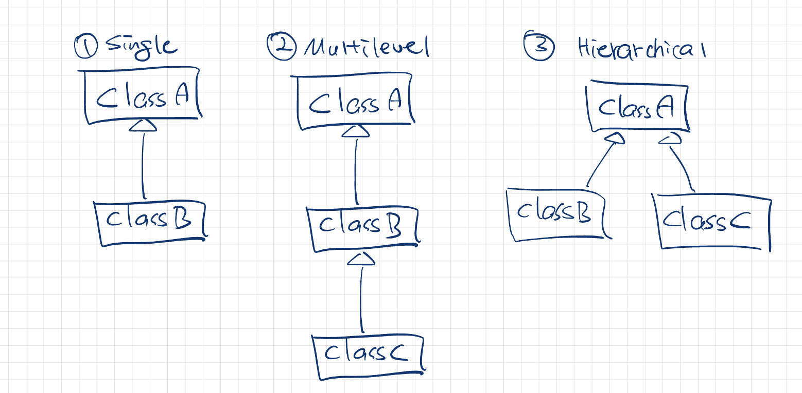
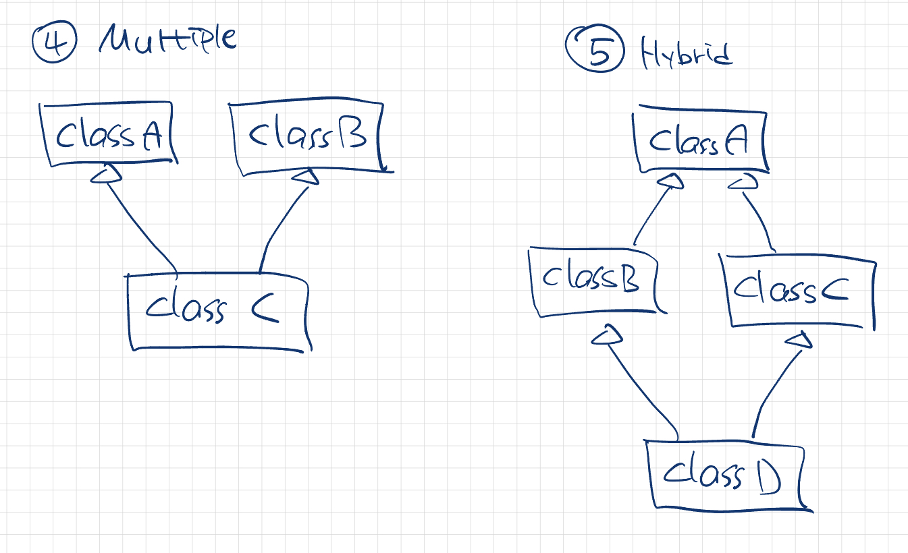

## 자바 상속의 특징
### 상속
* 한 클래스(자식 클래스)가 부모 클래스의 모든 속성(필드)과 행동(메소드)를 취득하는 메커니즘
  * 즉, 부모 클래스를 기반으로 새로운 클래스를 만들 수 있다
* OOP의 중요한 요소 중 하나
### 상속을 사용하는 이유
* 메소드 오버라이딩 (runtime polymorphism이 가능해진다)
* 코드 재사용성
### 상속 문법
* `extends` 키워드를 사용
```java
public class Parent {}

---

public class Child extends Parent {}
```
### 상속 구조
#### 자바에서 가능한 구조
1. Single
2. Multilevel
3. Hierarchical



```java
public class ClassA {...}

// Single
public class ClassB extends ClassA {...}

// Multilevel
public class ClassB extends ClassA {...}
public class ClassC extends ClassB {...}

// Hierarchical
public class ClassB extends ClassA {...}
public class ClassC extends ClassA {...}
```

#### 자바에서 (클래스로는) 불가능한 구조
4. Multiple
5. Hybrid



```java
public class ClassA {...}
public class ClassB {...}

// Multiple
public class ClassC extends ClassA, ClassB {...} // 불가 (컴파일 오류)

// Hybrid
public class ClassB extends ClassA {...}
public class ClassC extends ClassB {...}
public class ClassC extends ClassB, ClassC {...} // 불가 (컴파일 오류)
```

* 자바에서 다중 상속이 불가능한 이유
```java
public class ClassA {
    public void printMessage() {
        System.out.println("A");
    }
}
public class ClassB {
    public void printMessage() {
        System.out.println("B");
    }
}

public class ClassC extends ClassA, ClassB {
    public void someMethod() {
        printMessage(); // ClassA와 ClassB 중 어떤 부모 클래스의 메소드를 호출해야할지 모호한 문제 발생 -> 아예 지원 X
    }
}
```
## super 키워드
* 부모 클래스의 필드, 메소드 등에 접근하기 위해 사용
  * 자식 클래스에는 없고 부모 클래스에만 있는 메소드의 경우 `super` 없이 사용해도 부모의 것을 호출
  * 따라서, 주로 이름이 동일한 메소드, 생성자 등에서 자식 / 부모 클래스의 멤버를 구분하기 위해 사용
* `super` 사용 예시
```java
class Parent {
    protected int age = 50;
}

class Child extends Parent {
    protected int age = 20;

    public int getAge() {
        return age;
    }

    public int getParentAge() {
        return super.age;
    }
}

---

Child child = new Child();
System.out.println(child.getAge()); // 20
System.out.println(child.getParentAge()); // 50
```
* **생성자**에서의 `super` 사용 예시
```java
class Parent {
    private int age;

    Parent(int age) {
        this.age = age;
    }

    public int getAge() {
        return age;
    }
}

class Child extends Parent {
    Child(int age) {
        // 부모의 생성자를 호출
        super(age);
    }
}

---

Child child = new Child(20);
System.out.println(child.getAge()); // 20
```
## 메소드 오버라이딩
* 부모 클래스에 이미 선언된 메소드를 자식 메소드에서 다시 작성하는 것
### 사용 이유
* 부모 클래스에서 이미 제공되던 `동작`을 자식 클래스의 특정 구현에 맞게 제공하기 위해 사용
* `은행에 따라 달라지는 이자율 계산` 과 같이 구현체마다 다른 동작/값을 수행하고자 할 때 사용
```java
public class Bank {
    public double getRateOfInterest() {
        return 2.5;
    }
}

public class BankA extends Bank {
    @Override
    public double getRateOfInterest() {
        return 3.0;
    }
}

public class BankB extends Bank {
    @Override
    public double getRateOfInterest() {
        return 1.5;
    }
}
```
### 자바의 메소드 오버라이딩 규칙
* 부모 클래스의 메소드와 그 이름이 같아야 함
* 부모 클래스의 메소드와 파라미터가 같아야 함
* 반환 타입도 같아야함
  * 다만, 자식 메소드의 반환 타입이 부모 메소드의 반환 타입의 `sub-type`인 경우도 가능
* 메소드 오버라이딩 시 작성하는 `@Override`는 필수는 아니지만, 작성하는게 가독성에서 유리할 것으로 생각

### 접근제어자
* 부모 클래스 메소드보다 더 허용할 순 있으나, 덜 허용하진 못함
  * 즉, `default` -> `public` 은 가능하지만, `protected` -> `private` 는 불가능
* 추가로, `private` 메소드는 **오버라이딩이 불가능하다**
  * `private` 메소드는 컴파일 시 바인딩되기 때문
### final 키워드
* `final`로 선언된 메소드는 오버라이딩이 불가능하다
  * 클래스 관점에서는 뒤의 항목에서 다시 작성함
### static 메소드
* static 메소드는 `compile-time`에 메소드가 메모리에 올라감
  * 즉, 컴파일러가 어떤 메소드를 실행할지를 컴파일 시에 결정함
  * 따라서, 자식 클래스에서 static 메소드를 재정의해도 **실제 타입에 관게없이 선언된 타입에 따라** 호출되는 메소드가 결정됨
* 위와 같은 이유로 static 메소드의 재정의는 `overriding`이 아닌 `hiding`이라고 불림
* 예시
```java
class Parent {
    public static void staticPrint() {
        System.out.println("부모");
    }

    public void print() {
        System.out.println("부모");
    }
}

class Child extends Parent {
    public static void staticPrint() {
        System.out.println("자식");
    }

    public void print() {
        System.out.println("자식");
    }
}

---

Parent instance = new Child();
instance.print(); // 자식
instance.staticPrint(); // 부모 (컴파일 시 Parent 타입이므로 항상 Parent의 static 메소드 호출)
```
### 오버라이딩 시 예외처리
* 부모 메소드에서 예외를 던질 경우, 자식 메소드에서는 **해당 예외 포함 하위의 예외**만 던질 수 있다
  * 예외를 던지지 않아도 문제가 없음
* 부모 메소드에서 예외를 던지지 않는 경우, 자식 메소드에서는 `Unchecked Exception`만 던질 수 있다

#### 예시 - 예외를 던지는 경우
```java
class Parent {
    void logic() throws RuntimeException {
        ...;
    }
}

class Child1 extends Parent {
    // 동일한 예외 가능
    @Override
    void logic() throws RuntimeException {
        ...;
    }
}

class Child2 extends Parent {
    // 하위 예외 가능
    @Override
    void logic() throws ArithmeticException {
        ...;
    }
}

class Child3 extends Parent {
    // 예외 던지지 않는 것도 가능
    @Override
    void logic(){
        ...;
    }
}

class Child4 extends Parent {
    // 단, 상위 예외 타입은 불가능
    // 컴파일 에러
    @Override
    void logic() throws Exception {
        ...;
    }
}
```
#### 예시 - 예외를 던지지 않는 경우
```java
class Parent {
    void logic() {
        ...;
    }
}

class Child1 extends Parent {
    // unchecked exception 가능
    @Override
    void logic() throws ArithmeticException {
        ...;
    }
}

class Child2 extends Parent {
    // checked exception 불가능
    // 컴파일 에러
    @Override
    void logic() throws Exception {
        ...;
    }
}
```

## 다이나믹 메소드 디스패치 (Dynamic Method Dispatch)
* 실시간으로(Dynamic, runtime) 어떤 메소드(Method)를 호출할 지 결정(Dispatch) 하는 메커니즘
  * 런타임에 자식 클래스의 오버라이딩된 메소드를 호출하는 것을 말함
  * 부모 클래스로 자식 클래스가 `upcasting` 되는 경우, 부모 타입에 실제 어떤 자식 클래스가 들어있는지는 **런타임**에만 알 수 있다
```java
class Parent {
    public int getInteger() {
        return 0;
    }
}

class Child1 extends Parent {
    public int getInteger() {
        return 1;
    }
}

class Child2 extends Parent {
    public int getInteger() {
        return 2;
    }
}

---

Parent instance = new Parent();
instance.getInteger(); // 0

// 같은 Parent 타입인 instance에 어떤 객체가 런타입에 들어왔는지 판단하고, 해당 객체의 메소드를 호출해주는 기술이
// 다이나믹 메소드 디스패치
instance = new Child1();
instance.getInteger(); // 1

instance = new Child2();
instance.getInteger(); // 2
```
## 추상 클래스
* 객체 간의 공통적 특성을 추출한 클래스
  * 이때, 추상 클래스는 구체적인 실체가 없고 공통 특성을 추상적으로 갖고 있게 됨
* 추상 클래스는 **인스턴스화 할 수 없다**.
```java
// 아래와 같이 선언
class abstract AbstractClassA {...}
```
### 추상 메서드
* `abstract`가 붙은 메소드로 메소드 본문을 갖지 않음
* 추상 클래스는 **추상 메소드**를 **하나 이상** 가져야 함
  * 반대로, 추상 메소드를 하나 이상 가진 클래스는 무조건 추상 클래스가 되어야 함
```java
// 아래와 같이 선언
class abstract AbstractClassA {
    public abstract void methodA();
}
```
### 추상 클래스 사용 이유
* 객체 간의 **필드와 메서드의 이름을 통일**하여 **소스의 가독성**을 높이기 위함
  * 마치 인터페이스에 api 규약을 설정하는 것처럼 추상 클래스를 통해 하위 클래스가 따라야할 필드, 메서드의 이름을 규정함
  * (추상 클래스에 선언된 `abstract` 메소드는 반드시 하위 클래스에서 재정의해야 함 - 하지 않으면 추상 클래스로 밖에 존재할 수 없음)
* 중복 코드 제거
  * 모든 하위 클래스에 공통적인 필드, 메서드 등을 추상 클래스에 정의하고 하위 클래스에서는 상속받아 사용하게하여 코드의 중복을 제거함
* 인터페이스와의 차이
  * 자바 8부터 인터페이스에도 `default` 메소드 사용이 가능해졌지만, 인스턴스 변수 등의 선언은 불가능하므로 이런 부분에서 추상 클래스와 역할이 다르다고 생각

## final 키워드
* 클래스나 메소드에 `final` 키워드가 붙어있으면 상속이 불가능하다
  * 상속을 금지하고자 할 때 사용
  * Kotlin은 클래스에 `final` 이 기본 값
```java
// final 클래스
public final class ClassA {...}
public class ClassB extends ClassA {...} // 컴파일 에러

// final 메소드
public class ClassA {
    public final void methodA() {...}
}
public class ClassB extends ClassA {
    @Override
    public final void methodA() {...}  // 컴파일 에러
}
```
### 상속을 금지해야 하는 경우?
* 무분별한 상속으로 인한 예상하기 어려운 부수효과를 방지하기 위해
* 불변성을 유지하기 위해 (상속받은 클래스에서 불변을 유지해줄 것이라고 보장할 수 없음)
* 예로, 자바의 `String` 클래스는 `final`로 선언되어 있다

## Object 클래스
* 모든 자바 클래스의 **최고 조상 클래스**
  * 즉, 모든 자바 클래스는 `Object` 클래스를 상속받는다
  * 따라서, 모든 자바 클래스는 `Object` 클래스에 정의된 메소드를 사용할 수 있음
* `Object` 클래스는 필드 없이 11개의 메서드만으로 구성됨
* `java.lang` 패키지에 위치
  * 이 패키지는 자바에서 가장 기본적인 동작을 수행하는 클래스들의 집합으로, 별도로 `import` 하지 않아도 사용 가능
  * `Math`, `Long`, `Integer`, 등등이 이 패키지에 포함됨

### 메서드 목록
| 메소드 시그니처 | 설명 |
| :---: | :---: |
| boolean equals(Object obj) | 전달받은 객체와 현 객체가 같은지 여부를 반환 |
| String toString() | 객체의 정보를 문자열로 반환
| protected Object clone() | 객체의 복제본 생성 후 반환 |
| int hashCode() | 객체의 해시 코드 값을 반환 |
| Class<T> getClass() | 객체의 클래스 타입을 반환 |
| protedted void finalize() | GC가 객체의 리소스를 정리하기 위해 호출(?) -> GC 정리 시 다시 참고하기 |
| void notify() | 객체의 wait 상태 쓰레드 **하나**를 다시 실행할 때 호출 |
| void notifyAll() | 객체의 wait 상태 쓰레드 **모두**를 다시 실행할 때 호출 |
| void wait() | 다른 쓰레드가 notify()/notifyAll()을 해줄 때 까지 현재 쓰레드를 대기 시킴 |
| void wait(long timeout) | 다른 쓰레드가 notify()/notifyAll()을 해주거나 timeout이 지날 때 까지 현재 쓰레드를 대기 시킴 |
| void wait(long timeout, int nanos) | 다른 쓰레드가 notify()/notifyAll()을 해주거나 timeout이 지날 때 까지 (nanos 추가 고려) 현재 쓰레드를 대기 시킴 |

## 참고문헌
* https://www.javatpoint.com/inheritance-in-java
* https://www.javatpoint.com/method-overriding-in-java
* https://www.geeksforgeeks.org/overriding-in-java/
* https://velog.io/@cchloe2311/Java-static-method-%EC%83%81%EC%86%8D
* https://velog.io/@maigumi/Dynamic-Method-Dispatch
* https://coding-factory.tistory.com/866
* http://www.tcpschool.com/java/java_api_object