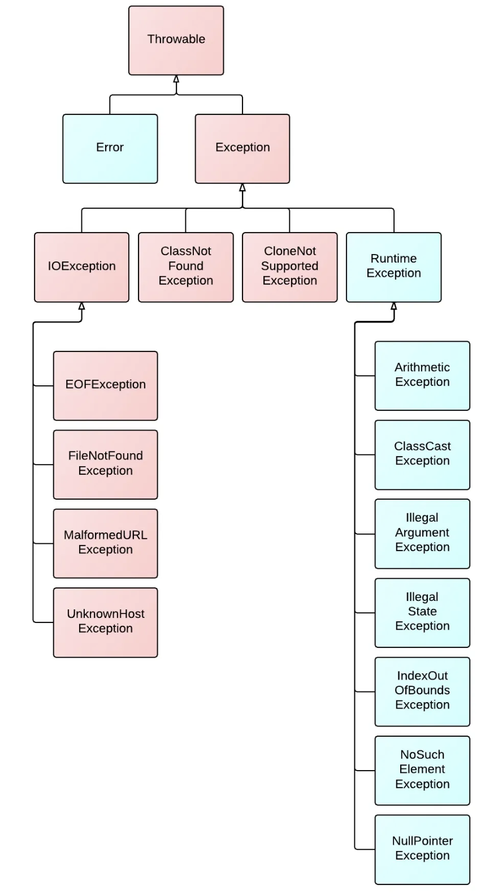

## 자바에서 예외 처리 방법 (try, catch, throw, throws, finally)
### 예외 처리의 목적
* 프로그램이 실행되다보면, 여러가지 이유로 인해 예외가 발생한다
* 이러한 상황이 발생했을 때 **예외 처리** 로직을 미리 작성해둠으로써 프로그램의 비정상적인 종료를 막고 프로그램의 상태를 정상 상태로 돌려놓기 위함
### try-catch
* 기본적으로 예외는 `try-catch` 문을 통해 처리할 수 있다.
  * `try {}` 에 예외가 발생가능한 로직을 넣고
  * `catch(Exception e) {}` 에 `e` 예외 발생 시 수행할 로직을 넣는다
* 발생한 예외가 `catch()` 문 괄호 안의 예외 클래스 하위의 클래스이면 해당 `catch() {}` 본문이 수행된다.
  * 만약 발생한 예외가 최초로 만난 `catch()` 문 괄호 안의 예외 클래스에 속하지 않는다면, 계속해서 해당하는 예외 클래스가 있을 때 까지 내려가며 비교한다.
  * 위쪽에서 `catch() {}`가 실행되면 아래의 `catch`문 들은 실행되지 않기 때문에 아래로 갈 수록 더 넓은 범위의 예외 클래스를 적어두어야 한다.
  * 보통 더 구체적인 예외를 상단에 두어 발생한 예외 상황에 맞는 별도의 처리 로직을 수행하고 마지막에 가장 부모 예외 클래스를 두어 다른 모든 예외 클래스에 해당되지 않아도 예외 처리는 이루어지도록 구성한다.
```java
public void doSomething() {
    try {
        // 예외 발생 가능성이 있는 코드
        methodThatCanThrowsException();
    } catch (IOException e) {
        // IOException.class 예외 발생 시 수행할 로직 작성
        doSomethingA();
    } catch (Exception e) {
        // Exception.class 예외 발생 시 수행할 로직 작성
        doSomethingB();
    }
}
```
### try-catch 실행 흐름
1. try 블럭 내에서 예외가 발생한 경우
   * 먼저 `try` 블럭은 예외가 발생한 코드까지만 실행되고 중단된다.
   1. 발생한 예외와 일치하는 `catch` 블럭이 **있는** 경우
      * 해당 `catch` 블럭 내의 로직 수행 후 `try-catch` 전체를 벗어나 다음 코드부터 이어서 실행
   2. 발생한 예외와 일치하는 `catch` 블럭이 **없는** 경우
      * 아무런 `catch` 블럭도 실행되지 못하고 `try-catch` 전체를 벗어나 다음 코드부터 이어서 실행.
      * 다만, `CheckedException`은 발생 예외와 일치하는 `catch` 블럭이 없으면 **컴파일 오류** 발생. 두 번째 경우는 `UncheckedException`에만 해당
3. try 블럭 내에서 예외가 발생하지 않는 경우
   * `try` 블럭의 모든 코드가 실행되고, `catch` 블럭은 아무것도 실행되지 않는다. 이후, 다음 코드 이어서 실행.

### Multicatch Block
* 여러 catch block을 하나로 합칠 수도 있다.
  * 여러 예외에 대하여 동일한 예외 처리를 해야할 때 코드 중복을 제거할 수 있다.
```java
try {
    // 예외 발생 코드
} catch (IllegalArgumentException | IllegalStateException e) {
    // 예외 처리 코드
}
```
* 단, 나열된 예외 클래스들이 `부모 - 자식 관계` 면 컴파일 오류가 발생한다.
  * 어차피 자식 예외 클래스로 잡아지는 오류는 부모 예외 클래스로도 잡아지기 때문
* 참조 변수 `e`에는 **실제로 발생한 예외 클래스**에 대한 정보가 담긴다.
```java
public void methodA() {
    try {
        methodB();
    } catch (IllegalStateException | IllegalArgumentException e) {
        System.out.println(e); // java.lang.IllegalStateException
    }
}

public void methodB() {
    throw new IllegalStateException();
}
```

### finally
* 예외의 발생 유무에 관계없이 항상 실행되는 블럭
  * 예외 발생 후 `catch` 블럭이 실행되었다고 해도 무조건 실행된다
* 커넥션 풀 닫기, 임시 파일 삭제, IO 닫기 등에 사용할 수 있다
```java
try {
    // 예외 발생 가능성이 있는 코드
    methodThatCanThrowsException();
} catch (IOException e) {
    // 예외 발생 시 수행할 로직 작성
    doSomethingA();
} finally {
    // 예외 발생 유무에 관계없이 무조건 실행되어야 할 코드 작성
    alwaysCalledMethod();
}
```
* 주의할점은, `finally` 내부에 `return`문이 있는 경우 `try`나 `catch` 에서 수행된 `return`을 덮어씌워버리므로 사용하지 않아야 한다. (안티패턴)
  * `finally`는 `try`나 `catch` 수행 후 무조건 수행되므로 반환 값을 덮어써버림

### try-with-resource
* 입출력/소켓/커넥션풀 등 자원의 연결 이후 무조건 종료해주어야 하는 로직에서 유용하게 사용할 수 있는 기능
* `finally`에서 자원의 종료를 별도로 명시해주지 않아도 `try-catch` 문 이후에 알아서 자원을 닫아준다
  * 자원을 열어두고 종료하지 않을 우려가 없고, 코드의 가독성이 훨씬 좋아진다.
* 아래와 같이 사용
```java
// 기존 코드
try {
	fin = new FileInputStream(file); // 자원 객체 생성 코드
    // 이후 로직 수행
} catch(IOException ie) {
	// 예외 처리 코드
} finally {
    // 자원 종료 코드
	try {
      if (Objects.nonNull(fin)) {
          fin.close();
      }
  } catch (IOException e) {
      e.printStackTrace();
  }
}

---

// try-with-resource 사용한 개선 코드
try(fin = new FileInputStream(file)) { // 자원 객체 생성 코드
	// 이후 로직 수행
} catch(IOException e) {
    // 예외 처리 코드
} // 자원 종료 코드 생략 가능
```
* 이 기능을 사용하기 위해서는 할당되는 자원이 `AutoCloseable` 인터페이스를 구현해야 한다.
```java
public interface AutoCloseable {
    void close() throws Exception;
}
```
* 자원을 닫는 코드는 가능하면 `finally`로 별도로 처리하기 보다 `try-with-resource`로 한번에 생성하고 닫아주는 편이 좋다
   * 자원을 닫는 `close()`에서도 `IOException`이 발생할 수 있기 때문에 여러 자원을 `finally`에서 한꺼번에 닫는 경우 닫는 코드를 `try-catch` 로 각각 감싸주지 않으면 자원이 닫히지 않는 문제가 발생할 수 있다
 * 여러 자원을 한번에 (`;`로 구분해서) 생성할 수도 있다
 ```java
 try (자원A a = new 자원A();
      자원B b = new 자원B()) {
    ...
} catch (...) {
    ...
}
 ```
 * 주의할 점은 예외 처리는 기존처럼 해주어야 함
   * `finally`로 자원을 닫는 것만 대체해주는 것
 * `try-with-resource`를 사용하고 추가로 `finally`를 쓰면, 자원을 닫고나서 `finally` 본문을 추가로 호출해준다
   * 컴파일러가 내부적으로는 `catch`로 자원을 닫도록 코드를 만들어주기 때문


### throw
* 예외를 고의로 발생시킬 수 있는 키워드
  * 사용자 입력을 특정 범위로 제한하고 싶을 때 등 사용 가능
```java
public class Person {

    public static final int NAME_MAX_LENGTH = 5;

    private String name;

    Person(String name) {
        validateName(name); // 이름이 적절하지 않은 경우 예외를 던지고, 객체 생성 X
        this.name = name;
    }

    private static void validateName(String name) {
        if (name.length() > NAME_MAX_LENGTH) {
            throw new IllegalArgumentException("이름은 5자 이하여야 합니다");
        }
    }
}
```

### throws
* 메서드에 해당 메서드에서 발생하는 예외를 명시하는 것
  * 여러 예외를 쉼표로 연결해서 선언할 수 있으며, 선언된 예외 클래스의 자식 예외 클래스도 발생할 수 있음
* `throws`를 통해 예외를 선언하게 되면, 메서드 내부에서 발생하는 예외를 현재 메서드에서 처리하지 않고 메서드를 사용하는 쪽으로 **처리의 책임을 전가**하게 된다
  * 따라서, 메소드 내부에서 `Checked Exception`이 발생할 수 있어도 `throws` 를 통해 예외를 선언하면 컴파일 오류가 발생하지 않는다
  * 현재 메서드를 사용하는 쪽에서 예외 처리를 하도록 하기 떄문
* 그렇게 계속해서 상위 메서드로 전달하다가 만약 해당 쓰레드를 실행시킨 최상위 메서드 (메인 쓰레드의 경우 `main()` 메서드) `throws`로 예외를 넘기게 되면 해당 쓰레드는 오류를 출력하고 그냥 종료된다.
```java
public void methodA() throws IOException, ...Exception {
    ...
}
```

## 자바가 제공하는 예외 계층 구조


### Throwable 클래스
* 모든 예외/에러가 상속받아야 하는 클래스
* 오류나 예외에 대한 메시지 (상세 정보)를 담는다
  * `chained exception`에서 연결된 예외의 정보들도 기록
* 예외의 정보를 출력하는 `getMessage()`, `printStackTrace()` 등의 메서드를 가짐

### Checked Exception
* 붉은 색으로 표시된 클래스가 `Checked Exception`
  * `Runtime Exception`을 상속받지 않는 예외는 모두 `Checked Exception`
  * **예외 처리**를 진행하지 않으면 컴파일 에러가 발생한다. 즉, `throws`나 `try-catch` 등을 통한 예외의 처리가 강제된다.

### Unchecked Exception
* 파란 색으로 표시된 클래스가 `Unchecked Exception`
  * `Runtime Exception`을 상속받는 예외들을 말함
  * 이러한 예외들은 컴파일 시점에 예외 처리 여부를 확인하지 않는다 (예외 처리를 하는 것은 가능하다) 

## Exception과 Error의 차이는?
* 오류(Error)는 시스템이 종료되어야 할 수준의 상황과 같이 수습할 수 없는 **심각한 문제**를 말함
  * `StackOverflowError`, `OutOfMemoryError` 등이 존재
  * 오류는 개발자가 예외 처리 로직을 통해 발생을 방지하기 어려움
* 예외(Exception)는 개발자가 작성한 코드나 사용자 입력에 의해 발생하는 문제를 말함
  * 오류와 달리 개발자가 미리 에측하여 방지할 수 있음 (예외처리)
* Error와 Exception 모두 `Throwable` 이라는 클래스를 상속받는다

[출처 - https://toneyparky.tistory.com/40]

## RuntimeException과 RE가 아닌 것의 차이는?
간단하게는 `Runtime(Unchecked) Exception`은 예외 처리가 강제되지 않고, `Runtime Exception`이 아닌 나머지 예외(`Checked`)는 예외처리가 강제된다. 자바는 왜 이렇게 디자인되었을까?

[오라클 공식문서](https://docs.oracle.com/javase/tutorial/essential/exceptions/runtime.html)에 따르면, `메소드에서 발생하는 예외`는 메서드에서 제공하는 인터페이스의 주요한 부분이라고 말한다. 즉, 해당 메서드를 사용하는 곳에서 해당 메서드에서 어떤 예외가 발생하는지 **알야아 하고**, 그에 합당한 예외 처리를 해주어야할 필요가 있다는 것이다.

그런데 위 설명대로라면 `Checked Exception`만 두어 모든 예외에 대해 예외처리를 하는 것이 좋아보인다. 그런데 `Runtime Exception`은 왜 존재할까?

마찬가지로 오라클 문서에 따르면, `Runtime Exception`은 개발자의 실수 등으로 인해 발생 가능한 `프로그래밍 문제`에 의해 발생하는 예외를 표현하기 위해 존재한다. 이러한 문제는 메서드를 가져다 사용하는 클라이언트 측에서 예외 처리를 할 것으로 기대할 수 없다. 이를테면, `ArithmeticException`, `NullPointerException`, `IndexOutOfBoundsException` 등이 있다.

`Runtime Exception`은 프로그램의 모든 곳에서 발생할 수 있고, 그 수가 매우 많기 때문에 이러한 예외 모두에 예외 처리 로직을 강제하면 프로그램이 명료해지지 않기 때문에 컴파일러가 강제하지 않는다는 오라클 문서의 설명도 있었다.

여기까지 설명을 읽으니 자연스럽게 아래의 질문이 생각났다.
> 둘의 차이는 알겠는데 그렇다면 언제 Checked를 던지고, Unchecked를 던져야 할까?

오라클 문서에서는 클라이언트가 예외 발생을 예측하고 처리하는 것이 타당하면 `Checked Exception`을 던지고, 그렇지 않으면 (클라이언트가 예외 처리를 위해 할 수 있는 것이 없으면, 타당하지 않으면) `Unchecked Exception`을 던지라고 한다.

> 음.. 무슨 말인지는 이해했다. 근데 예를 들어 사용자 입력을 받아서 리스트의 특정 값을 반환하는 프로그램을 작성한다고 했을 때, 리스트의 `get()` 메소드를 사용할텐데 만약 사용자 입력을 검증하는 로직이 없다면 많은 경우에 `IndexOutOfBoundsException` 예외가 발생할 것이다. 이런 경우에, `get()`을 사용하는 클라이언트에서 예외 처리를 하지 않는게 '타당' 한건가??
> 
> 이 부분은 좀 더 고민해봐야할 것 같다.

## 커스텀한 예외 만드는 방법
* `Runtime Exception` 이나 `Exception` 등을 상속받는 커스텀 예외 클래스를 만들 수 있다
```java
public class CustomException extends RuntimeException {

    CustomException() {
    }

    // 결과적으로 Throwable의 `detailMessage` 변수에 에러 메시지 내용이 저장됨
    CustomException(String message) {
        super(message);
    }
}
```
* `Throwable` 클래스에서 제공하는 메서드들을 커스텀할 수도 있다.
```java
public class Throwable implements Serializable {

    public String getMessage() {
        return detailMessage;
    }    
    
    public void printStackTrace() {
        printStackTrace(System.err);
    }
    
    ...
}

---

public class CustomException extends RuntimeException {

    public static final String MESSAGE_HEADER = "커스텀 에러 메시지 : ";

    CustomException() {
    }

    // 결과적으로 Throwable의 `detailMessage` 변수에 에러 메시지 내용이 저장됨
    CustomException(String message) {
        super(message);
    }

    @Override
    public String getMessage() {
        return MESSAGE_HEADER + super.detailMessage;
    }

    @Override
    public synchronized Throwable fillInStackTrace() {
        // stack trace의 생성 비용을 줄이기 위해 fillInStackTrace() 메소드를 재정의하는 경우
        return this;
    }
}
```
* 추가적으로, 커스텀 예외를 만들 때 `root cause`를 받는 인자를 만들면 좋다
  * `catch` 구문에서 커스텀 예외로 기존 예외를 감싸서 다시 던지는 경우 해당 예외의 원인이 되는 예외를 같이 예외 객체에 담아서 던질 수 있도록 하면 유용할 수 있다
   * 단, 상위 예외를 파악해야 하는 상황에만 사용하기
```java
public class MyException extends RuntimeException {
    ...
    // cause를 인자로 받는 생성자 추가
    public MyException(String message, Throwable cause) {
        super(message, cause);
    }
    ...
}
```

### 커스텀 예외 사용의 단점
* 커스텀 예외를 사용하는게 좋은지, 어떤 상황에 사용해야 하는지는 고민이 필요한 부분인 것 같다.
  * 먼저, 커스텀 예외가 굳이 필요없는 이유와 상황에 대한 예시이다
1. 표준 예외의 예외 메시지만으로도 충분히 의미 전달이 가능하다
   1. 커스텀 예외 클래스가 오직 예외 클래스 이름으로 예외 정보를 전달하는 역할만 수행한다면, 모든 예외 상황에 맞는 커스텀 예외 클래스를 전부 만드는 게 과도한 구현일 수 있다.
   2. 이렇게 모든 상황에 맞는 커스텀 예외를 만들면 커스텀 예외 클래스가 지나치게 많아질 수 있다.
2. 표준 예외를 사용하면 API를 처음 사용하는 개발자들에게 가독성이 높아진다.
   1. 즉, 해당 예외가 어떤 예외인지 (익숙하기 때문에) 한 번에 파악할 수 있다

### 커스텀 예외 사용의 장점
* 상황에 따라선 커스텀 예외 사용이 좋은 경우도 있다.
1. 예외 클래스 이름만으로 더 구체적인 정보 전달이 가능하다
2. 생성자를 추가로 생성해 `detailMessage`를 좀 더 구체적으로 작성해줄 수 있다.
3. 같은 상황의 예외가 여러 곳에서 발생할 경우, 해당 예외에 대한 코드를 한 클래스에 모음으로써 응집도를 높일 수 있다. (클래스를 만드는 행위는 관련 정보를 해당 클래스에서 최대한 관리하겠다는 뜻)
4. 예외 생성 비용의 감소
   1. `Stack Trace`는 예외 발생 시 `call stack`의 메소드 리스트를 저장하는데, 해당 정보가 불필요한 경우에는 이를 담당하는 `fillInStackTrace()` 메소드를 재정의하여 불필요한 오버헤드를 줄일 수 있다.

* 결론은, 상황에 따라서 고민하고 사용해야 할 듯.

## (추가) Stack Trace
### Stack Trace란?
* `Stack Trace`는 `Stack Frame`의 배열로, 예외가 발생하기까지 메소드 스택의 경로를 담아둔 것을 의미한다.
* 아래와 같이 예외가 발생해서 콘솔에 에러가 출력되었을 때 `(1)`이 예외에 대한 설명이고 이어서 출력된 `(2)`가 바로 `Stack Trace` 이다
```java
public class ExceptionTest {
    public void method1() {
        method2();
    }

    public void method2() {
        method3();
    }

    public void method3() {
        method4();
    }

    public void method4() {
        throw new IllegalStateException("올바른 상태가 아닙니다");
    }

    public static void main(String[] args) {
        ExceptionTest instance = new ExceptionTest();
        instance.method1();
    }
}
```

* `Stack Trace`는 아래와 같이 `Throwable` 클래스에서 제공하는 메소드들을 통해 얻을 수 있다
  1. `printStackTrace()` 메소드로 `System.err`에 출력
  2. `getStackTrace()` 메소드로 `StackTraceElement[]` 얻기

#### StackTraceElement
* `Stack Trace`를 캡슐화한 객체
* 생성자에서 클래스명, 메소드명, 라인넘버 등을 인자로 받아 저장한다

### 생성 비용과 `fillInStackTrace()` 재정의
* 예외를 처리하는 비용은 비싸다
  * 비용의 대부분은 `Stack Trace`를 생성하는 데에서 발생 ([관련 링크](https://meetup.nhncloud.com/posts/47))
#### 해결 방안
* `Stack Trace` 를 생성하는 `fillInStackTrace()` 메소드를 재정의한다
   * 해당 메소드는 `Throwable`의 모든 생성자에서 호출되어 예외가 생성될 때 `Stack Frame`을 생성한다
 * 정말로 예외가 발생한 경로를 알아야 하는 경우도 있겠지만, 웹 앱을 개발하며 사용하는 커스텀 예외의 경우 오직 `비지니스 로직을 수행하기 부적절한 상태` 임을 알리기 위한 것도 있다 -> 이때는 굳이 `Stack Trace`가 필요하지 않다!!
   * 따라서, 이를 생성하지 않도록 `fillInStackTrace()` 메소드를 재정의할 수 있다
```java
@Override 
public synchronized Throwable fillInStackTrace() {
    return this;
}
```

## (추가) Runtime Exception 을 상속받는 표준 예외들
* `Runtime Exception`을 상속받는 여러 예외들을 잘 알아두면 개발 시 발생하는 여러 종류의 예외 상황에 맞게 적절한 예외를 던지거나 처리할 수 있다.

1. NullPointerException
   1. `null` 객체를 참조했을 경우
2. IllegalStateException
   1. 메소드를 호출당한 객체의 상태가 올바르지 않은 경우
3. IllegalArgumentException
   1. 메소드 / 생성자 호출 시 인자가 올바르지 않은 경우
4. UnsupportedOperationException
   1. 요청한 기능이 지원되지 않는 경우 (ex. `UnmodifiableList`의 `add(), remove()`)
5. ConcurrentModificationException
   1. `Iterable` 객체를 순회하면서 요소를 삭제 & 변경하는 경우
6. IndexOutOfBoundsException
   1. 리스트형 객체에서 존재하지 않는 원소의 인덱스로 `get()` 등을 시도하는 경우

## 피드백
* `catch()` 문에서 마지막에 `Exception.class` 를 잡는 경우가 있는지?
  * 드물다. 보통은 `try {}` 문에서 던지는 예외에 한정하여 처리
* 인텔리제이에서 코드 뭉탱이를 `if`, `else`, `try-catch` 등으로 감싸고 싶으면 `옵션+커맨드+t`
* 커스텀 예외를 만드는 대신, 표준 예외를 최대한 활용하는게 최선
  * 만약 커스텀 예외를 만들었다면 docs 꼭 잘 작성하기

## 참고자료
* https://catsbi.oopy.io/92cfa202-b357-4d47-8de2-b9b3968dfb2e
* https://wisdom-and-record.tistory.com/46
* https://veneas.tistory.com/entry/Java-%EC%BB%A4%EC%8A%A4%ED%85%80-%EC%98%88%EC%99%B8-%EB%A7%8C%EB%93%A4%EA%B8%B0Custom-Exception
* https://tecoble.techcourse.co.kr/post/2020-08-17-custom-exception/
* https://www.javatpoint.com/java-stack-trace