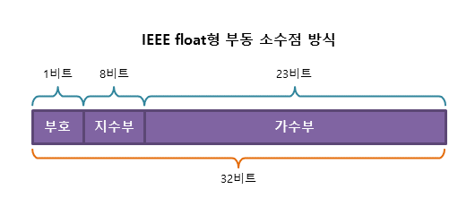
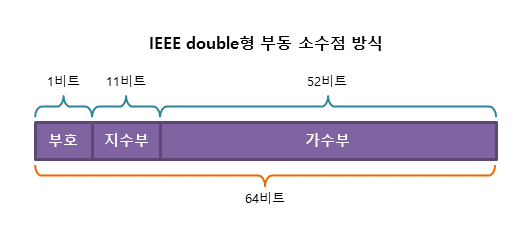
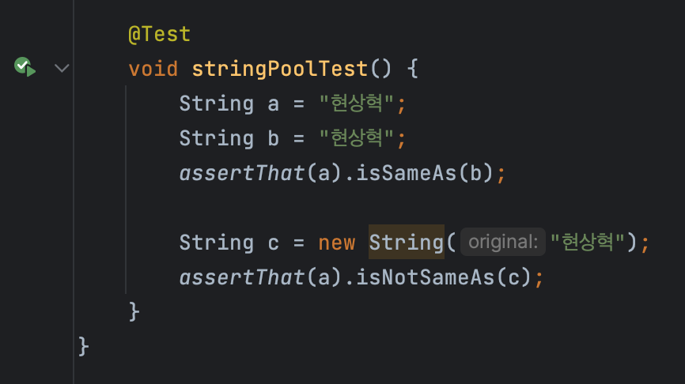
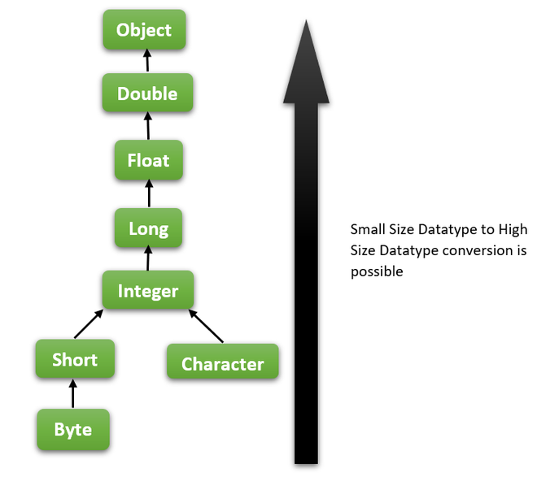
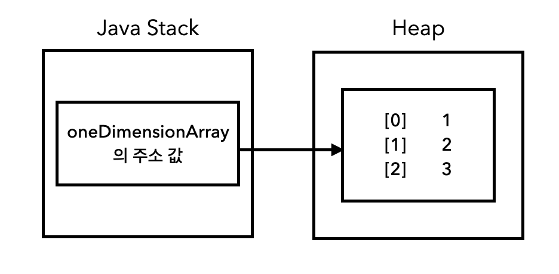
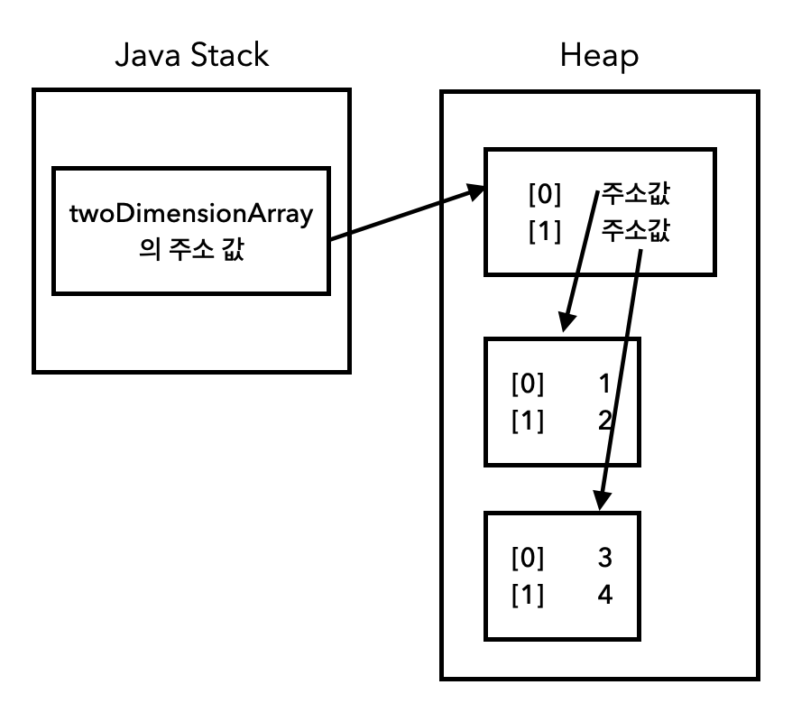

## 프리미티브 타입과 레퍼런스 타입
### 프리미티브 타입 (Primitive Type)
* 실제 `값` 자체를 **`Stack`**에 저장
* `byte`, `short`, `int`, `long`, `char` 등
### 레퍼런스 타입 (Reference Type)
* `class`, `interface`, `enum`, **`array`**, `String`
* 값에 대한 `참조(주소값)`을 `Stack`에 저장
  * 실제 값은 **`Heap`**에 저장
### Example
| Stack | Heap |
| :---: | :---: |
| int a = 10; | |
| char b = 'C'; | |
| MyClass myClass = 100번지; | 100번지 = myClass 인스턴스 |
## 프리미티브 타입 종류, 범위, 기본 값
| 이름 | 크기 | 값 범위 | 기본 값 | 비고 |
| --- | --- | --- | --- | --- |
| byte | 1 byte | -128 ~ 127 | 0 |  |
| short | 2 bytes | -32,768 ~ 32,767 | 0 |  |
| signed int | 4 bytes | $-2^{31}$  ~  $2^{31}-1$ | 0 |  |
| unsigned int | 4 bytes | 0  ~  $2^{32}-1$ | 0 | java 8 이상부터 가능 |
| signed long | 8 bytes | $-2^{63}$  ~  $2^{63}-1$ | 0L |  |
| unsigned long | 8 bytes | $0$  ~  $2^{64}-1$ | 0L | java 8 이상부터 가능 |
| float | 4 bytes | single-precision 32-bit | 0.0f |  |
| double | 8 bytes | double-precision 64-bit | 0.0d |  |
| boolean | 1 bit | true / false | false |  |
| char | 2 bytes | '\u0000' ~ '\uffff' | '\u0000' |  |

* `unsigned` -> 부호가 없으므로 `signed`에 비해 약 2배 더 많은 값을 저장할 수 있음
* `\u`는 Unicode escape 문자로, 뒤의 `0000`, `ffff`가 [유니코드](https://www.rapidtables.com/code/text/unicode-characters.html)
### int 값의 범위와 값이 정해지는 원리
* int는 `4byte` 이다
  * `1byte` == `8bit` 이다
  * `1bit`는 2가지의 비트를 저장할 수 있다
* 따라서, `4byte`에는 총 $2^{32}$ 개의 값을 저장할 수 있다
  * 이때, `signed`의 경우 맨 앞자리를 부호로 사용하므로 음수, 양수 각각 $2^{31}$ 개의 수를 저장할 수 있게 된다
  * 마지막으로 양수는 0을 포함하므로 양수에서 1을 빼어 `signed int`의 범위가 $-2^{31}$ ~ $2^{31} - 1$ 로 정해지는 것이다
### 부동 소수점
* 현재 대부분의 언어 / 시스템은 `IEEE 754` 표준을 따름

#### float (32bit)의 경우


#### double (64bit)의 경우


#### 특징 및 주의점
* 부동 소수점 방식은 항상 **오차가 존재할 수 밖에 없음**
  * 따라서, 실수를 다룰 땐 **정확한 값이 아닌 근사치를 표현하고 있을 뿐임**을 기억해야 한다
* 아래 예제에서 볼 수 있듯 0.1을 1000번 더했음에도 sum은 `100`이 아닌 `99.9999...` 가 된다
  * 마찬가지 이유로 double과 float과의 비교 연산 시 같은 수를 저장하고 있다고 해도 (실제로는 저장하는 비트의 개수가 달라서) 같다고 나오지 않는다. (ex. `10.1F != 10.1D`)
```java
	double sum = 0.0;
    for (int i = 0 ; i < 1000 ; i++) {
    	sum += 0.1;
    }
    System.out.println(sum); // 99.9999999999986
```
* 자바에서 실수 정확하게 계산하는 방법
  * `BigDecimal` 사용하기
```java
  	BigDecimal bigNumber1 = new BigDecimal("1000.0");
  	BigDecimal bigNumber2 = new BigDecimal("999.9");
    
    BigDecimal result = bigNumber1.subtract(bigNumber2); // 0.1 (정확한 값이 나옴)
```

## 리터럴
* 코드 상에서 직접 표현한 값을 의미함
### Integer Literals
* 숫자 값은 `int`
  * int는 `1000000 == 1_000_000` 로도 가능 (다른 표기법)
* `long` 타입은 `L`이나 `l`로 끝나는 값
  * ~~근데 인텔리제이에서 lower case로 쓰면 upper로 쓰라고 권유하던데 왠진 모르겠다~~
* 2진수는 `0b`로 시작
* 16진수는 `0x`로 시작
* 8진수는 `0`으로 시작

### Floating-Point (실수) Literals
* `float` 타입은 `F`나 `f`로 끝나는 값
  * `float f = 10.5` 는 오류 발생. `float f = 10.5f` 라고 해야 함
* 그 외 나머지는 `double` (`D` or `d`를 적을 수도 있음)

### Character & String Literals
* 기본적으로 Unicode Character 가능
* escape character
  * `\b` : 백스페이스
  * `\t` : 탭
  * `\n` : 개행
  * `\f` : form feed (used to indicate to a printer that it should start a new page)
  * `\r` : 캐리지 리턴 (CRLF에서의 개행 -> `\r\n`)
  * `\"` , `\'` : double, single quote
  * `\\` : 역슬래시
#### String Pool
* String을 리터럴로 초기화하게 되면, `Heap` 내의 `String Pool`에 저장되고 **재활용 됨**
  * 반면 `new` 키워드를 통해 초기화하면, `Heap` 내에 다른 객체와 동일하게 저장되고 **재활용되지 않음**



[출처 : [Baeldung - Where Does Java’s String Constant Pool Live, the Heap or the Stack?](https://www.baeldung.com/java-string-constant-pool-heap-stack)]
### Boolean Literals
* `true` or `false`

## 변수 선언 및 초기화하는 방법
### 선언 시 초기화
```java
	int a = 10;
    char c = 'C';
    String s = "abc";
    MyClass myClass = new MyClass();
```
### 선언 후 초기화
```java
	int a;
    char c;
    String s;
    MyClass myClass;
    
    a = 10;
    c = 'C';
    s = "abc";
    myClass = new MyClass();
```
## 변수의 스코프와 라이프타임
### 클래스 변수 (static)
* 클래스 전체
  * 인스턴스가 없어도 접근 가능
  * static 요소는 JVM에 **클래스가 로딩될 때** 생성됨
* `클래스이름.변수명`, `인스턴스.변수명` 모두로 접근 가능
* static 변수는 GC의 대상에서 제외 (애플리케이션 로딩 시점부터 종료 시점까지 생존)
### 인스턴스 변수 (non-static)
* `static`이 아닌 클래스 전체에서 접근 가능
* 인스턴스가 생성되어야만 접근 가능
  * 즉, `인스턴스.변수명`으로만 접근 가능
### 블록 `{}` 내에서 선언된 변수
* 기본적으로 해당 변수가 선언된 블록 내에서만 사용 가능
### 변수의 초기화
* 클래스 변수 / 인스턴스 변수
  * 선언 후 **초기화 하지 않아도** 기본 값 (0, null 등) 이 들어가서 바로 사용할 수 있음 (권장되진 않지만 컴파일 오류는 발생 X)
* 지역 변수
  * 선언 후 초기화하지 않고 사용하면 컴파일 오류 발생
### 접근제어자
* `public`, `protected` : 상속받은 클래스에서도 사용 가능
* `private` : 자기 클래스에서만 사용 가능
## 타입 변환, 캐스팅 그리고 타입 프로모션
### 타입 프로모션 (묵시적 형 변환)
* 타입 프로모션은 자동으로(묵시적으로) 발생하는 형 변환을 말함
* 아래와 같은 상황에서 `1`, `2`라는 `int` 값이 자동으로 `double`로 변환됨
```java
    public double sum(double a, double b) {}
    
    public static void main(String[] args) {
    	sum(1, 2);  // int -> double 묵시적 형 변환 발생
	}
````
* 타입 프로모션은 작은 크기의 타입에서 큰 크기의 타입으로만 가능
  * 큰 크기의 타입 -> 작은 크기의 타입은 `명시적`으로 캐스팅해주어야 함

[출처 : [geeksforgeeks](https://www.geeksforgeeks.org/automatic-type-promotion-in-overloading-in-java/)]
### 타입 캐스팅 (명시적 형 변환)
#### Upcasting
* `subclass` -> `superclass`
  * `subclass`는 항상 `superclass` 전체를 포함하므로 안전한 캐스팅 가능
  ```java
     public static class Parent {
          public void message() {
              System.out.println("Parent");
          }
      }

      public static class Child extends Parent{
          @Override
          public void message() {
              System.out.println("Child");
          }
          public String name = "childA";
      }

      public static void main (String[] args) {
          Child child = new Child();
          Parent parent = (Parent) child;
          parent.message(); // Child
  //        System.out.println(parent.name); // 컴파일 에러 발생 (안전)
      }
  ```
#### Downcasting
* `superclass` -> `subclass`
  *  `superclass`는 `subclass`의 일부를 포함하지 않을 수 있으므로 오류 발생 가능
```java
	public static class Parent {
          public void message() {
              System.out.println("Parent");
          }
      }

      public static class Child extends Parent{
          @Override
          public void message() {
              System.out.println("Child");
          }
          public String name = "childA";
      }

      public static void main (String[] args) {
          Child child = new Child();
          Parent parent = (Parent) child; // 런타임 에러 발생 (위험)
          // 아래 두 코드모두 컴파일 타임에는 오류 발생 X
          parent.message();
		  System.out.println(parent.name);
      }
```
* 원시타입의 경우 `Downcasting`을 하게 되면 값의 손실이 발생할 수 있음
## 1차 및 2차 배열 선언하기
### 선언
```java
	// 1차 배열
    int[] oneDimensionArrayOne = {1, 2, 3};
    
    int[] oneDimensionArrayTwo = new int[3];
    oneDimensionArrayTwo[0] = 1;
    ...
    
    // 2차 배열
    int [][] twoDimensionArrayOne = {{1, 2}, {3, 4}};
    int [][] twoDimensionArrayTwo = new int[2][2];
    twoDimensionArrayTwo[0][0] = 1;
    ...
```
* 배열에 대한 주소(참조)는 JVM `Runtime Data Area`의 `Java Stack` 내부에 생성되며, 실제 배열 값들은 `Heap` 영역에 저장됨
* 1차원 배열


* 2차원 배열



## 타입 추론, var
* 자바 10부터 지원하는 가능
* 명시적으로 변수의 타입을 적어주지 않아도 컴파일러가 알아서 `변수의 타입`을 입력한 `리터럴`을 통해 추론하는 것을 말함
  * `var number = 10;`과 같이 사용가능
### 제약 사항, 특징
* `var`은 반드시 선언과 동시에 초기화가 이루어져야 함
* `var`에는 `null`이 들어갈 수 없음
* `var`은 지역변수로만 사용 가능함
* `var`은 키워드가 아니므로 변수명으로 사용할 수 있음
* 파이썬 등과 다르게 자바의 `var`은 런타입에 **타입이 변경될 순 없음**

## 피드백
1. 각 프리미티브 타입의 범위가 왜 그렇게 정해지는지 원리 이해하기 (byte) + **부동소수점** 이 갖는 문제점/특징 이해
2. `unsigned`는 자바 8부터 가능한데, 프리미티브 타입으로 직접 지원하진 않고 `Integer.parseUnsignedInt()`, `Integer.toUnsignedString()`으로 사용가능 (사용 권장 X)
3. 변수가 선언될 때 바이트코드 상에서는 두 줄로 나누어 이뤄지기 때문에 동시성 문제가 발생할 수 있다..
## 질문
#### 1. `BigInteger`과 `Long`의 차이
* int와 long의 범위

| int | long |
| :---: | :---: |
| -2,147,483,648 ~ 2,147,483,647 | 	-9,223,372,036,854,775,808 ~ 9,223,372,036,854,775,807 |
* BigInteger
  * BigInteger은 숫자를 `문자열`로 취급하기 때문에 무한하게 숫자를 저장할 수 있음
  * `valueOf()`로 `BigInteger` 객체 생성 가능
  * 연산 시 `add`, `subtract` 등 메서드 사용해야 함
  * `intValue()`, `longValue()` 등으로 값을 빼낼 수 있음

## 레퍼런스
* https://www.notion.so/2-38b5d67c7f5a48238529bb8f1617ea0d
* https://catch-me-java.tistory.com/19
* http://www.tcpschool.com/java/java_datatype_floatingPointNumber
* https://inpa.tistory.com/entry/JAVA-%E2%98%95-%EC%8B%A4%EC%88%98-%ED%91%9C%ED%98%84%EB%B6%80%EB%8F%99-%EC%86%8C%EC%88%98%EC%A0%90-%EC%9B%90%EB%A6%AC-%ED%95%9C%EB%88%88%EC%97%90-%EC%9D%B4%ED%95%B4%ED%95%98%EA%B8%B0#%EB%B6%80%EB%8F%99_%EC%86%8C%EC%88%98%EC%A0%90_%EA%B3%84%EC%82%B0_%EB%B0%A9%EB%B2%95